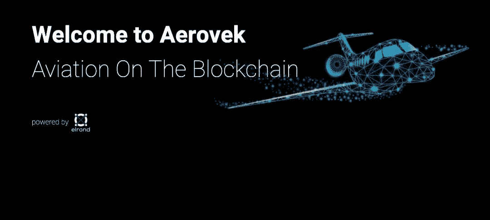

# Aerovek 航空项目

> 原文：<https://medium.com/coinmonks/aerovek-aviation-project-aero-b04c3e954d32?source=collection_archive---------51----------------------->

Aerovek Aviation 是一个社会经济平台，旨在成为一个一站式商店，在一个分散的、由社区管理的对等环境中提供与航空相关的一切服务。他们的重点是为加密和航空业创建最大和最有激情的 WEB3 社区。

根据他们在白皮书中的描述，Aerovek 是一个您可以高效、经济、安全地做任何与航空相关的事情的地方。

■购买、出售和交易飞机和飞机零件

■查找当地航班、飞行员、乘客和飞行学校

■了解航空、加密、DEFI 和 WEB3

■创建治理提案并进行投票

■通过赌注和奖励赚取被动收入

他们相信创造一个无信任、100%透明、可验证的网络和社区。这就是为什么他们做出了创建 AeroDAO 的简单决定，aero Dao 是 Aerovek 生态系统的管理实体。

Aero 和 Atip 是项目令牌。Aerovek 令牌(AERO)是他们的 ESDT(埃尔隆德标准数字令牌)。AERO 促进了 Aerovek 生态系统的运行。AERO 持有人将对成员的提案和所有未来的工作进行管理。

Aerovek Tip Token (ATIP)是他们的 ESDT，通过在 Aerovek 休息室以及即将推出的更多平台上发布高质量和信息丰富的内容来获得。AeroTips (ATIP)是 Aerovek 制作的社区令牌，旨在奖励 Aero 平台上的内容创作者。

AERO 和 ATIP 都可以通过选择用户的呼号进行转移和接收。您还可以访问埃尔隆德浏览器，并能够验证每笔交易，持有人数量，发行量，交易金额，等等。

AERO 令牌没有预售，如果你把 EGLD 放在 Maiar 应用程序中，通过他们的 staking agency 进行 staking，就可以在上市前获得。几天前 AERO 在 Maiar Dex 上发布，你可以从那里购买令牌，在 EGLD 和 AERO 之间进行交换。

他们的团队人数众多，在白皮书的团队部分，我们看到来自各个领域的人:开发、营销、航空、通信。Ryan Dietz 是 Aerovek Aviation 的区块链开发者和联合创始人，在他的 LinkedIn 个人资料上，我们可以看到关于 Aerovek 的各种文章，这证明他参与了这个项目并对其负责。您可以在白皮书中找到关于团队其他成员的详细信息。

总之，我们认为这是一个创新的想法，在现实生活中很实用，在区块链系统中也很实用。

在他们的白皮书中，我们可以看到团队的使命、价值观和目标。他们的项目看起来非常有趣、大胆，而且他们承诺的价格实惠。除了租飞机短途飞行，你还可以:找飞行教练学习飞行，学习如何跳出飞机，在飞机上开派对，派直升机去接你的客人。

此外，他们希望建立航空钱包，这种钱包为用户提供跟踪航空，ATIP，EGLD & MEX 的市场价格和图表的能力。纳入 NFT，使用户可以查看，使他们的个人资料图片与点击一个按钮，转移，并看到每个 NFT 的稀有细节。休息室、用户帐户和 DAO 都将合并到 wallet 仪表板中。

> 加入 Coinmonks [电报频道](https://t.me/coincodecap)和 [Youtube 频道](https://www.youtube.com/c/coinmonks/videos)了解加密交易和投资

# 另外，阅读

*   【Crypto.com 评论】|[|](/coinmonks/crypto-com-review-f143dca1f74c)|[信用交易](/coinmonks/huobi-margin-trading-b3b06cdc1519)
*   [Bybit vs 币安](https://coincodecap.com/bybit-binance-moonxbt)|[stealth x 回顾](/coinmonks/stealthex-review-396c67309988) | [Probit 回顾](https://coincodecap.com/probit-review)
*   [顶级付费加密货币和区块链课程](https://coincodecap.com/blockchain-courses)
*   [CBET 评论](https://coincodecap.com/cbet-casino-review) | [库科恩 vs 比特币基地](https://coincodecap.com/kucoin-vs-coinbase)
*   [如何在加拿大购买加密货币？](https://coincodecap.com/how-to-buy-cryptocurrency-in-canada)
*   [无聊猿游艇俱乐部(BAYC)评论](https://coincodecap.com/bored-ape-yacht-club-bayc-review)
*   [5 款最佳加密交易终端](https://coincodecap.com/crypto-trading-terminals) | [最佳 DeFi 应用](https://coincodecap.com/best-defi-apps)
*   [在美国如何使用 BitMEX？](https://coincodecap.com/use-bitmex-in-usa) | [BitMEX 评论](https://coincodecap.com/bitmex-review)