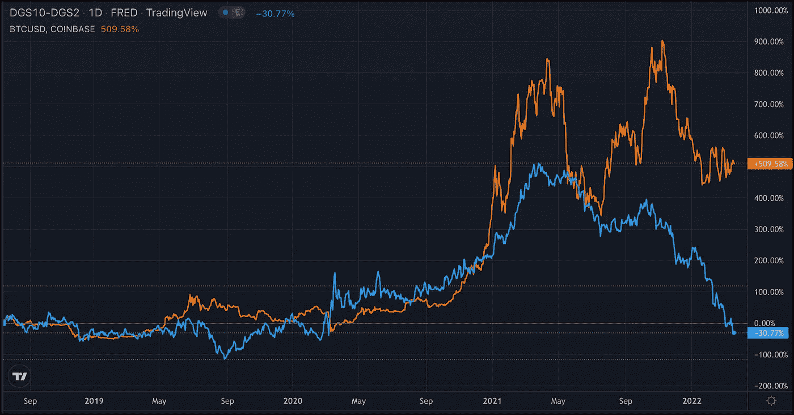

# 害怕收益率曲线？

> 原文：<https://medium.com/coinmonks/afraid-of-the-yield-curve-594b7a7360c?source=collection_archive---------43----------------------->

收益率曲线应该成为比特币多头的担忧吗？几年来，它们的映射相当好，但比特币似乎坚定地拒绝与美国利率反转。

这种关系有合法性吗？收益率曲线的反转一直是经济问题的良好指标。当短期利率高于长期利率时，经济就会放缓。我们正在进入衰退。投资者更关心“当下”，而不是“未来”。

或许这种突破可以与围绕比特币的普遍情绪联系起来。“现在”看起来不算太糟。华尔街人士正蜂拥使用加密技术，并帮助推动其采用。交易所已经表示，交易商正在将 BTC 撤出交易所，这应该表明他们近期没有出售所持股份的意愿。

经济放缓/衰退对 BTC 来说真的那么糟糕吗？也许是，也许不是。在艰难时期，秘密人群倾向于埋头苦干。态度决定一切。

> 加入 Coinmonks [电报频道](https://t.me/coincodecap)和 [Youtube 频道](https://www.youtube.com/c/coinmonks/videos)了解加密交易和投资

# 另外，阅读

*   [币安期货交易](https://coincodecap.com/binance-futures-trading)|[3 commas vs Mudrex vs eToro](https://coincodecap.com/mudrex-3commas-etoro)
*   [如何购买 Monero](https://coincodecap.com/buy-monero) | [IDEX 评论](https://coincodecap.com/idex-review) | [BitKan 交易机器人](https://coincodecap.com/bitkan-trading-bot)
*   [CoinDCX 评论](/coinmonks/coindcx-review-8444db3621a2) | [加密保证金交易交易所](https://coincodecap.com/crypto-margin-trading-exchanges)
*   [红狗赌场评论](https://coincodecap.com/red-dog-casino-review) | [Swyftx 评论](https://coincodecap.com/swyftx-review) | [CoinGate 评论](https://coincodecap.com/coingate-review)
*   [Bookmap 评论](https://coincodecap.com/bookmap-review-2021-best-trading-software) | [美国 5 大最佳加密交易所](https://coincodecap.com/crypto-exchange-usa)