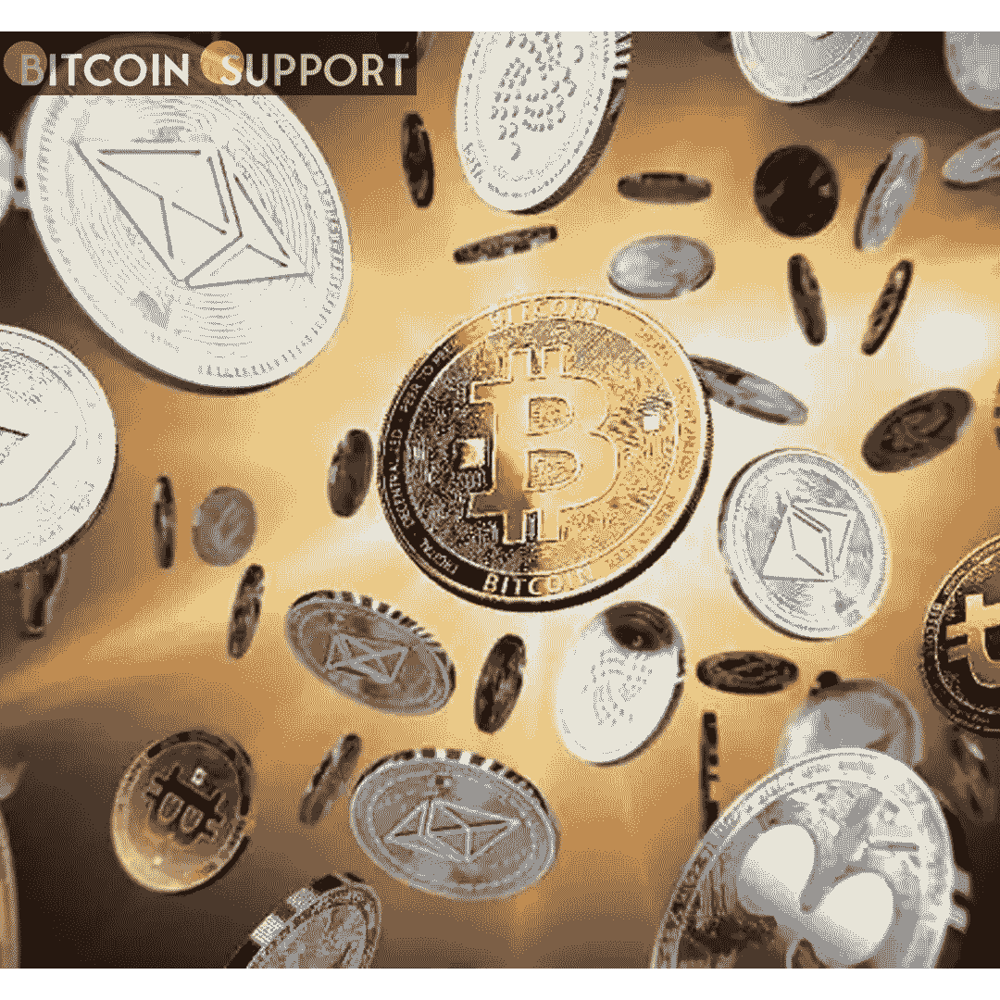
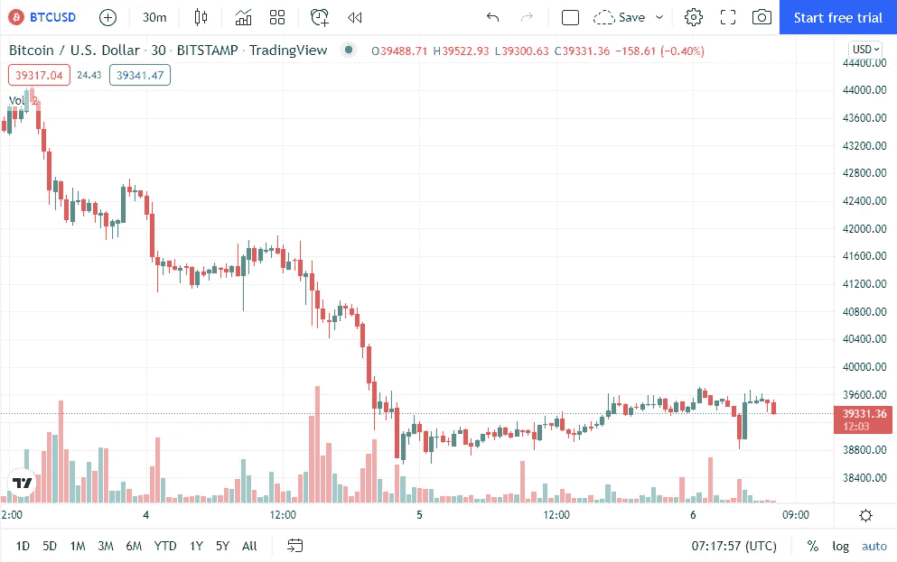
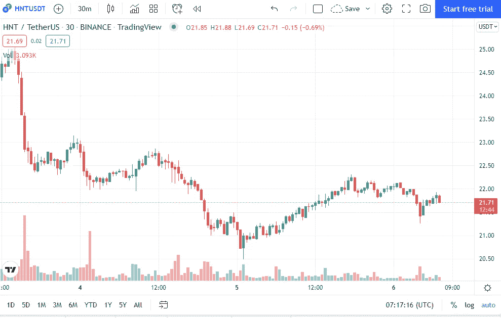

# 在短暂的低迷之后，比特币、以太坊和氦的价格已经上涨

> 原文：<https://medium.com/coinmonks/after-a-brief-downturn-the-prices-of-bitcoin-ethereum-and-helium-have-risen-1b4b7ccfd6a7?source=collection_archive---------51----------------------->

**Visit our website:-** [**https://bitcoinsupports.com/**](https://bitcoinsupports.com/)

全球加密市场在长期亏损后已经出现转机。结果，不确定性增加，其价值也随之下降。比特币率先为其他货币提供了稳定感。以太坊和币安币的兴起得益于比特币的看涨，其他加密货币也很快跟进。近几个月来，CBD 变得越来越受欢迎，而最近的丑闻只是增加了这种受欢迎程度。中国最近被描述为一个计划通过开发自己的数字货币来与比特币和其他加密货币竞争的国家。

**比特币是一种数字货币(BTC)**

**Visit our website:-** [**https://bitcoinsupports.com/**](https://bitcoinsupports.com/)

最近比特币价值的增加使加密货币市场比股票市场更有优势。随着比特币的市值增加，投资者增加了投资。对俄罗斯人来说，封锁 SWIFT 是生死攸关的事情，这鼓励了该国的比特币活动。

**【以太坊】**

**Visit our website:-** [**https://bitcoinsupports.com/**](https://bitcoinsupports.com/)

随着比特币价格的上涨，以太坊的价格在过去 24 小时内上涨了 1.65%。这一改善支撑了连续七天的上涨，降低了看跌的价值。根据最近的报告，目前的利率为-1.63%。

**IMGG 氦(HNT)**

**Visit our website:-** [**https://bitcoinsupports.com/**](https://bitcoinsupports.com/)

因为市场正在失去地盘，这对氦来说是一个糟糕的时期。其每周-8.10%的表现表明其价值持续下跌。在此期间，一项 24 小时性能研究显示上升了 4.36%。它目前的价格是 21.96 美元，在撰写本文时，它在全球排名第 47 位。

**访问我们的网站:-**[**https://bitcoinsupports.com/**](https://bitcoinsupports.com/)

**免责声明:以上为作者观点，不应视为投资建议。读者应该自己做研究。**