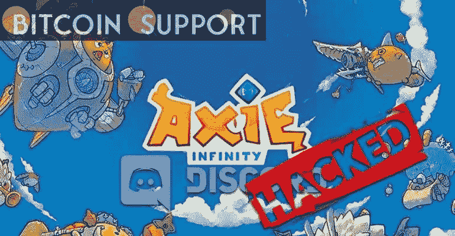

# 在一名黑客获得了 Ronin 验证程序后，Axie Infinity 遭受了 6.2 亿美元的损失

> 原文：<https://medium.com/coinmonks/after-a-hacker-gained-access-to-ronin-validators-axie-infinity-suffered-a-620-million-loss-5aed8bb5f506?source=collection_archive---------7----------------------->

**Visit our website:-** [**https://bitcoinsupports.com/**](https://bitcoinsupports.com/)

根据区块链 NFT 游戏 Axie Infinity 的制造商 Sky Mavis 的说法，浪人网络受到了攻击，一名黑客成功地取走了 173，600 以太币和 2550 万美元硬币(USDC)。Ronin bridge 和 Katana Dex 已被暂停，攻击者已获得约 6.2 亿美元的加密资产。

全球最大 NFT 区块链游戏 Axie Infinity 被黑 6.2 亿美元

全球最大不可替代代币(NFT)区块链游戏 Axie Infinity 在浪人网络验证器被渗透后于周二被黑。据 Axie Infinity 项目背后的企业 Sky Mavis 称，验证器早在 3 月 23 日就被攻破了。在一名用户抱怨他们无法在浪人桥上提取 5000 以太后，天空 Mavis 检测到了攻击。根据 Sky Mavis 的事后声明，“攻击者利用泄露的私钥伪造了虚假取款。”“我们正在与执法机构、法医密码学家和我们的投资者合作，以确保所有资金得到追回或偿还，”Sky Mavis 说，并补充说 Ronin bridge 和 Katana Dex 已经停止。现在，浪人上的 AXS、罗恩和 SLP 都很安全。研究人员接着说，Ronin 由九个验证器节点管理，其中五个节点需要处理一个交易。“攻击者控制了 Sky Mavis 的四个浪人验证器以及一个由 Axie DAO 操作的第三方验证器，”Sky Mavis 补充道验证器密钥方案被设计成分散的，以减少像这样的攻击媒介，然而攻击者通过我们的 gas-free RPC 节点发现了一个后门，他们利用这个后门来获取 Axie DAO 验证器的签名。

更糟糕的是，Sky Mavis 观察到攻击者因为 2021 年 11 月制作的一个补丁而逃脱，而“Axie DAO allowlisted”技术在随后的一个月被停止。

团队注意到“allowlist 访问未被撤销”，并且“在攻击者获得对 Sky Mavis 系统的访问权限后，他们能够通过使用 gas-free RPC 从 Axie DAO 验证程序获得签名。“Sky Mavis 继续她的验尸:

**我们已经验证了欺诈性取款中的签名与五个可疑验证者的签名相匹配。**

对浪人的攻击超过了对虫洞桥的攻击，成为今年对加密协议最大的攻击之一。对虫洞桥的攻击导致了 3.2 亿美元的损失，然而 Jump Crypto 能够补充现金。周二，Sky Mavis 强调，该团队正在与执法部门合作，“确保将罪犯绳之以法。此外，该团队正在与利益相关方会面，考虑如何确保用户获得补偿。”Sky Mavis 将继续存在，并将继续发展，”该团队在事后总结中写道。

**访问我们的网站:-**[**https://bitcoinsupports.com/**](https://bitcoinsupports.com/)

**免责声明:以上为作者观点，不应视为投资建议。读者应该自己做研究。**

> 加入 Coinmonks [电报频道](https://t.me/coincodecap)和 [Youtube 频道](https://www.youtube.com/c/coinmonks/videos)了解加密交易和投资

# 另外，阅读

*   [3 商业评论](/coinmonks/3commas-review-an-excellent-crypto-trading-bot-2020-1313a58bec92) | [Pionex 评论](https://coincodecap.com/pionex-review-exchange-with-crypto-trading-bot) | [Coinrule 评论](/coinmonks/coinrule-review-2021-a-beginner-friendly-crypto-trading-bot-daf0504848ba)
*   [莱杰 vs n rave](/coinmonks/ledger-vs-ngrave-zero-7e40f0c1d694)|[莱杰 nano s vs x](/coinmonks/ledger-nano-s-vs-x-battery-hardware-price-storage-59a6663fe3b0) | [币安评论](/coinmonks/binance-review-ee10d3bf3b6e)
*   [Bybit Exchange 审查](/coinmonks/bybit-exchange-review-dbd570019b71) | [Bityard 审查](https://coincodecap.com/bityard-reivew) | [Jet-Bot 审查](https://coincodecap.com/jet-bot-review)
*   [3 commas vs crypto hopper](/coinmonks/3commas-vs-pionex-vs-cryptohopper-best-crypto-bot-6a98d2baa203)|[赚取加密利息](/coinmonks/earn-crypto-interest-b10b810fdda3)
*   最好的比特币[硬件钱包](/coinmonks/hardware-wallets-dfa1211730c6) | [BitBox02 回顾](/coinmonks/bitbox02-review-your-swiss-bitcoin-hardware-wallet-c36c88fff29)