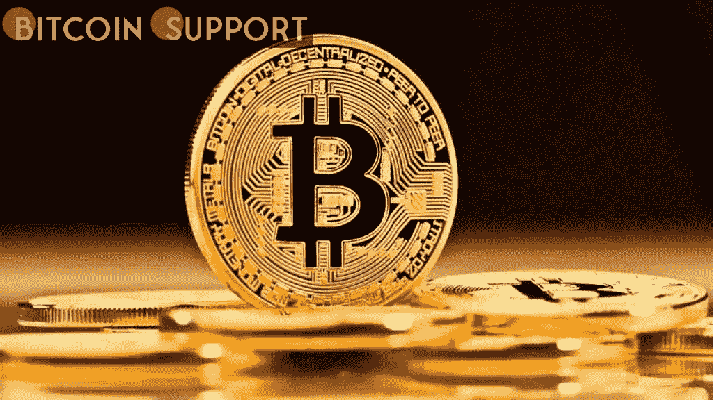
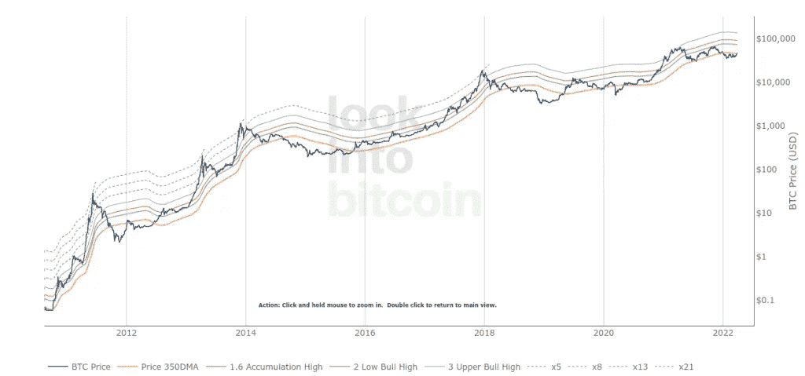
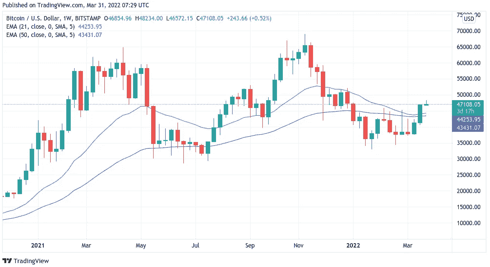

# 经过长时间的休息，比特币刚刚恢复了自 2020 年 3 月以来从未出现过的关键价格趋势线

> 原文：<https://medium.com/coinmonks/after-a-long-break-bitcoin-has-just-regained-a-key-price-trendline-that-it-hasnt-seen-since-march-a2b09f903b47?source=collection_archive---------60----------------------->

**Visit our website:-** [**https://bitcoinsupports.com/**](https://bitcoinsupports.com/)

350 天移动平均线是 BTC 价格将再次开始上涨的最新迹象。这让 Q1 2022 看起来越来越像是在逆势而为。比特币(BTC)可能在 47000 美元盘整，但长期图表显示本周的小牛市有多重要。

一个被称为黄金比例乘数(GRM)的指标称，3 月 27 日，BTC/美元重新获得了一个重要的支持区域，以获得更多的收益。

**出现了比 2020 年 3 月更大的趋势线暴跌。比特币现在已经走出低谷**

GRM 是衡量比特币价格走势的长期指标。它被用来观察比特币的价格增长(或相反)相对于其作为一种资产在采用方面的成熟程度是否过快。

当它这样做时，它使用一个对数标度，它由比特币的 350 天移动平均线(DMA)和斐波那契序列组成，以显示该趋势线改变了多少次。

由于 BTC/美元自 2019 年年中以来的大部分时间都在 350 毫安以上，因此现在跌破 350 毫安就表明价格没有按照应有的方式运行。

随着比特币越来越老，使用它的人越来越多，对数极值变得不那么引人注目。

“黄金比例乘数是一个很好的工具，因为它可以显示在比特币的采用曲线增长和市场周期方面，市场何时可能被过度拉伸，”分析师菲利普·斯威夫特(Philip Swift)当时表示，他在 2019 年提出了这一工具。

2020 年 3 月期间。例如，新冠肺炎崩溃是比特币最近在 350 毫安以下最长的一次旅行。但在 2022 年，它成功地以 3 个月比 2 个月的优势击败了它，成为最近持续时间最长的低于 350 毫安的下跌。谈到 GRM，今年的前三个月看起来明显不同寻常。你可以对 GRM 做的另一件事是计算出比特币市场周期的顶部在什么时候。Swift 认为下一个 top 将是 2019 年 350DMA 的三倍。他说，如果这种斐波纳契数列模式保持过去九年的趋势，那么下一个市场周期高点将是价格在 350DMA x3 区域的时候。

**Visit our website:-** [**https://bitcoinsupports.com/**](https://bitcoinsupports.com/)

**周线图吞噬了中端时间框架上曾经强大的**

阻力，正如 Cointelegraph 所说，比特币已经在陈述将于 2022 年底形成的趋势线。

21 周和 50 周的指数均线，这两个在第一季度成为障碍的均线，本周进行了第一次战斗。Cointelegraph Markets Pro 和 TradingView 的数据显示，多头正在争夺新的支撑。自 2021 年初以来，交易区间分为两个部分。下限和上限分别为 28 000 美元和 69 000 美元。

之前，一位知名交易员和分析师表示，如果 BTC/美元走在他们上方，它可能会在其历史上首次达到新的历史高点。他本周表示:这是 BTC 自 2021 年 7 月中旬以来首次收于 21 周牛市均线之上，当时它处于上升趋势。

**访问我们的网站:-**[**https://bitcoinsupports.com/**](https://bitcoinsupports.com/)

**免责声明:以上为作者观点，不应视为投资建议。读者应该自己做研究。**

> *加入 Coinmonks* [*电报频道*](https://t.me/coincodecap) *和* [*Youtube 频道*](https://www.youtube.com/c/coinmonks/videos) *了解加密交易和投资*

# 另外，阅读

*   [Bookmap 评论](https://coincodecap.com/bookmap-review-2021-best-trading-software) | [美国 5 大最佳加密交易所](https://coincodecap.com/crypto-exchange-usa)
*   最佳加密[硬件钱包](/coinmonks/hardware-wallets-dfa1211730c6) | [Bitbns 评论](/coinmonks/bitbns-review-38256a07e161)
*   [新加坡十大最佳加密交易所](https://coincodecap.com/crypto-exchange-in-singapore) | [购买 AXS](https://coincodecap.com/buy-axs-token)
*   [红狗赌场评论](https://coincodecap.com/red-dog-casino-review) | [Swyftx 评论](https://coincodecap.com/swyftx-review) | [CoinGate 评论](https://coincodecap.com/coingate-review)
*   [投资印度的最佳密码](https://coincodecap.com/best-crypto-to-invest-in-india-in-2021)|[WazirX P2P](https://coincodecap.com/wazirx-p2p)|[Hi Dollar Review](https://coincodecap.com/hi-dollar-review)