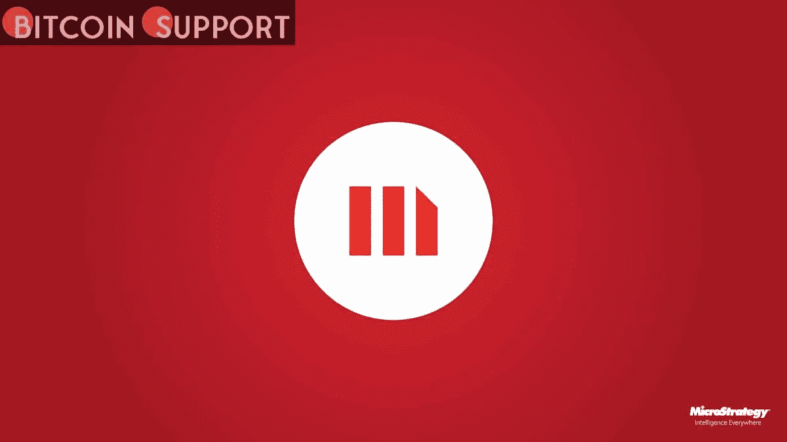

# 在完成一笔 2.05 亿美元的加密抵押贷款后，MicroStrategy 的一家子公司将购买比特币

> 原文：<https://medium.com/coinmonks/after-closing-a-205-million-crypto-collateralized-loan-a-microstrategy-subsidiary-will-buy-a2275bcea93a?source=collection_archive---------56----------------------->

**Visit our website:-** [**https://bitcoinsupports.com/**](https://bitcoinsupports.com/)

在撰写本文时，比特币的价格为 47806 美元，这使得 MicroStrategy 目前持有的 125051 股 BTC 价值约 60 亿美元。

在获得银门银行数百万美元贷款后，商业智能巨头 MicroStrategy 的子公司 MacroStrategy 宣布将购买比特币。根据 MicroStrategy 周二的公告，Silvergate 提供了一笔 2.05 亿美元的贷款，“以 MacroStrategy 抵押账户中存储的某些比特币为担保”。贷款资金将由该公司的子公司 MacroStrategy 用于购买比特币(BTC)，支付贷款费用和利息，以及支付正常的业务支出。

MicroStrategy 首席执行官迈克尔·塞勒(Michael Saylor)表示，“SEN 杠杆贷款让我们有机会扩大我们作为比特币首要公共企业投资者的地位。”“我们已经利用贷款资金有效地将比特币转化为生产性抵押品，使我们能够更好地执行我们的业务目标。”

[https://twitter.com/saylor/status/1508784757894795265](https://twitter.com/saylor/status/1508784757894795265)

2020 年推出的 Silvergate Exchange Network leverage 服务允许企业以美元获得 BTC 抵押贷款。据该行称，截至 12 月 31 日，该行的债务约为 5.7 亿美元。在 2020 年 8 月完成 2.5 亿美元的 BTC 投资后，MicroStrategy 目前拥有数十亿比特币。该公司用手头的现金购买比特币，并从向机构买家私募出售可转换优先票据中获利。该公司的 125，051 枚硬币价值约 60 亿美元，以出版时的 BTC 价格 47，806 美元计算。许多加密和区块链行业的公司都受益于银门公司的资金。加密采矿初创公司马拉松数字公司(Marathon Digital)在 10 月份从该银行获得了 1 亿美元的信贷额度，这笔资金将用于为其运营提供资金，并增加 BTC 矿工的数量。去年 11 月，Crypto.com 宣布与 Silvergate 合作，允许机构客户使用美元存取资金。

**访问我们的网站:-**[**https://bitcoinsupports.com/**](https://bitcoinsupports.com/)

**免责声明:以上为作者观点，不应视为投资建议。读者应该自己做研究。**

> 加入 Coinmonks [电报频道](https://t.me/coincodecap)和 [Youtube 频道](https://www.youtube.com/c/coinmonks/videos)了解加密交易和投资

# 另外，阅读

*   [瓦济里克斯 NFT 评论](https://coincodecap.com/wazirx-nft-review)|[Bitsgap vs Pionex](https://coincodecap.com/bitsgap-vs-pionex)|[Tangem 评论](https://coincodecap.com/tangem-wallet-review)
*   [如何使用 Solidity 在以太坊上创建 DApp？](https://coincodecap.com/create-a-dapp-on-ethereum-using-solidity)
*   [币安 vs FTX](https://coincodecap.com/binance-vs-ftx) | [最佳(SOL)索拉纳钱包](https://coincodecap.com/solana-wallets)
*   [如何在 Uniswap 上交换加密？](https://coincodecap.com/swap-crypto-on-uniswap) | [A-Ads 审查](https://coincodecap.com/a-ads-review)
*   [加密货币储蓄账户](/coinmonks/cryptocurrency-savings-accounts-be3bc0feffbf) | [YoBit 评论](/coinmonks/yobit-review-175464162c62)