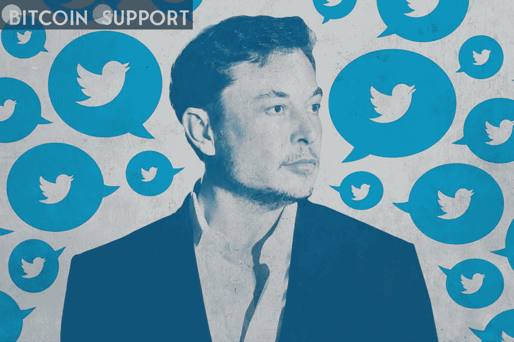

# 埃隆·马斯克暗示将进行人事变动后，购买了 Twitter 9.2%的股份

> 原文：<https://medium.com/coinmonks/after-hinting-at-a-shake-up-elon-musk-buys-a-9-2-stake-in-twitter-eada3e9bdc41?source=collection_archive---------34----------------------->

**Visit our website:-** [**https://bitcoinsupports.com/**](https://bitcoinsupports.com/)

埃隆马斯克(Elon Musk)购买了 Twitter Inc . 9.2%的股份，使他成为该平台最大的股东，就在一周前，他警告称，他将重组社交媒体业务。在盘前交易中，在马斯克周一提交监管文件披露他购买该公司后，Twitter 的股价上涨了近 26%。根据周五的收盘价，该股价值约为 28.9 亿美元。50 岁的马斯克上个月对他的 8000 多万推特粉丝进行了调查，询问该公司是否坚持言论自由的理念。在超过 70%的人回答“不”后，他询问是否需要一个新的平台，并表示他正在认真考虑推出自己的平台。

[https://twitter.com/elonmusk/status/1507259709224632344](https://twitter.com/elonmusk/status/1507259709224632344)

马斯克是最知名的推特用户之一，他在平台上有陷入争议的历史。特斯拉公司(Tesla Inc .)首席执行官埃隆马斯克(Elon Musk)正试图摆脱 2018 年与美国证券交易委员会(SEC)达成的一项协议，该协议对他关于这家电动汽车公司的推文施加了限制。这一宣布将是 Twitter 新任首席执行官帕拉格·阿格拉瓦尔的又一次关键考验，他在去年 11 月突然辞职后接替了杰克·多西。Agrawal 承诺提高产品执行力，加强问责制，并做出更快的决策。到 2023 年底，该公司建立了雄心勃勃的增长目标，包括将年收入增长到 75 亿美元，并达到 3.15 亿日用户。

在 Twitter 透露阿格拉瓦尔将于 12 月接替多尔西担任首席执行官后，马斯克上传了一个隐晦的迷因。影片中阿格拉瓦尔扮演苏联独裁者约瑟夫·斯大林，多尔西扮演被推入水中的苏联秘密警察局长尼古拉·叶佐夫。

**Visit our website:-** [**https://bitcoinsupports.com/**](https://bitcoinsupports.com/)

Twitter 面临着更快开发新事物的压力。为了让怀疑者相信它是认真发展业务的，该公司设定了很高的收入和用户增长目标。虽然 Twitter 多年来一直在逐步增长，但其股票却落后于业内同行。马斯克抨击了 Twitter 最近创建的与不可替代令牌相关的个人资料图片，声称这个社交媒体平台关注的是错误的事情。

**完整博客访问:-**[**https://bitcoinsupports . com/after-hinting-at-a-shake-up-elon-musk-buys-a-9-2-stake-in-Twitter/**](https://bitcoinsupports.com/after-hinting-at-a-shake-up-elon-musk-buys-a-9-2-stake-in-twitter/)

**免责声明:以上为作者观点，不应视为投资建议。读者应该自己做研究。**

> 加入 Coinmonks [电报频道](https://t.me/coincodecap)和 [Youtube 频道](https://www.youtube.com/c/coinmonks/videos)了解加密交易和投资

# 另外，阅读

*   [分散交易所](https://coincodecap.com/what-are-decentralized-exchanges) | [比特恩斯 FIP](https://coincodecap.com/bitbns-fip) | [宾邦评论](https://coincodecap.com/bingbon-review)
*   [用信用卡购买密码的 10 个最佳地点](https://coincodecap.com/buy-crypto-with-credit-card)
*   [加拿大最佳加密交易机器人](https://coincodecap.com/5-best-crypto-trading-bots-in-canada) | [Bybit vs 币安](https://coincodecap.com/bybit-binance-moonxbt)
*   [阿联酋 5 大最佳加密交易所](https://coincodecap.com/best-crypto-exchanges-in-uae) | [SimpleSwap 评论](https://coincodecap.com/simpleswap-review)
*   购买 Dogecoin 的 7 种最佳方式 | [ZebPay 评论](https://coincodecap.com/zebpay-review)
*   [最佳期货交易信号](https://coincodecap.com/futures-trading-signals) | [流动性交易所评论](https://coincodecap.com/liquid-exchange-review)