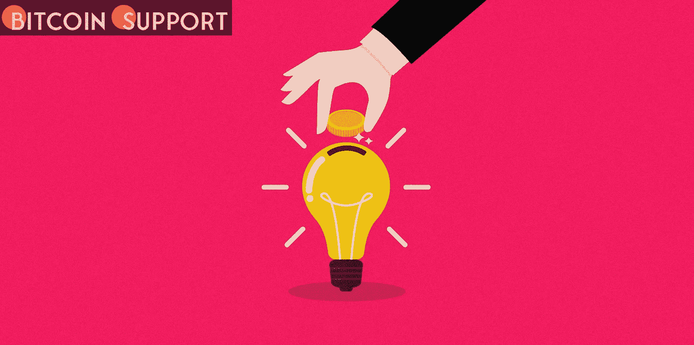
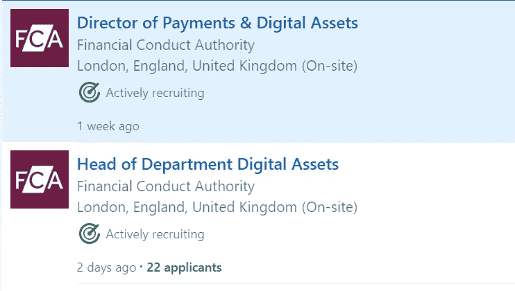

# 在注意到失败的征兆后，一名加密初创公司的员工辞职了

> 原文：<https://medium.com/coinmonks/after-noticing-telltale-symptoms-of-failure-a-crypto-startup-employee-quits-81acbf298dfb?source=collection_archive---------92----------------------->

**Visit our website:-** [**https://bitcoinsupports.com/**](https://bitcoinsupports.com/)

Redditor 看到了危险信号，在没有足够基础设施的情况下提供 NFT 服务，而仅仅基于受欢迎程度在 ATH 购买加密技术。创业环境长期以来被认为有助于将密码社区塑造成一个近 2 万亿美元的产业。另一方面，许多玩家依赖于这种信念，不断地过度承诺和欠兑现大 WAGMI 梦想。2021 年 12 月，Redditor busterrulezzz 被一家加密公司聘用后，觉得自己找到了梦想中的工作——却发现自己现在也是问题的一部分，两个月后就离开了。

**Visit our website:-** [**https://bitcoinsupports.com/**](https://bitcoinsupports.com/)

根据 busterrulezzz:

**的说法，“首先，混乱无序的程度简直是精神错乱。基于市场的最新动向，我们每天早上都有不同的目标。”Redditor 声称，由于一项未决的保密协议，加密业务还没有被命名，做了所有加密投资者通常被建议反对的事情。这包括在没有必要基础设施的情况下提供 NFT 服务，以及仅仅基于加密货币的受欢迎程度，在历史高点买入加密货币。据 busterrulezzz 报道，该公司的议程如下:

**“我们的一款产品因为匆忙推出了一个 bug 修复补丁而不再发挥作用，这是真的吗？”让我们假装它没有发生，继续推广玫瑰色营销文章！加入这个团队后不久，这位 Redditor 就了解到“如果你连自己的目标都不能确立并坚持下去”，一家公司就不可能在密码市场上盈利或高产。Redditor 进一步声称，该公司故意误导和欺诈投资者，利用机器人操作官方电报频道，在 Discord 上冒充社区参与者，并与有影响力的人合作，使他们的产品看起来受欢迎。

**“就是这样的东西让 crypto 在外界的名声很差。"**

创始人们可能只关心尽快赚到最多的钱，但他们却是这位新员工注意到的最大的警告信号之一:

**"我们像一个邪恶的对冲基金一样运营，这正是 crypto 旨在打击的组织类型。在这种所谓的顿悟之后，busterrulezzz 开始觉得自己像个骗子，并放弃了他们的工作。幸运的是，雇主没有支付他前一周的工资，因为他失踪了。另一方面，Reddit 社区希望他们聘请一名律师来撤销 NDA，并返还未决现金。”谢谢你的建议；我会调查的，”他们说。尽管有负面的经历，Redditor 还是建议社区“不要把时间浪费在那些鲜为人知的初创企业上，它们有很高的梦想，但却无法实现。在接受工作邀请之前，读者应该对公司的创始人和战略计划做足功课。虽然故事的重点是欺诈性加密业务的所谓内部运作，但该行业的一些最大参与者，如全球交易量最大的加密交易所币安，都来自卑微的出身。另一方面，政府机构终于认识到了雇佣密码专家的必要性。

据 Cointelegraph 报道，英国金融行为监管局(FCA)在 LinkedIn 上发布了数字资产部门负责人和支付与数字资产部门主管的职位招聘广告。******

**Visit our website:-** [**https://bitcoinsupports.com/**](https://bitcoinsupports.com/)

根据声明，这个新职位是 FCA 创建一个专门的加密部门的雄心的一部分:

“我们正在寻找一个部门的负责人来创建和领导一个新的加密部门，该部门将监督和协调 FCA 在这个快速增长的市场中的监管行动。”在一个计划中的负责开发商业模式的新董事会中，这是一项至关重要的领导工作。"

【https://bitcoinsupports.com/】访问我们的网站:-

****免责声明:以上为作者观点，不应视为投资建议。读者应该自己做研究。****

> ***加入 Coinmonks* [*电报频道*](https://t.me/coincodecap) *和* [*Youtube 频道*](https://www.youtube.com/c/coinmonks/videos) *了解加密交易和投资***

# **另外，阅读**

*   **[Bookmap 评论](https://coincodecap.com/bookmap-review-2021-best-trading-software) | [美国 5 大最佳加密交易所](https://coincodecap.com/crypto-exchange-usa)**
*   **最佳加密[硬件钱包](/coinmonks/hardware-wallets-dfa1211730c6) | [Bitbns 评论](/coinmonks/bitbns-review-38256a07e161)**
*   **[新加坡十大最佳加密交易所](https://coincodecap.com/crypto-exchange-in-singapore) | [购买 AXS](https://coincodecap.com/buy-axs-token)**
*   **[红狗赌场评论](https://coincodecap.com/red-dog-casino-review) | [Swyftx 评论](https://coincodecap.com/swyftx-review) | [CoinGate 评论](https://coincodecap.com/coingate-review)**
*   **[投资印度的最佳密码](https://coincodecap.com/best-crypto-to-invest-in-india-in-2021)|[WazirX P2P](https://coincodecap.com/wazirx-p2p)|[Hi Dollar Review](https://coincodecap.com/hi-dollar-review)**
*   **[加拿大最好的加密交易机器人](https://coincodecap.com/5-best-crypto-trading-bots-in-canada) | [库币评论](https://coincodecap.com/kucoin-review)**