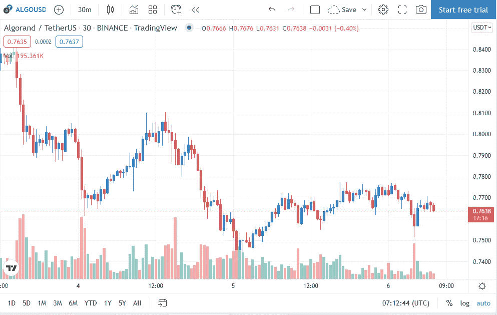

# 经过最近强劲的看跌势头，阿尔格兰德(ALGO)的价格已经巩固

> 原文：<https://medium.com/coinmonks/after-recent-strong-bearish-momentum-the-price-of-algorand-algo-has-consolidated-8ad32b3a8b86?source=collection_archive---------35----------------------->

**Visit our website:-** [**https://bitcoinsupports.com/**](https://bitcoinsupports.com/)

加密货币在市场上取得成功的关键原因通常是其价格上涨趋势。按照这个情节来看，阿尔格兰德已经抵制了。因此，ALGO 无法将投资者从低迷中拉出来。ALGO 的南方之旅似乎还远未结束。自 9 月份以来，altcoin 的价格一直在下降。与其他加密货币不同，ALGO 的价值在 11 月份没有增加，而是保持稳定。

到了 12 月底，币难严重，1 月到了。实际上，在这两个月里，更大市场的波动加剧了阿尔格兰德的问题。在撰写本文时，它比 ATH 便宜 68%。

熊市希望本赛季强势回归。阿尔格兰德公司的股票现在交易价为 0.76 美元，这表明该公司可能会让投资者更加失望。根据市场活动，所有信号都指向未来会有更多的红色蜡烛。只要抛物线 SAR 的白点停留在蜡烛上方，它们就会一直存在。下跌受到 ADX 指数上涨的支撑，该指数即将突破 25.0。

**Visit our website:-** [**https://bitcoinsupports.com/**](https://bitcoinsupports.com/)

此外，阿尔格兰德目前处于熊市，这意味着价格可能会下跌。因此，Algorand 的价格可能会从目前的水平下降到 0.68 美元，或 11.36%。此外，投资者行为和网络数据最近也令人沮丧。连锁交易的数量直线下降。大多数投资者现在并不急于参与，因为没有好转的前景。

**访问我们的网站:-**[**https://bitcoinsupports.com/**](https://bitcoinsupports.com/)

**免责声明:以上为作者观点，不应视为投资建议。读者应该自己做研究。**