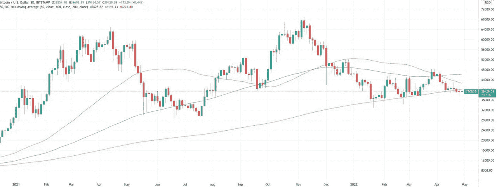
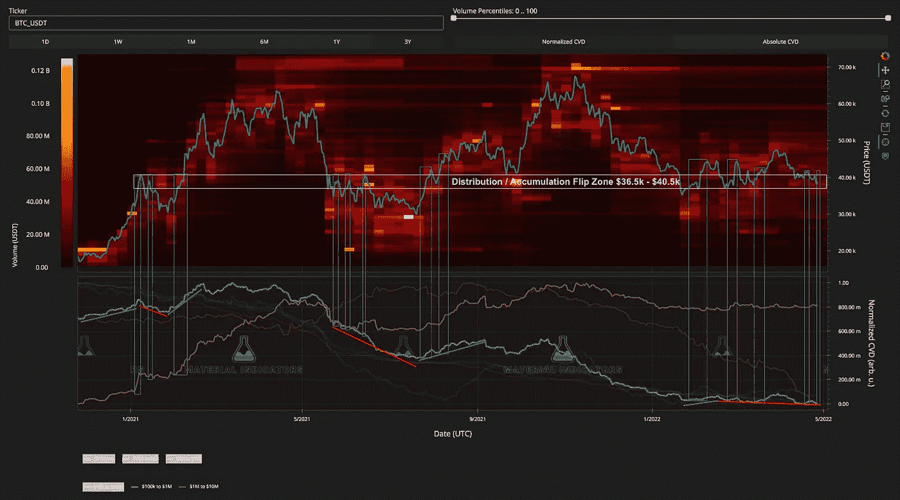

# 在比特币价格出现大幅上涨后，这种加密货币将迎来一个波动的月度收盘

> 原文：<https://medium.com/coinmonks/after-the-btc-price-checks-all-the-boxes-for-a-significant-move-bitcoin-is-set-for-a-tumultuous-c6617168b677?source=collection_archive---------63----------------------->

**For full blog visit:-**[**https://bitcoinsupports.com/after-the-btc-price-checks-all-the-boxes-for-a-significant-move-bitcoin-is-set-for-a-tumultuous-monthly-close/**](https://bitcoinsupports.com/after-the-btc-price-checks-all-the-boxes-for-a-significant-move-bitcoin-is-set-for-a-tumultuous-monthly-close/)

Material Indicators 声称，鲸鱼、移动平均线和宏观事件的强烈组合将决定比特币价格的下一步走向。比特币(BTC)已重新进入其最重要的终身巩固区，但新的研究警告称，它仍可能跌至“宏观底部”

4 月 27 日，on-chain analytics 平台 Material Indicators 在推特上强调了 3.8 万美元对 BTC 普莱斯行动的重要性。

**根据 TradingView 的数据，比特币包围了关键的控制点**

【BTC/美元在盘中的流动性徘徊在 37，700 美元或以上后，尚未做出决定性的上涨或下跌。交易员们一直在猜测市场将走向何方。随着通胀和地缘政治不稳定对股市的影响显而易见，宏观力量需要更大的跌幅。另一方面，以矿商及其不断增加的杂碎率投资为首的连锁迹象一点也不悲观。不考虑日期，38000 美元对比特币来说是一个重要的历史价格。

“自 2020 年 12 月突破 20k 美元以来，BTC 在此区间的巩固程度超过了任何其他国家，”Material Indicators 指出。根据这份报告,“控制点”——本质上是交易量最大的价格水平——现在“正好”是现货价格发挥作用的地方。鉴于本月的价格轨迹，尚不清楚比特币将何去何从。在分析了 3 日图后，材料指标注意到看涨和看跌形态本周都在重复。在 3 日图上，这些是 50 周期，100 周期和 200 周期的移动平均线。“稍微放大三日图就可以发现，三日图中 50 毫安在 100 三日图中下方的交叉导致了反弹，而与三日图中 200 毫安的相互作用要么导致了反弹，要么导致了宏观底部的崩溃，”该公司表示。

**“这个星期，BTC 已经检查了所有那些箱子。”**

**For full blog visit:-**[**https://bitcoinsupports.com/after-the-btc-price-checks-all-the-boxes-for-a-significant-move-bitcoin-is-set-for-a-tumultuous-monthly-close/**](https://bitcoinsupports.com/after-the-btc-price-checks-all-the-boxes-for-a-significant-move-bitcoin-is-set-for-a-tumultuous-monthly-close/)

**均线即已经失去的**

波动几乎是确定的，不管方向如何，由于临近月收盘。目前预计 BTC/美元将在 4 月底比开始时低 6000 美元。正如之前报道的那样，在上周日收盘时，周线图产生了自 2020 年 6 月以来的第一根四期红烛。与此同时，两条重要的周均线复制了一个独特的趋势，导致 BTC 价格本周两次下跌 50%。最后，物质指标将鲸鱼引入了等式。除了现在低于所有三条移动平均线之外，鲸鱼在这个关键时刻的买卖行为对于决定未来的轨迹至关重要。“这些被称为分配反弹，用于卖出 rip 或增加空头头寸，直到 BTC 收复主要均线，”它说。

**“随着每月收盘/开盘日期的临近，预计波动性会增加。”然后我会留意月图上新的趋势预测信号。”**

**完整博客访问:-**[**https://bitcoinsupports . com/after-the-BTC-price-checks-all-the-box-For-a-significant-move-bit coin-set-For-a-turbulent-monthly-close/**](https://bitcoinsupports.com/after-the-btc-price-checks-all-the-boxes-for-a-significant-move-bitcoin-is-set-for-a-tumultuous-monthly-close/)

**免责声明:这些是作者的观点，不应被视为投资建议。读者应该自己做研究。**

> 加入 Coinmonks [电报频道](https://t.me/coincodecap)和 [Youtube 频道](https://www.youtube.com/c/coinmonks/videos)了解加密交易和投资

# 另外，阅读

*   [无聊猿游艇俱乐部(BAYC)评论](https://coincodecap.com/bored-ape-yacht-club-bayc-review)
*   [5 款最佳加密交易终端](https://coincodecap.com/crypto-trading-terminals) | [最佳 DeFi 应用](https://coincodecap.com/best-defi-apps)
*   [在美国如何使用 BitMEX？](https://coincodecap.com/use-bitmex-in-usa) | [BitMEX 评论](https://coincodecap.com/bitmex-review)
*   [最佳期货交易信号](https://coincodecap.com/futures-trading-signals) | [期交所评论](https://coincodecap.com/liquid-exchange-review)
*   [南非的加密交易所](https://coincodecap.com/crypto-exchanges-in-south-africa) | [BitMEX 加密信号](https://coincodecap.com/bitmex-crypto-signals)
*   [MoonXBT 副本交易](https://coincodecap.com/moonxbt-copy-trading) | [阿联酋的加密钱包](https://coincodecap.com/crypto-wallets-in-uae)