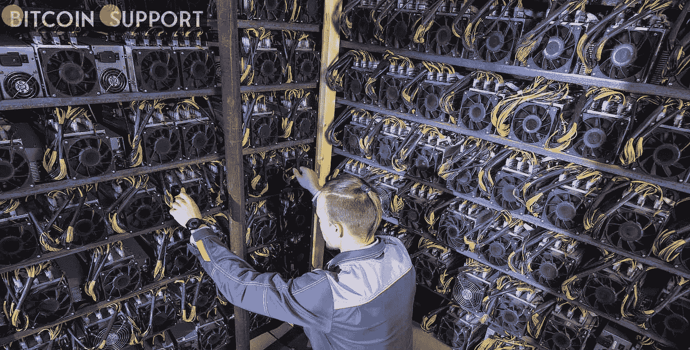

# 在欧盟拒绝工作证明禁令后，比特币和加密货币矿工将受到新的审查

> 原文：<https://medium.com/coinmonks/after-the-eu-rejected-the-proof-of-work-ban-bitcoin-and-cryptocurrency-miners-will-be-subjected-to-464b4a0bb404?source=collection_archive---------71----------------------->

**Visit our website:-** [**https://bitcoinsupports.com/**](https://bitcoinsupports.com/)

尽管拒绝了一项草案法律，该法律将有效禁止整个欧盟的工作证明(PoW)挖掘，但欧盟仍然在追逐比特币(BTC)和以太坊(ETH)矿工。昨日，欧盟议会经济与货币事务委员会(European parliament ' s Economic and Monetary Affairs Committee)拒绝了作为其加密资产(MiCA)框架草案一部分的 BTC 和瑞士联邦理工学院(ETH)事实上的采矿禁令，随后宣布了一项新的加密监管“谈判立场”。根据该委员会的一份新闻声明，该帖子“旨在增加用户的信心，并帮助数字服务和替代支付工具的发展”。然而，对矿商来说，这将是一个警钟——也是一个清晰的提醒:战俘投票的失败只是欧洲议会议员监管欧盟矿业努力的开始，而不是结束。

以下是委员会写的:

**“为了减少加密货币的高碳足迹，特别是用于验证交易的机制，欧洲议会议员要求委员会在 2025 年 1 月 1 日前向欧洲议会议员提交一份立法提案，以将任何显著导致气候变化的加密资产开采活动纳入欧盟可持续活动分类(一种分类系统)。”尽管有 23 名委员会成员没有对新的立场进行表决，但只有 4 名委员会成员投了反对票，31 名成员投了赞成票。欧盟分类法(EU taxonomy)是一种分类系统，包括一系列无害环境的经济活动，是立法者给他们未来可持续金融网络愿景的绰号。作为其分类策略的一部分，欧盟委员会金融稳定、金融服务和资本市场总司联盟早些时候表示，该联盟“将致力于制定气候友好型加密资产的标准。”如果这些想法得到欧盟委员会(European Commission)和成员国政府的批准，受新框架影响的将不仅仅是矿工。如果提案被欧盟委员会和成员国政府批准，企业和经销商也可能面临新的法律。

**欧洲议会还表示，他们寻求监管“那些发行和销售加密资产(包括资产参考代币和电子货币代币)的人”，并解决“透明度、披露、授权和交易监管”问题他们指出，作为拟议措施的结果，“消费者将更好地了解风险、费用和收费”。该委员会表示，其他 IT 行业也是他们的目标，这显然是为了回应矿工们的请求，即不要谴责一个一些人认为不会比其他许多行业污染更严重的行业。该委员会还表示:“欧洲议会强调，其他行业(如视频游戏和娱乐，以及数据中心)使用的能源资源对气候不友好。”声明称，欧洲议会议员要求欧盟委员会“致力于立法，应对不同领域的这些挑战”。欧洲议会还希望欧洲证券和市场管理局(European Securities and Markets Authority)监管资产支持代币的发行，而欧洲银行管理局(European Banking Authority)将监管电子货币代币。

**访问我们的网站:-**[**https://bitcoinsupports.com/**](https://bitcoinsupports.com/)

**免责声明:以上为作者观点，不应视为投资建议。读者应该自己做研究。******

> 加入 Coinmonks [电报频道](https://t.me/coincodecap)和 [Youtube 频道](https://www.youtube.com/c/coinmonks/videos)了解加密交易和投资

# 另外，阅读

*   [7 大最佳零费用密码交易平台](https://coincodecap.com/zero-fee-crypto-exchanges)
*   [氹欞侊贸易评论](https://coincodecap.com/anny-trade-review) | [霍比保证金交易](/coinmonks/huobi-margin-trading-b3b06cdc1519)
*   [分散交易所](https://coincodecap.com/what-are-decentralized-exchanges) | [比特 FIP](https://coincodecap.com/bitbns-fip) | [Pionex 评论](https://coincodecap.com/pionex-review-exchange-with-crypto-trading-bot)
*   [用信用卡购买密码的 10 个最佳地点](https://coincodecap.com/buy-crypto-with-credit-card)
*   [最好的卡达诺钱包](https://coincodecap.com/best-cardano-wallets) | [Bingbon 副本交易](https://coincodecap.com/bingbon-copy-trading)
*   [印度最佳 P2P 加密交易所](https://coincodecap.com/p2p-crypto-exchanges-in-india) | [柴犬钱包](https://coincodecap.com/baby-shiba-inu-wallets)
*   [八大加密附属计划](https://coincodecap.com/crypto-affiliate-programs) | [eToro vs 比特币基地](https://coincodecap.com/etoro-vs-coinbase)