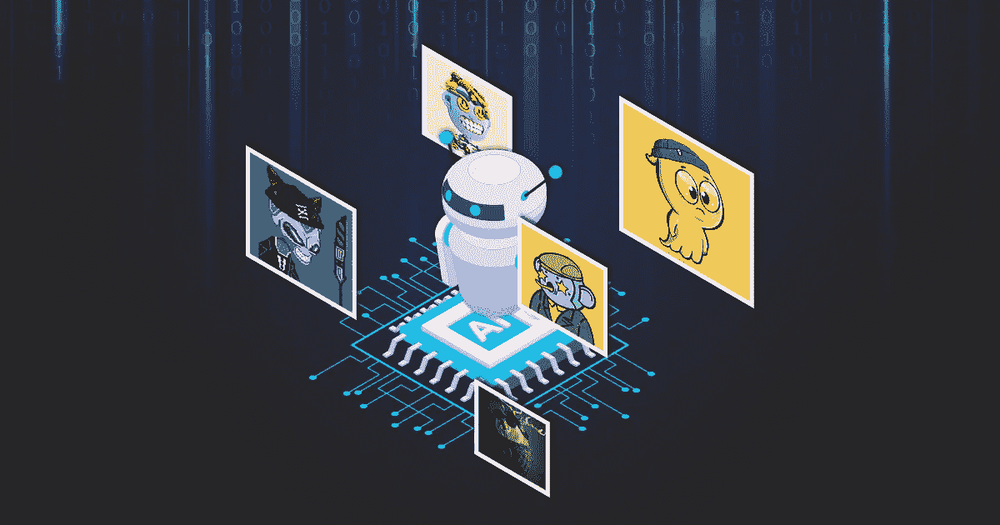
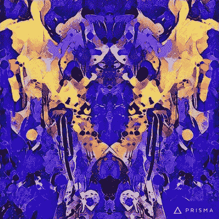

# 人工智能生成的艺术虚拟收藏品——NFT 市场的一场革命

> 原文：<https://medium.com/coinmonks/ai-generated-art-virtual-collectibles-a-revolution-in-the-nft-market-90ebd7c80552?source=collection_archive---------20----------------------->

NFT art

rt 在世界上扮演着重要的角色。几乎我们现在所知道的关于世界的一切都曾经作为艺术被刻在石头上。自从人类开始文明以来，艺术就一直存在。就像人类花了几个世纪的时间发展一样，艺术也是如此。从铭文到 NFT，这段旅程和人类走过的一样长。*由于虚拟收藏品的引入，艺术品在数字世界的价值正在飙升。非物质文化遗产对艺术家来说是变相的祝福，因为它们给了他们被世界拒之门外的力量。你不好奇为什么艺人都把 NFTs 叫做福报吗？如果你是，这是你需要知道的一切。*

# **NFTs 和 art**

NFTs 和 art 有一个比罗密欧与朱丽叶更美的爱情故事。众所周知，NFT 代表[不可替代代币](https://www.forbes.com/advisor/investing/nft-non-fungible-token/)。你基本上可以把你的艺术品做成 NFT，换个更高的价格。对于你可以用哪种艺术形式来制作不可替代的代币，没有限制。然而，将草图和绘图制作成不可替换的标记是最容易的。作为一名艺术家，除了将它们转换成数字化的代币，你想不出更好的方式来推销你的艺术。然而，如果你不是艺术家，你可能会担心铸造自己的数字收藏品。当人类大脑无法完成某项任务时，我们总是可以信任更高层次的人。不，我不是在说耶稣基督。是人工智能。

## **人工智能(AI)在铸造 NFTs**

人工智能总是在不同领域得到人类的支持。我们可以看到它是如何在许多方面取代人类的。因此，创造艺术只是它帽子上的另一根羽毛。为了创造一个虚拟的艺术收藏品，你不需要一个艺术家或者不再是一个艺术家。你所需要的只是一台能稳定上网的好的个人电脑。在进入这一部分之前，让我们了解一下人工智能生成的艺术 NFT 的好处。让我们看看使用人工智能铸造 NFT 的步骤。

# **用人工智能创建 NFTs 的好处**

*   它不需要编码，你只需点击几下鼠标就可以设置人工智能算法的参数。因此，通过消除编码部分，它为您节省了大量的时间和劳动。当你选择这种方法时，你不需要成为一个技术人员或者需要雇佣一个技术人员。
*   您可以从多个设备访问您的作品。你可以从你的 MacBook、笔记本电脑、电脑甚至智能手机上创作和管理你的艺术作品。这个功能也可以帮助你在任何地方观看你的作品。
*   批量创建选项允许您在几分钟内创建数百个 [**虚拟艺术收藏品**](https://www.appdupe.com/nft-crypto-art-marketing?utm_source=Medium&utm_medium=Blog28mar&utm_campaign=Yasmeen) 。您可以使用此选项批量创建用于多种目的的数字令牌，如票证或身份验证。
*   你可以将不同风格的艺术融合在一起，创造出一个在各方面都独一无二的数字化收藏。这种品质给你创造各种艺术风格的自由，让你的艺术变得更好。

在知道这种创作方法的好处后，你是否有冲动**创造你自己的人工智能生成的虚拟收藏品**？好吧，同样的想法，通过滚动来学习如何使他们！

## **如何创建一个人工智能生成的艺术虚拟令牌？**

**第一步:选择**

第一步是选择一个图像样式，您希望将它做成一个不可替换的标记。

**第二步:上传**

一旦您选择了您的图像的基础，上传到铸造门户网站。确保您的图像分辨率更高，以获得高质量的艺术作品。

**第三步:创建**

上传部分完成后，单击“创建”

**第四步:等待**

耐心就是力量。请等待人工智能(AI)在你的图像上酝酿它的咒语。

**第五步:交易**

最后一步是高效地销售你的人工智能生成的 NFTs。

> “卖掉它们？但是在哪里？”你可能会问。好吧，继续读下去了解更多。

# 哪里可以出售我的人工智能生成的艺术数字化代币？

你可以在专门为数字收藏品设计的交易平台——NFT 市场——上出售、购买和交易你的虚拟收藏品。这些市场在区块链网络上运作，这项技术现在被认为是当今时代的一个奇迹。NFT 交易场所的特点是，不像其他交易论坛，你不必担心丢失你的数据。因为一旦您的详细信息进入区块链，就没有什么可以篡改它，所以您的所有信息都是安全的。由于区块链技术带有智能合约，它们提供分散的交易。交易的分散化确保了安全和保障。既然是点对点的交易方式，那就放心，不管什么情况都会收到你的付出。如果你是一个 NFT 热情的企业家，正在寻找投资的事业，那么你甚至可以[**创建一个 NFT 艺术市场**](https://www.appdupe.com/nft-art-marketplace-development?utm_source=Medium&utm_medium=Blog28mar&utm_campaign=Yasmeen) 。

## **包装完毕，**

无论你选择信任一个市场来进行艺术创作，还是创建自己的交易场所来铸造和交易，你都需要确保你信任一个潜在的市场/解决方案提供商。

## **常见问题解答(FAQ):**

**1。如何创作虚拟艺术？**

为了**创造一个 NFT 艺术**，你需要做的就是上传一个风格和内容图片。上传后，单击创建。网站里的人工智能会为你生成独一无二的艺术。

**2。交易我的艺术作品后，我的艺术作品的所有权会改变吗？**

不。你的名字会永远刻在 NFTs 里。即使你把你的艺术品卖给了买家，你仍然会作为艺术品的原始所有者获得版税。

**3。铸造艺术品 NFTs 要花钱吗？**

凡事都有代价。因此，你可能要为铸造你的虚拟收藏品支付汽油费。然而，一些受欢迎的 NFT 市场确实提供免费铸造。

> 加入 Coinmonks [电报频道](https://t.me/coincodecap)和 [Youtube 频道](https://www.youtube.com/c/coinmonks/videos)了解加密交易和投资

# 另外，阅读

*   [有哪些交易信号？](https://coincodecap.com/trading-signal) | [Bitstamp vs 比特币基地](https://coincodecap.com/bitstamp-coinbase) | [买索拉纳](https://coincodecap.com/buy-solana)
*   [ProfitFarmers 回顾](https://coincodecap.com/profitfarmers-review) | [如何使用 Cornix Trading Bot](https://coincodecap.com/cornix-trading-bot)
*   [十大最佳加密货币博客](https://coincodecap.com/best-cryptocurrency-blogs) | [YouHodler 评论](https://coincodecap.com/youhodler-review)
*   [my constant Review](https://coincodecap.com/myconstant-review)|[8 款最佳摇摆交易机器人](https://coincodecap.com/best-swing-trading-bots)
*   [MXC 交易所评论](/coinmonks/mxc-exchange-review-3af0ec1cba8c) | [Pionex vs 币安](https://coincodecap.com/pionex-vs-binance) | [Pionex 套利机器人](https://coincodecap.com/pionex-arbitrage-bot)