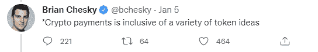

# Airbnb 可能在 2022 年接受比特币现金作为支付方式

> 原文：<https://medium.com/coinmonks/airbnb-may-accept-bitcoin-cash-as-payment-method-in-2022-1b9e43774888?source=collection_archive---------7----------------------->

加密货币正以缓慢的速度被采纳为一种支付方式，比特币现金一直是实体世界的首选之一。

Airbnb 的首席执行官布莱恩·切斯基(Brian Chesky)最近暗示，他的公司期待采用加密货币作为支付方式，关于 Airbnb 将选择何种加密货币的猜测正在增加。

分析师们匆忙分析了通常包括比特币——BTC 和以太坊(Ethereum)等货币的选项，这些货币经常受到高费用的困扰，长期以来一直放弃任何货币功能。

比特币现金也可能被纳入 Airbnb 的新战略，以在 2022 年内扩大加密货币支付选项，也许是通过使用 Bitpay 作为支付处理器，就像我们之前在 AMC 看到的那样。

在选择加密货币进行支付时，比特币现金作为一种选择是无可匹敌的，很少被任何严肃的企业忽视。

# 通过支付处理器采用

虽然 Airbnb 尚未公布细节，但与其他选择相比，比特币现金是最佳选择之一。

低费用和即时交易结构使比特币现金成为消费者的最佳支付方式。

AMC 和更多的公司今天接受第三方使用的比特币现金，(如 Bitpay，GoCrypto，Rakuten 等。).

Bitpay 是大多数企业使用最多的第三方支付处理器。Bitpay 从每笔交易中抽取 1%的费用，费用由商家承担。

公司普遍认为比特币现金是一个很好的选择，因为它的高容量、用户群和货币特性使其成为所有加密货币之间交易的最佳选择。

比特币现金网络的质量和较大的块大小使其能够保持较高的可扩展性，满足大规模采用的要求。

比特币现金由多个受欢迎的科技巨头和投资机构仔细处理，它总是与四五种加密货币一起被采用。

# 比特币现金机构和散户投资者的兴趣正在上升

也许很多比特币现金社区之外的人没有注意到一个事实，即比特币现金对投资者来说是一个极好的前景，在审查 crypto 时，一种支付方法总是包含在顶级选项中。

该列表包含一些最近采用比特币现金作为加密货币投资工具或支付方式的基金和公司。

*   **灰度(美国):(BCHG—GBTC—ETHE—LTCN—ETCG)****(*[*阅读更多*](https://read.cash/@Pantera/grayscales-bitcoin-cash-trust-to-become-sec-reporting-company-84ac9c2c) *)**
*   ***摩根大通&公司(美国):(BCH—BTC—ETH—ETC)***(*[*阅读更多*](https://read.cash/@Pantera/jpmorgan-allows-access-to-retail-investing-in-bitcoin-cash-c82844b4) *)**
*   ***SBI 控股(日):(XRP—BCH—BTC—ETH—LTC)***(*[*阅读更多*](https://read.cash/@Pantera/bitcoin-cash-was-selected-by-sbi-bank-for-the-first-crypto-fund-in-japan-049ea9b7) *)**
*   ***乐天(日本):(BCH—BTC—ETH)***(*[*阅读更多*](https://read.cash/@Pantera/rakuten-accepts-bitcoin-cash-ac5785e6) *)**
*   ***21 股(欧盟)**:(**BCH—BTC—ETH)***(*[*阅读更多*](https://read.cash/@Pantera/bitcoin-cash-etp-in-europe-abch-01effa54) *)**
*   ***互动券商(美国):(BCH—BTC—ETH—LTC)***(*[*阅读更多*](https://read.cash/@Pantera/this-350-billion-fund-is-now-offering-bitcoin-cash-trading-f70f44e1) *)**
*   ***AMC 影院— Bitpay(美国)(BCH — BTC — ETH —柴犬)** *(* [*阅读更多*](https://read.cash/@Pantera/amc-theaters-announced-bitcoin-cash-as-a-payment-method-1136eed0) *)**
*   ***PayPal(目前美国&英国):(BCH—BTC—ETH—LTC)***(*[*来源*](https://www.cnbc.com/2021/08/22/paypal-crypto-service-launches-in-the-uk.html) *)**
*   ***Bancolombia(哥伦比亚):(BCH—BTC—ETH—LTC)***(*[*阅读更多*](https://read.cash/@Pantera/bancolombia-offers-bitcoin-cash-investing-option-4c46a27b) *)**
*   ***Newegg — Bitpay (BCH — BTC 等)** *(* [*来源*](https://kb.newegg.com/knowledge-base/using-crypto-on-newegg/) *)**

*很明显，比特币现金受到关注和接受。顶级基金、银行和公司纳入比特币现金，不是一个开发人员做出的简单决定，而是顶级金融研究人员进行量化分析的结果。*

*然而，所有这些关于比特币现金的积极而重要的消息大多对公众隐瞒，没有出现在头条新闻中，也没有在密码圈内进行应有的讨论。*

*一个清晰的营销策略可能会推动未来类似的公告，为比特币现金创造更好的机会，并在加密市场获得更高的地位。*

**

# *总之:比特币现金是最好的选择*

*理性的消费行为表明，消费者将永远偏好划算和即时的交易机制。BTC 和以太坊早就失去了这些功能，用户更喜欢用菲亚特支付，而不是过渡到每笔交易收取 100 美元费用的支付方式。*

*比特币现金实现了提供一种无足轻重的费用和即时交易的支付方式。*

**

*或许公司也将开始采用 P2P，因为加密支付的 1%费用将是为基础设施支付的数百万美元的额外成本，而基础设施在电子商务网站中应该是免费的，并且易于实施。*

*Airbnb 可能会在 2022 年内扩大加密支付业务，它会发现比特币现金是最佳选择。*

**

*Writing at the following websites: ● [ReadCash](https://read.cash/@Pantera) ● [NoiseCash](https://noise.cash/u/Pantera99) ● [Medium](/@panterabch) ● [Hive](https://hive.blog/@pantera1) ● [Steemit](https://steemit.com/@pantera1) ●[Vocal](https://vocal.media/authors/pantera) ● [Minds](https://www.minds.com/pantera99/) ● [Twitter](https://twitter.com/Panterabch) ● [LinkedIn](https://www.linkedin.com/in/panterabch/) ● [email](https://read.cash/@Pantera/localcryptos-p2p-exchange-is-now-offering-bitcoin-cash-trading-06637230#bad-link)*

> ***免责声明**:本内容发布的所有材料均用于娱乐和教育目的，且**符合公平使用准则**。无意侵犯版权。如果您是或代表本文所用材料的版权所有者，并且对所述材料的使用有疑问，请发送[电子邮件](https://read.cash/@Pantera/cryptouknowns-battlegrounds-the-crypto-battle-royal-part-i-0ca762da#bad-link)。*

*如果你喜欢这篇文章，别忘了订阅并点赞！*

**原发布于*[*https://read . cash*](https://read.cash/@Pantera/airbnb-may-accept-bitcoin-cash-as-payment-method-in-2022-a3198ac0)*。**

**

> *加入 Coinmonks [电报频道](https://t.me/coincodecap)和 [Youtube 频道](https://www.youtube.com/c/coinmonks/videos)了解加密交易和投资*

## *另外，阅读*

*   *[有哪些交易信号？](https://blog.coincodecap.com/trading-signal) | [Bitstamp vs 比特币基地](https://blog.coincodecap.com/bitstamp-coinbase) | [买索拉纳](https://blog.coincodecap.com/buy-solana)*
*   *[ProfitFarmers 回顾](https://blog.coincodecap.com/profitfarmers-review) | [如何使用 Cornix 交易机器人](https://blog.coincodecap.com/cornix-trading-bot)*
*   *[十大最佳加密货币博客](https://blog.coincodecap.com/best-cryptocurrency-blogs) | [YouHodler 评论](https://blog.coincodecap.com/youhodler-review)*
*   *[my constant Review](https://blog.coincodecap.com/myconstant-review)|[8 款最佳摇摆交易机器人](https://blog.coincodecap.com/best-swing-trading-bots)*
*   *[MXC 交易所评论](/coinmonks/mxc-exchange-review-3af0ec1cba8c) | [Pionex vs 币安](https://blog.coincodecap.com/pionex-vs-binance) | [Pionex 套利机器人](https://blog.coincodecap.com/pionex-arbitrage-bot)*
*   *[我的密码交易经验](/coinmonks/my-experience-with-crypto-copy-trading-d6feb2ce3ac5) | [《比特币基地评论》](/coinmonks/coinbase-review-6ef4e0f56064)*
*   *[CoinFLEX 评论](https://blog.coincodecap.com/coinflex-review) | [AEX 交易所评论](https://blog.coincodecap.com/aex-exchange-review) | [UPbit 评论](https://blog.coincodecap.com/upbit-review)*
*   *[Remitano 审查](https://blog.coincodecap.com/remitano-review)|[1 英寸协议指南](https://blog.coincodecap.com/1inch) | [购买 Floki](https://blog.coincodecap.com/buy-floki-inu-token)*
*   *[MoonXBT vs Bybit vs 币安](https://blog.coincodecap.com/bybit-binance-moonxbt) | [仲裁:第 2 层解决方案](https://blog.coincodecap.com/arbitrum)*
*   *[火笔点评](https://blog.coincodecap.com/huobi-review) | [奥克克斯保证金交易](https://blog.coincodecap.com/okex-margin-trading) | [期货交易](https://blog.coincodecap.com/futures-trading)*
*   *[比特币基地 Staking](https://blog.coincodecap.com/coinbase-staking)|[hot bit Review](/coinmonks/hotbit-review-cd5bec41dafb)|[ku coin Review](https://blog.coincodecap.com/kucoin-review)*
*   *[7 种购买 Dogecoin 的最佳方式](https://blog.coincodecap.com/ways-to-buy-dogecoin)|[zepay Review](https://blog.coincodecap.com/zebpay-review)*