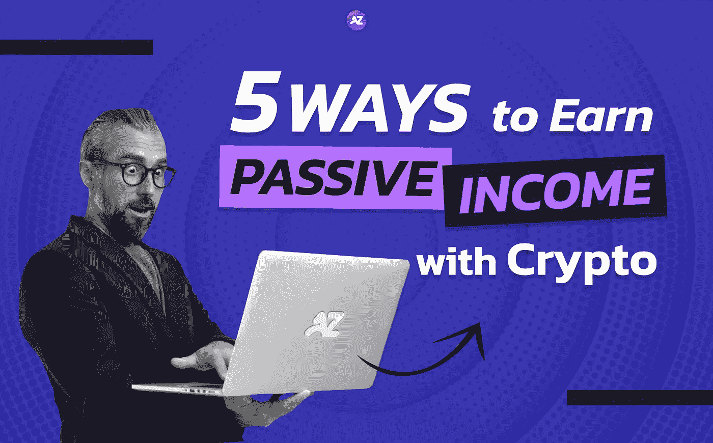
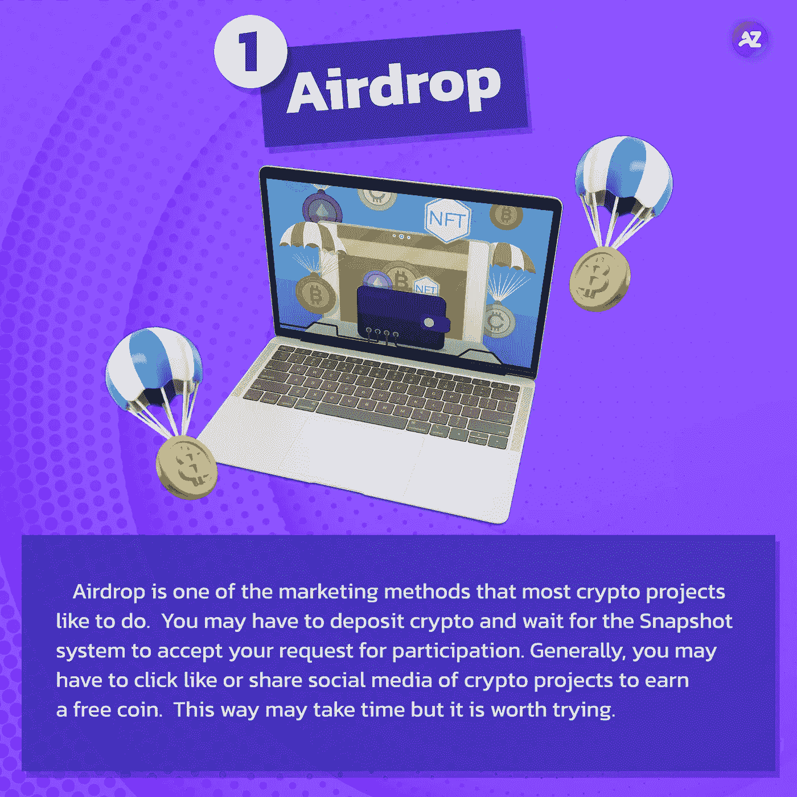
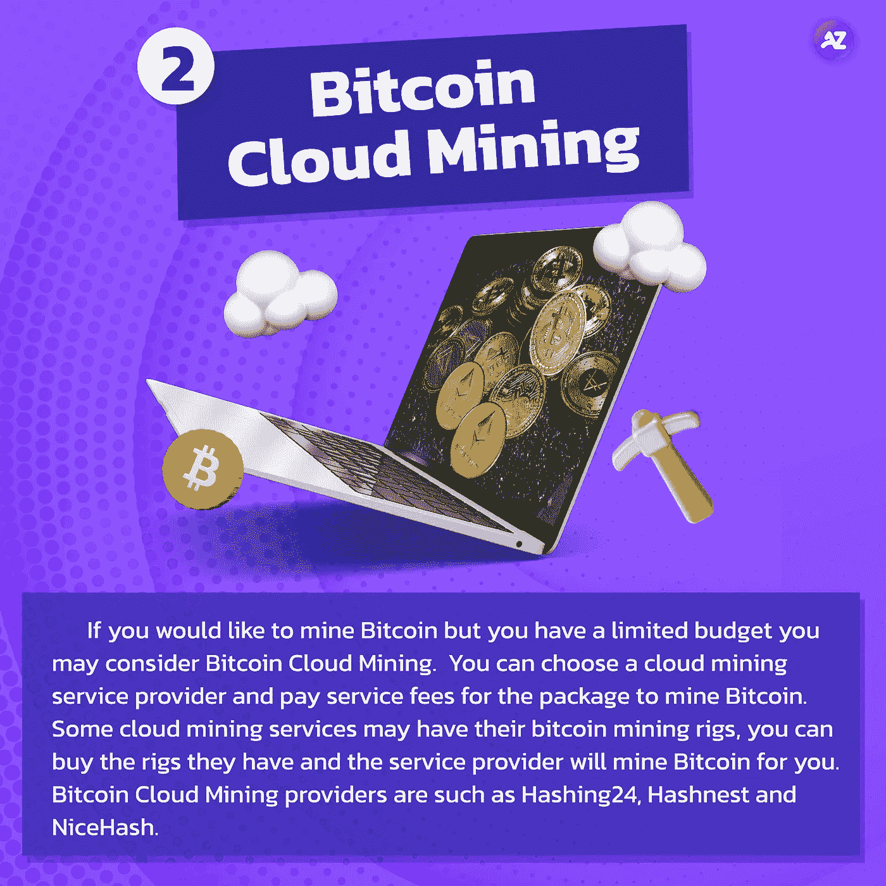
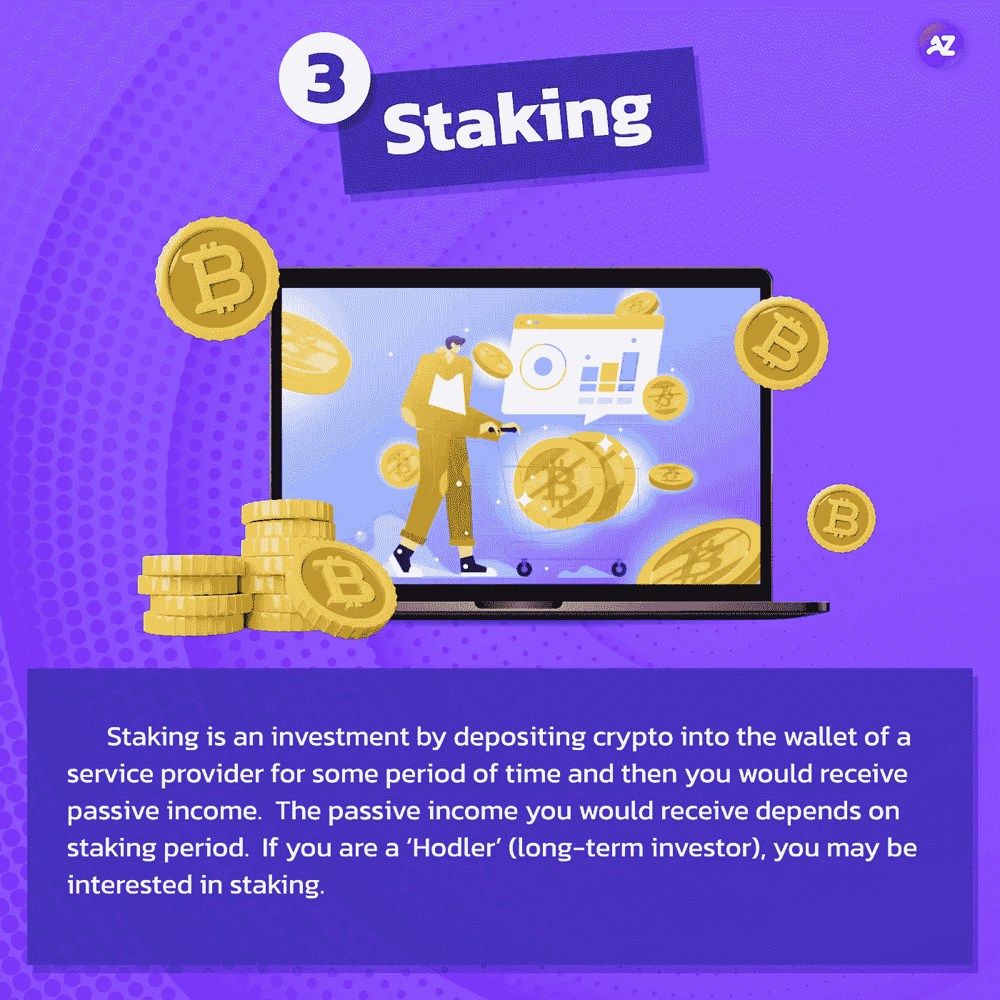
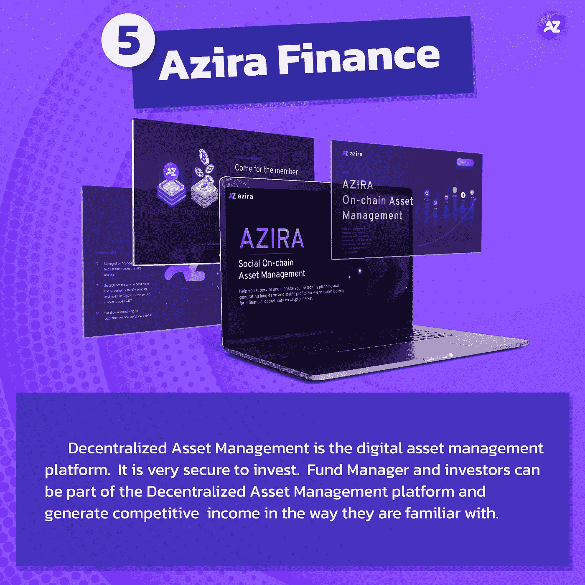

# 使用 Crypto 2022 赚取被动收入的 5 种方法

> 原文：<https://medium.com/coinmonks/airdrop5-ways-to-earn-passive-income-with-crypto-8a6f7e272f0a?source=collection_archive---------12----------------------->

## 让我们看看你可以用 crypto 为被动收入做些什么

5 Ways to Earn Passive Income with Crypto

由于我们现在面临严峻的通货膨胀率和经济衰退，每个人都希望赚取更多的收入生活。根据你的功效，我们可以通过各种方式从加密中获益。这篇文章将谈论 5 种方法来赚取被动收入与加密。

Airdrop Crypto

**1。空投**

你可以通过空投免费接收加密。我们可以说 airdrop 是大多数 crypto 项目喜欢做的营销方式之一。如果您想要参与 airdrop 项目，您必须遵循每个 airdrop 项目公告中显示的条件，否则，您可能无法参与并获得免费的 crypto。您可能需要存放加密，并等待快照系统接受您的参与请求。一般来说，你可能必须点击喜欢或分享加密项目的社交媒体才能获得免费硬币。这种方法可能需要时间，但值得一试。

**Bitcoin Cloud Mining**

**2。比特币云挖掘**

如果你想挖掘比特币，但你的预算有限，或空间有限，你可以考虑比特币云挖掘。可以选择云挖矿服务商，支付套餐服务费来挖矿比特币。一些云开采服务可能有他们的比特币开采钻机，你可以购买他们的钻机，服务提供商将为你开采比特币。比特币云挖矿提供商有 [Hashing24](https://hashing24.com/) 、 [Hashnest](https://www.hashnest.com/) 和 [NiceHash](https://www.nicehash.com/) 等。

Staking Crypto

**3。打桩**

另一种赚取被动收入的方法是投资加密交易所提供的加密赌注。赌注是一种投资，将密码存入服务提供商的钱包一段时间，然后你将获得被动收入。你将获得的被动收入取决于赌注期。如果你是‘霍德勒’(长期投资者)，你可能会对赌注感兴趣。

**GameFi**

**4。GameFi**

如果你是一个游戏玩家，你可能会通过玩游戏来获得收入。你可能必须找到一个投资者，如果你已经成长，你可能会建立自己的加密项目。有些游戏是免费的。这叫“GameFi”。然而，GameFi 的风险很大，因为 GameFi 的一些项目可能不会成功，项目可能会在任何投资者获得任何回报之前关闭。

[**Azira Finance**](/@azirafinance/fund-managersa-brand-new-choice-for-investors-with-azira-finance-944f77e5698a?source=your_stories_page-------------------------------------)

**5。** [**阿齐拉金融**](/@azirafinance/fund-managersa-brand-new-choice-for-investors-with-azira-finance-944f77e5698a?source=your_stories_page-------------------------------------)

另一种获得被动收益的方式是投资分散资产管理平台。分散资产管理是数字资产管理平台。投资很有保障。基金经理和投资者可以成为分散资产管理平台的一部分，并以他们熟悉的方式产生有竞争力的收入。

如果你是一个秘密投资者，这些只是一些被动收入的来源。在秘密世界里，有很多方法可以获得被动收入。然而，请注意，加密市场是非常不稳定的。在你投资之前，你必须自学并研究你感兴趣的加密项目。

*请注意，投资数字资产有风险，交易者应在投资前自我教育。

如果您对分散资产管理感兴趣，请随时联系我们。

请确保您不会错过任何更新的新闻，请关注我们的社交媒体如下:
推特:[https://twitter.com/azirafinance](https://twitter.com/azirafinance)
媒体:[https://medium.com/@azirafinance](/@azirafinance)
脸书:[https://www.facebook.com/azirafinance](https://www.facebook.com/azirafinance)
Reddit:[https://www.reddit.com/user/azirafinance](https://www.reddit.com/user/azirafinance)
白皮书:[https://azira-finance.gitbook.io/product-docs/](https://azira-finance.gitbook.io/product-docs/)

> 加入 Coinmonks [电报频道](https://t.me/coincodecap)和 [Youtube 频道](https://www.youtube.com/c/coinmonks/videos)了解加密交易和投资

# 另外，阅读

*   [AscendEx 保证金交易](https://coincodecap.com/ascendex-margin-trading) | [Bitfinex 赌注](https://coincodecap.com/bitfinex-staking) | [bitFlyer 评论](https://coincodecap.com/bitflyer-review)
*   [Bitget 回顾](https://coincodecap.com/bitget-review)|[Gemini vs block fi](https://coincodecap.com/gemini-vs-blockfi)cmd |[OKEx 期货交易](https://coincodecap.com/okex-futures-trading)
*   [AscendEx Staking](https://coincodecap.com/ascendex-staking)|[Bot Ocean Review](https://coincodecap.com/bot-ocean-review)|[最佳比特币钱包](https://coincodecap.com/bitcoin-wallets-india)
*   [霍比审核](https://coincodecap.com/huobi-review) | [OKEx 保证金交易](https://coincodecap.com/okex-margin-trading) | [期货交易](https://coincodecap.com/futures-trading)
*   [网格交易机器人](https://coincodecap.com/grid-trading) | [Cryptohopper 审查](/coinmonks/cryptohopper-review-a388ff5bae88) | [Bexplus 审查](https://coincodecap.com/bexplus-review)
*   [7 个最佳零费用加密交易平台](https://coincodecap.com/zero-fee-crypto-exchanges)