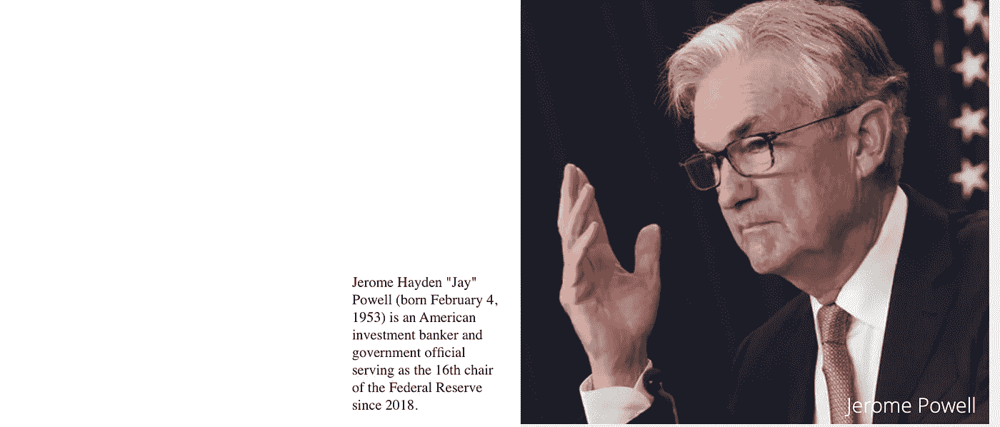
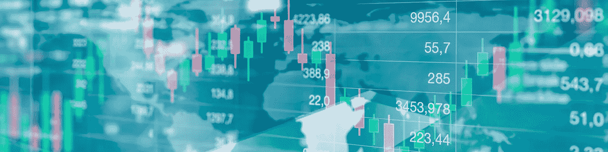

# 宏、市场和加密的片段

> 原文：<https://medium.com/coinmonks/alegherzisnippets-of-macro-markets-crypto-fbf8a5ec37b?source=collection_archive---------52----------------------->

**第 11 期每周市场评论
2022 年 5 月 6 日
作者 Alessandro Gherzi**

L est 我们忘记了上一次美联储主席在 2021 年春天会见 POTUS，因为那标志着困扰我们至今的股市低迷的开始。自那次会面以来，股市的下跌和风险资产的消失并非巧合，在我们看来，这是白宫对美联储及其主席施加影响的直接结果。让我们花一分钟时间把时钟倒回到几个月前，提醒我们自己乔·拜登让杰罗姆·鲍威尔在圣诞树下找到什么，他提供了什么回报。简而言之，通货膨胀开始成为民主党的一个严重问题，主要由于生活成本上升导致的支持率下降使乔和他的团队生活不舒服。另一方面，随着杰罗姆的任期结束，美联储主席的席位即将空缺，但他仍有可能连任。这是一个眨眼的例子，你开始解决让我头疼的问题(通货膨胀)，作为回报，你保住了你的工作(美联储主席)。作为一个独立的超级实体，美联储就到此为止了，但那是另外一个故事了。因此，在周一平静的阵亡将士纪念日之后，市场参与者获得了额外的一天时间从上周旺盛的市场反弹中清醒过来，许多人想知道周二乔和杰罗姆之间毫无疑问公正的聊天会如何。不要错过老朋友的有趣聚会，前美联储主席珍妮特·耶伦和现任财政部长也参加了聚会。一旦手续清理完毕，并且不再有细枝末节，杰罗姆似乎在强化其货币政策立场方面做得还不够，他又一次被提醒，在谁面前他必须下跪，他必须亲吻谁的手。整个新闻发布会至少可以说是尴尬的，但拜登和耶伦都发出了响亮而明确的信息“杰罗姆，我们是养活你的手，所以照我说的做”。乔在一次简短的演讲中设法听起来像一张破唱片，用“通货膨胀”这个词充斥着广播，而他的老朋友珍妮特做了一个道歉，承认 12 个月太晚了，政府完全错误地将通货膨胀称为短暂的。我们认为，杰罗姆这个驱动市场的人，已经重申了他对让他留任的人的忠诚，因此会按照别人的吩咐去做。尽管市场对此不屑一顾，总体上当天没有什么变化，但这对希望美联储在不久的将来改变方针的鸽派来说不是好消息。我们并不是说他们不会，但在勇敢的杰罗姆杀死喷火的通货膨胀龙之前，改变主意的可能性仍然很小，因此我们在预测牛市反转时要小心谨慎。

> 我们认为，杰罗姆这个驱动市场的人，已经重申了他对让他留任的人的忠诚，因此会按照别人的吩咐去做。

趋势逆转达到顶峰，当大人物开始预测厄运和悲观时，我们可能会开始看到希望的曙光。就像耶伦在 12 个月后为“暂时性通货膨胀”的错误道歉一样，摩根大通首席执行官杰米·戴蒙在 6 个月后表示，他正在为美国最大的银行准备迎接未来非常艰难的时期。“你知道，我说过有风暴云，但我要改变它…这是一场飓风，”戴蒙周三在纽约的一次金融会议上说。他补充说，虽然目前情况看起来“不错”，但没人知道飓风是“小飓风还是超级飓风桑迪”。还好吗？真的吗？我猜杰米的彭博终端已经停机好几个月了，或者也许他正处于非礼勿视的状态。他给出了大量建议，尽管“摩根大通正在支撑我们自己。你最好做好准备”，谢谢杰米也许他是在邀请我们大家勒紧裤带，就像他在摩根大通股东反对他的 5000 万美元留任奖金后所做的那样，他们几周前投票反对了这一提议。他说的话可能是出于愤怒，然而，当美国最有权势的银行家说“现在天气有点晴朗，一切都很好，每个人都认为美联储可以处理好这件事”时，你就会开始质疑这种评论的真实性。已经有很长一段时间没有“阳光明媚”了，如果他已经阅读我们的周刊几个月了，我们已经写道“不，美联储不能处理这个”。你可能会说，谁在乎一只肥猫会说什么，但这种危言耸听最终确实影响了投资者的心理，以至于他的言论逆转了周三一个积极的交易日，最终以红色收盘。

> 在喷火的通胀巨龙被勇敢的杰罗姆杀死之前，回心转意的可能性仍然很小，因此我们在预测牛市反转时应该保持谨慎。

美联储本月将开始的一件事，也是戴蒙在他的讲话中过分强调的一件事，是开始所谓的量化紧缩，即逆转其紧急债券购买计划，该计划主要是为了在疫情抛售期间支撑市场，现在已经结束，并将导致资产负债表萎缩。量化紧缩无疑将对市场产生重大影响，当然不能忽视，但我们必须再次警告不要发表导致周三市场走低的大胆言论。戴蒙警告说，“飓风就在那里，沿着道路，向我们走来。”主要是因为“我们从未有过这样的 QT，所以你看到的可能是你 50 年来写在历史书上的东西”。毫无疑问，QT 不会有所帮助，但毫无疑问的是，世界上最有权力的两位银行家确实在关起门来讨论如何进行 QT，尤其是考虑到大多数 QT 将通过摩根大通这样的机构过滤。由于这是一个新现象，我们认为美联储将非常小心地部署 QT，他们在玩弄它方面处于未知的水域。我们希望他们会小心处理，不，历史书不会写在上面，杰米知道这一点。我们要说的是，通常当像戴蒙这样的人在数月后才散布悲观情绪，市场达到恐惧的顶点，而我们认为我们还没有到那一步时，我们就开始看到趋势反转的迹象。

> 量化紧缩无疑将对市场产生重大影响，当然不能忽视，但我们必须再次警告不要发表导致周三市场走低的大胆言论。

如果对即将到来的更严厉的事情的恐惧不足以在周中扰乱市场，那么对收紧货币政策的担忧在周三变得更加强烈，此前美国供应管理协会(Institute for Supply Management)表示，5 月份制造业 PMI 为 56.1，高于前一个月的 55.4。因此，宏观经济数据描绘了一幅美国仍在蓬勃发展的画面，尽管经历了 40 年的高通胀和疲惫的消费者，美国经济仍具有弹性。矛盾而又违背直觉的是，对市场而言，这正是问题所在，因为乐观的经济数据被认为(这是完全正确的)，给了美联储进一步的火力来收紧货币条件，而不会冒着经济停滞甚至陷入衰退的风险。美联储正在把它的脚趾浸入冰水中，但是暂时还没有被冻伤。他们越来越有底气，因为最近的加息并没有导致经济急剧放缓，但也不足以抑制通胀，因此给了他们全权部署所有可能的反通胀斗争。这种“坏消息是好消息”或“好消息是坏消息”的古怪范式，取决于个人的观点，在周五被进一步揭露。当天，投资者分析了美国劳工统计局(Bureau of Labor Statistics)发布的最新就业报告，该报告显示，美国 5 月份的就业人数继续上升，上个月非农就业人数增加了 39 万人，而市场预期增加了 32.8 万人。这大大超出了预期，对经济来说无疑是个好消息，你瞧，市场大幅下跌，记住在今天这个时代“好消息就是坏消息”。美联储是投资者情绪的摇摆因素，如此强劲的就业数据不太可能让美联储变得不那么鹰派，或许也不那么急于倾向于他们使命中的第二条戒律，即充分就业。周五的就业数据中唯一值得庆幸的是，5 月份平均时薪增长了 0.3%，略低于 0.4%的普遍预期，与 4 月份的速度一致。如果收益增长出乎意料地出现上行，而不是错过下行，股票就会投降，因为至少我们避免了工资价格螺旋上升，这是最危险和最棘手的通胀形式之一……市场有面包屑值得感激。

> 由于这是一个新现象，我们认为美联储将非常小心地部署 QT，他们在玩弄它方面处于未知的水域。

不出所料，市场经历了糟糕的一周，无法延续上周的强劲反弹。正如许多人担心的那样，上周的反弹是死猫反弹。关于 crypto 的一个简短的词只是为了证明这篇时事通讯的标题，因为这是这个领域特别平静的一周。除了协议和协议之外，没有什么值得大书特书的。几个月来，我们一直警告说，对如此多的协议采取“快速行动，打破常规”的方法，而不是对极少数协议的严格执行，可能会适得其反。Solana 本周再次中断，SOL 最终成为按市值排名的前 100 种加密货币中表现最差的令牌。本周留给我们的是，我们仍未走出低谷，牛市趋势的逆转仍未到来。从“逢低买入”到“逢高卖出”的心态转变如此普遍，在我们看来，只有在通胀下降的情况下，才会出现逆转。下周所有重要的通胀数据将会告诉我们答案。

> 加入 Coinmonks [电报集团](https://t.me/joinchat/Trz8jaxd6xEsBI4p)，了解加密交易和投资

> 几个月来，我们一直警告说，对如此多的协议采取“快速行动，打破常规”的方法，而不是对极少数协议的严格执行，可能会适得其反。

谢谢你的滚动。
感激你不可估量的时间。Alessandro Gherzi |首席财务官 STIMA

加入由志同道合者组成的 STIMA 社区，让你的生活变得有价值。
关注我们:T9**https://linktr.ee/stima.io**