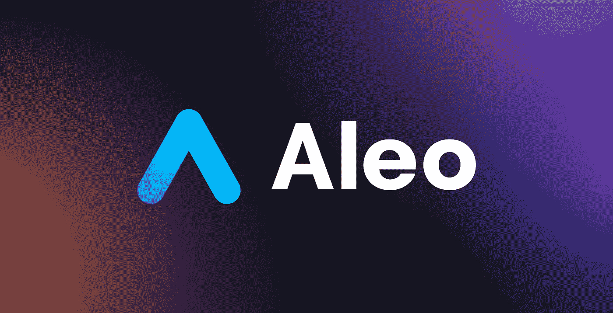
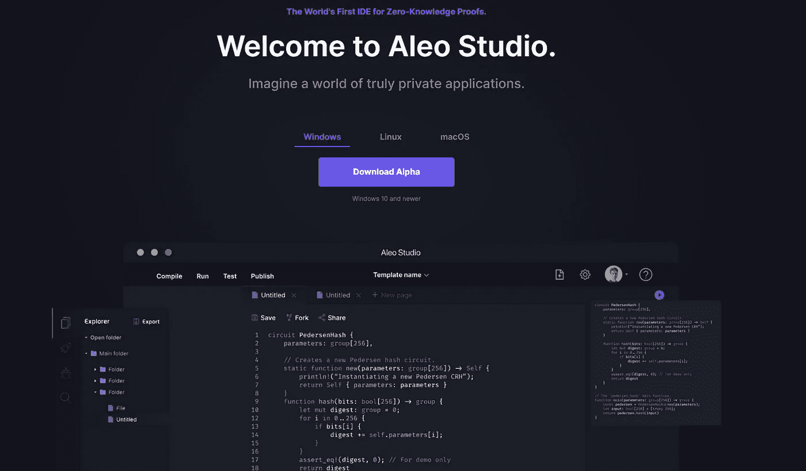
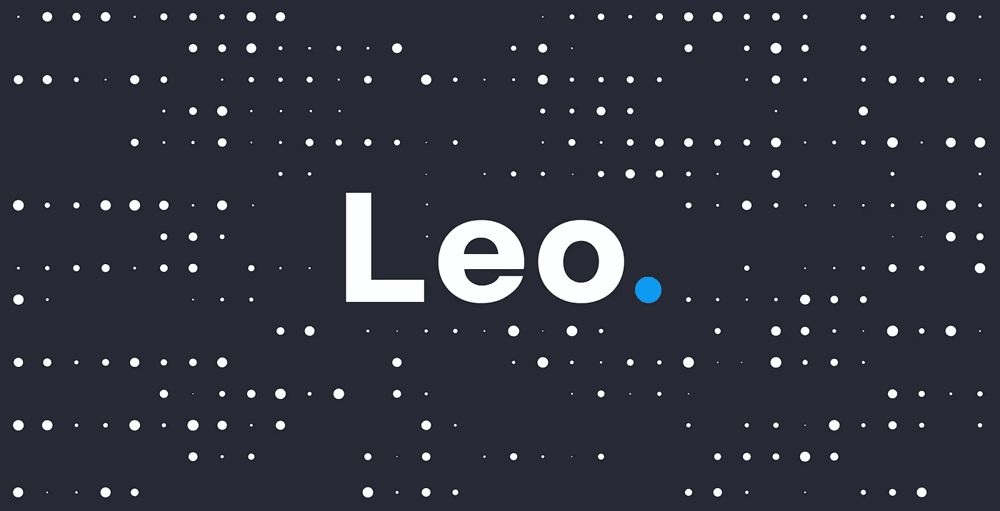
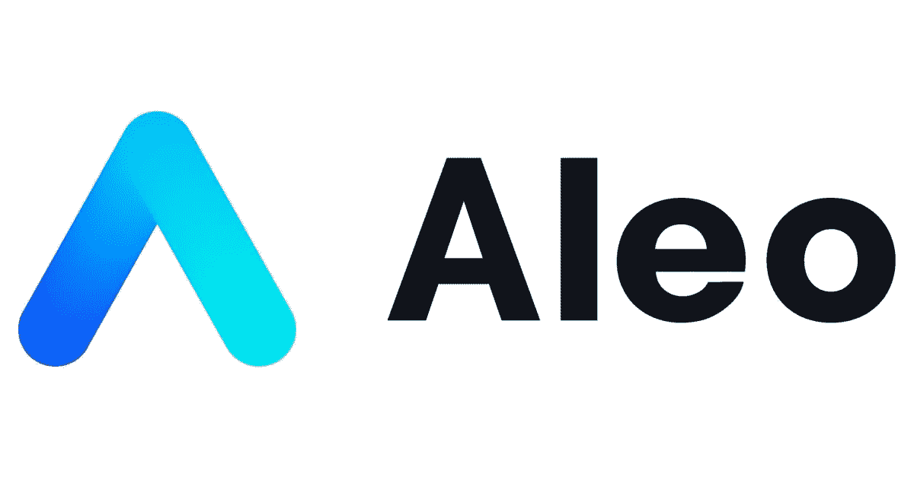
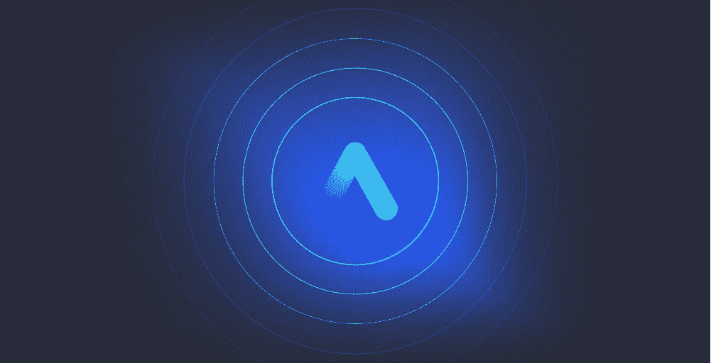

# Aleo:一个传奇的介绍

> 原文：<https://medium.com/coinmonks/aleo-an-introduction-of-a-legend-4c69c05d79ac?source=collection_archive---------2----------------------->

[https://www.aleo.org](https://www.aleo.org)

嘿伙计们！这里我要给大家介绍一个轰动的项目 [**在不久前宣布了大使计划**](https://aleosystems.typeform.com/aleoambassadors?typeform-source=yandex.ru) :)

**是 Aleo** 💎。这是一个平台，你可以用它来创建完全私有的、可扩展的、经济高效的应用程序。高达每秒数千笔交易！

## 支持者:

[https://www.aleo.org/post/aleo-raises-series-b](https://www.aleo.org/post/aleo-raises-series-b)

## **Kora 管理 LP*

## **软银愿景基金 2*

## **老虎环球*

## **海都*

## **三星风险投资*

## **慢创业*

## 安德森·霍洛维茨(a16z)

> Kora Management LP 和 SoftBank Vision Fund 2、Tiger Global、Sea Capital、Samsung Next、Slow Ventures 和 Andreessen Horowitz (a16z)为项目融资提供了帮助，因此项目估计为 14.5 亿美元。
> 
> 在 2021 年 4 月 a16z 领导下的公司进行的 A 轮(价值 2800 万美元)之后，B 轮代表着零知识行业最大一轮的融资。
> 
> [Aleo 还在 B 轮融资中筹集了**2 亿美元，以扩大默认私有的区块链平台。**](http://Aleo Raises $200M in Series B to Expand Private-by-Default, Blockchain Platform)

****

****对于隐私类 app，如何用 leo 语言描述 Aleo？:)****

**Leo 是 Aleo 的开源语言，你已经可以开始构建 dapps 了。**

****

**[https://www.aleo.studio/](https://www.aleo.studio/) join!**

## **🗝Using 零知识密码学，Aleo 将智能合约的执行转移到链外。**

**Aleo 建立在一个开放的公共区块链上，具有以太坊的所有灵活性。这个平台有一个更具可扩展性的架构，在这个架构中，矿工们不需要重新进行每一次交易——只需要检查它的正确性就足够了。**

## **⚒ **Aleo 在互联网上创造了一种既真实又私人的用户体验。****

**很快，web 服务将无处不在，而不仅仅是在浏览器中。他们会开始控制一个人个人生活的每一个私密细节。人们实际上已经不再控制他们在互联网上的数据。正因为如此，**我们的私人生活已经成为公共领域**。**

**互联网提供免费服务来换取个人信息，不管这听起来有多悲伤。许多用户已经开始理解这一点。原来，为了在日常生活中相互交往，网恋者必须用亲密信息为这种交流“买单”。**

****

**🚀Aleo 定义了互联网的新标准。它采用创新的方法来实现**安全、隐私和数据所有权**。用户不再需要牺牲他们永远无法返回的信息，web 服务也不会拿他们的个人数据冒险。**

****服务提供商必须管理因存储、处理或披露不当而危及其业务的机密数据**。Aleo 的开发者认为这是相当有问题的，所以我们迫切需要拿出点东西来！**

****

## **❓Will 互联网将来会默认为私有吗？**

**在过去的十年里，保护用户数据的新技术变得更加实用。用户第一次有了选择。他们不应该放弃对其数据的控制，信息泄露不再是不可避免的成本。**

**网络服务第一次可以使用隐私技术来保护用户，同时扩大他们在互联网上工作的可能性。这种保护隐私的方式将改变我们查看和使用数据的方式。**

**web 服务不是放弃控制，而是谈论它们，但事实上它们将无法查看它们。Web 服务将不再存储机密数据，它们将把自己的工作交还给用户。因此，无论是个人还是服务提供商都不会知道比他们应该知道的更多的信息，并且对个人数据的控制将仍然属于信息的所有者。**

**这种方法重新思考了服务提供的隐私保证以及用户如何看待他们的数据。这样的创新将从根本上改变互联网的工作！**

## **零知识的形成。**

**与现代网络技术不同，零知识加密为安全、合规和公平的网络提供了基础。使用这一原则构建的新网络标准为用户提供了选择，并减轻了数据泄露的后果。**

****

## **🧘🏼现在我们来谈谈好处:**

****零知识让 web 服务安全。****

**现在，其他人可以在设备上散列他们的密码，而不必将密码传输到任何 web 服务，而不必冒用户密码泄露的风险。这不仅节省了设备上的数据，还减少了访问控制的开销，减轻了 web 服务目前必须承担的法律责任。**

****零知识让 web 服务兼容。****

**如今，经纪公司不仅研究用户的完整交易历史，还会了解用户何时进行交易。这些信息的使用权可以出售给第三方。此外，经纪公司的所有者可以拒绝向特定用户提供服务，甚至在交易所替代他们。这是一个严重的尚未解决的问题！**

**用户不能总是希望他们的经纪人会诚实行事，监管者必须有证据证明经纪公司遵守他们的标准。**

**零知识让网络服务变得公平。**

**这些服务不必拥有个人信息来提供有价值的体验。用户应该能够在不访问自己数据的情况下与 web 服务进行交互。**

**例如，如果一家经纪公司的管理人员不能找到他们客户的个人资料，他们就不能锁定任何一个用户，拒绝为他服务或提供不公平的价格。选择权应该属于信息的所有者。**

****今天我们为开发者发布了第二版预览版。****

**为了更容易在 Aleo 上创建应用程序，**开发了一种特殊的编程语言 leo。**默认保证用户数据隐私，在互联网上无缝工作。Leo 是第一种面向零知识水平的正式测试应用程序的编程语言。为了尝试，一个游乐场被推出。该演讲于 2021 年 2 月 7 日在旧金山举行。**

****

## **为什么 Aleo 比其他区块链好？**

> **Aleo 首席执行官兼首席技术官霍华德·吴(Howard Wu)表示:“我们的目标是为下一代去中心化网络应用奠定基础。“我们希望使用零知识证明和区块链等技术，为开发者创造一个生态系统，丰富和增强互联网用户的能力。”**

**Aleo 平台使用一种称为零知识加密的先进技术，允许开发人员创建分散的应用程序，为用户提供个性化的 Web3 服务，而不牺牲对他们个人数据的控制。**

****

**与以太坊等其他区块链不同，Aleo 交易在链外处理，仅由网络节点验证(不执行)。这使得平台能够支持更大的交易量。开发者将能够创建能够解决当前需要集中服务器的复杂任务的应用程序，同时遵守当前的法律。**

**在该团队致力于即将推出的网络的同时，Aleo 将使用最新的资金来开发产品和服务，帮助开发人员创建基于分散网络的生态系统。**

> **“区块链最大的两个挑战是隐私和规模，”Kora Management LP 的创始人丹尼尔·雅各布斯(Daniel Jacobs)说。“Aleo 创建了一个解决这两个问题的基础层，这将有助于催化和开发下一代真正大规模的区块链市场用例，从游戏到 DeFi 等等。”**

**Howard 和他的团队的工作将极大地影响区块链和其他地区的应用程序，保护用户和服务的身份，而不影响支持数亿用户所需的性能。**

> **软银投资顾问公司(SoftBank Investment Advisors)的投资者 Aaron Wong 表示:“随着区块链行业的发展，它正在证明自己有潜力支持一个由可访问性、效率和互操作性定义的数字生态系统。”。**

**开发人员相信，Aleo 创建了一个基础层，将确保未来 Web3 的可扩展性、可靠性和安全性，使其可以用于各种应用程序，如游戏和金融交易。与的领导者 Howard Wu 及其团队的合作对于支持他们创造全新网络体验的使命至关重要。**

**在此轮融资之前，举行了破纪录的 Aleo 创建仪式和令人兴奋的 testnet。**

**Aleo 平台准备在今年晚些时候推出其 mainnet，这将允许开发人员创建具有隐私支持的分散式应用程序。**

****

# **我的联系人:**

*   **[*电报*](https://t.me/Tommmymlt)**
*   **[电报通道(RU)](https://t.me/molotcrypto)**
*   **[*GitHub*](https://github.com/Unlimitedmolot)**
*   **[*推特*](https://twitter.com/Unlimitedmolot)**

# **如何追踪 Aleo？**

**[*推特*](https://twitter.com/aleohq)**

**[*不和*](https://discord.gg/aleohq)**

**[*网站*](https://www.aleo.org/)**

> **加入 Coinmonks [电报频道](https://t.me/coincodecap)和 [Youtube 频道](https://www.youtube.com/c/coinmonks/videos)了解加密交易和投资**

# **另外，阅读**

*   **[itsgap 评审](/coinmonks/bitsgap-review-a-crypto-trading-bot-that-makes-easy-money-a5d88a336df2) | [Quadency 评审](/coinmonks/quadency-review-a-crypto-trading-automation-platform-3068eaa374e1) | [Bitbns 评审](/coinmonks/bitbns-review-38256a07e161)**
*   **[加密复制交易平台](/coinmonks/top-10-crypto-copy-trading-platforms-for-beginners-d0c37c7d698c) | [Coinmama 评论](/coinmonks/coinmama-review-ace5641bde6e)**
*   **[印度的加密交易所](/coinmonks/bitcoin-exchange-in-india-7f1fe79715c9) | [比特币储蓄账户](/coinmonks/bitcoin-savings-account-e65b13f92451)**
*   **[OKEx vs KuCoin](https://coincodecap.com/okex-kucoin) | [摄氏替代度](https://coincodecap.com/celsius-alternatives) | [如何购买 VeChain](https://coincodecap.com/buy-vechain)**
*   **[币安期货交易](https://coincodecap.com/binance-futures-trading)|[3 commas vs Mudrex vs eToro](https://coincodecap.com/mudrex-3commas-etoro)**