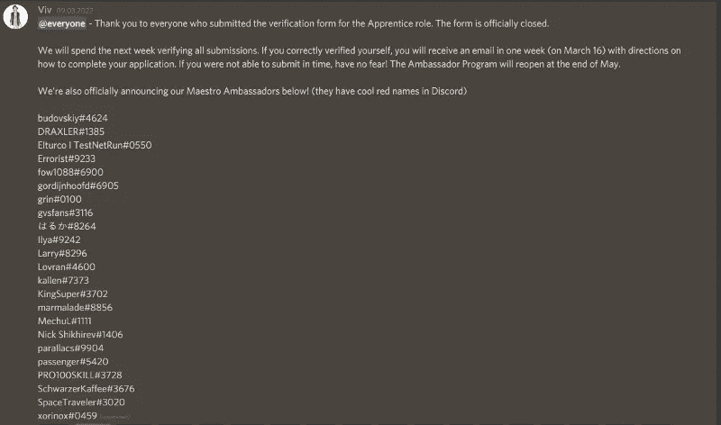
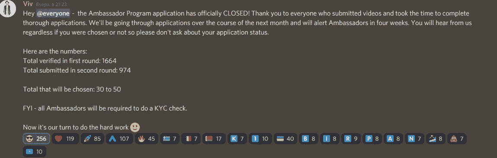
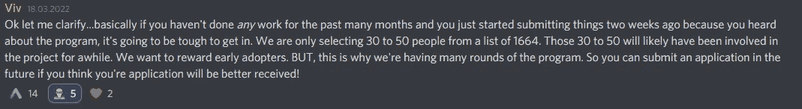
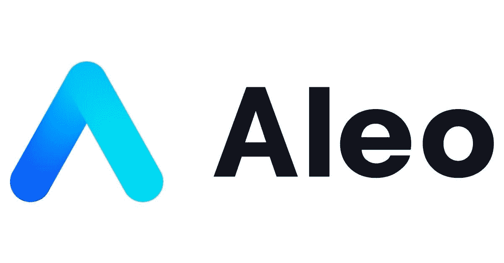

# Aleo:第一批大使

> 原文：<https://medium.com/coinmonks/aleo-first-batch-of-ambassadors-d8f7d5b2eba3?source=collection_archive---------74----------------------->

谁会被选中？

嘿，阿莱奥家族！

这是 Molot#4905，我想和你分享我对第一批大使潜在结果的想法。

让我提醒你，Aleo 的一个大使计划早些时候宣布，其中**30-50 人将成为大使，并在国际社会中代表 Aleo**，以吸引更多的观众参与该项目的活动。未来使用 GPS Aleo 也需要这些用户。

“质量比数量更重要”的原则被反复提及，但并非所有用户都持有相同的观点。

然而，我们也知道其他项目的**顶级大使已经是这里的**大师了。我已经向他们表示了祝贺，我希望他们能够有尊严地为 Aleo 社区服务。

Congratz!

3 月 9 日，我们通过了第一阶段，大约 400 份申请已经被淘汰。

3 月 16 日，只有不到 1000 人申请。

**目前这 974 人有两种方式:**

1.继续造福项目和社区。

2.一切顺其自然，希望被选中。

**我 100%确定，我们需要继续“为了 Aleo 而沉沦”，因为这不仅会增加我们进入当前一波的机会，万一现在失败，也会大大增加进入下一批的机会。**

974 人在争夺最强者的头衔，没有人会放弃。

**Aleo 的团队明确表示，花在项目上的时间和内容的质量将决定你的地位。**

所以，希望你还是有上进心的，没有失去成为大使的愿望。生活中经常有这样的时候，我们不需要放弃并相信自己，所以试一试——一切都会好的！

# 我的联系人:

*   [*电报*](https://t.me/molotcrypto)
*   [*GitHub*](https://github.com/Unlimitedmolot)
*   [*推特*](https://twitter.com/Unlimitedmolot)

# 如何在 Aleo 上追踪？

# Aleo？

[*推特*](https://twitter.com/AleoHQ)

[*电报*](https://t.me/aleorussian)

[*不和谐*](https://discord.gg/aleohq)

[*网站*](https://www.aleo.org/blog)

> 加入 Coinmonks [电报频道](https://t.me/coincodecap)和 [Youtube 频道](https://www.youtube.com/c/coinmonks/videos)了解加密交易和投资

# 另外，阅读

*   [如何获得自己的。XYZ 领域？](https://coincodecap.com/xyz-domain)
*   [最佳加密交换平台](https://coincodecap.com/best-crypto-swap-platforms) | [最佳加密交易所](https://coincodecap.com/crypto-exchange)
*   [购买比特币印度](/coinmonks/buy-bitcoin-in-india-feb50ddfef94) | [Pionex 评论](/coinmonks/pionex-review-exchange-with-crypto-trading-bot-1e459d0191ea) | [加密交易机器人](/coinmonks/crypto-trading-bot-c2ffce8acb2a)
*   [印度的加密交易所](/coinmonks/bitcoin-exchange-in-india-7f1fe79715c9) | [比特币储蓄账户](/coinmonks/bitcoin-savings-account-e65b13f92451)
*   [Cloudbet 赌场评论](https://coincodecap.com/cloudbet-casino-review) | [点火赌场评论](https://coincodecap.com/ignition-casino-review)
*   [币安收费](/coinmonks/binance-fees-8588ec17965) | [僵尸加密审查](/coinmonks/botcrypto-review-2021-build-your-own-trading-bot-coincodecap-6b8332d736c7) | [热点审查](/coinmonks/hotbit-review-cd5bec41dafb)