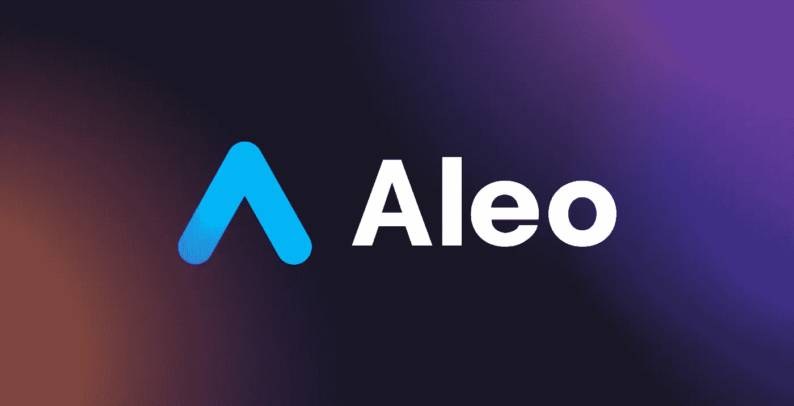

# Aleo:你能做些什么呢？

> 原文：<https://medium.com/coinmonks/aleo-how-can-you-contribute-941b0d1b3a87?source=collection_archive---------23----------------------->

你好朋友！在这篇文章中，我想告诉你如何对 Aleo 项目有价值，这样以后你很可能会被选为大使。

我会马上做出保留，我不能影响团队选择你作为大使的决定，但我相信我的建议会给你更多的机会。

**所以，现在我来告诉你如何持之以恒地让自己更接近这个头衔。**

1.首先，我们需要彻底研究项目本身，了解它的优势，熟悉区块链的特点，它的优势，团队和他们的经验，投资者，合作伙伴。对于这一切，我们需要研究项目的[网站](https://aleo.org)，还要研究[不和](https://discord.gg/qpwjX3TdrM)，尤其是#公告频道。

2.当我们大致了解项目是关于什么的时候，我们需要确定我们的优势，我们的哪些行动会给项目带来最大的利益

2.1 基本上，大使执行下列行动:

a)中庸，回答新人提问，以不和谐为主；

b)制作高质量的视频，我们在其中谈论 Aleo 的优势，为什么这个区块链比其他的更酷，它的主要优势是什么。(因为将来会有一个 testnet，所以我建议也制作一个关于它的视频，但是目前新闻报道很少，你可以只制作一个项目的视频分析)

c)写文章。这类似于 B 点，但是如果你不确定你的编辑能力，我建议从文章开始。这篇文章的主题可以非常不同:预测，潜在的合作伙伴关系，团队分析，令牌组学分析。不如拿一个具体的东西，研究一下，用你的眼光呈现出来；

d)推文。这是一个非常重要的方向，因为 Twitter 目前是影响者的领先平台之一。使用标签。使用图片。提到人，包括名人。这一切，哪怕是潜意识层面的，都会增加人们对 Aleo 的认同。不要小看 Twitter

e)制作令人敬畏的艺术品。如果你不知道如何绘画，可以订购 15-50 美元的作品(根据协议)。我建议你努力创造 Aleo 符号。比如 Aleo 由 A 和 leo 组成。Leo 和 Lion 这个词是一致的。你可以想出一个人物:狮子，是 Aleo 的象征。你会创作出高质量的艺术作品——这将是进一步加分的主要原因；

f)所以我们做了艺术品(或者订购了，有人给我们做了)。接下来我们可以为不和谐或电报制作贴纸。我们也可以订购(价格高不了多少)。我们向表演者详细描述技术任务，以便每个贴纸都有特定的情感。写下你如何看待它以获得最佳结果；

g)想出一首关于 Aleo 的诗。写下来贴在 Twitter 上，或者做一个合适的背景，贴成图片(也在 Twitter 上)。这很酷，根本没有多少人这么做。使用押韵发生器写诗非常容易；

h)如果你会唱，那就唱！并录制一段视频。想出一首歌，按照曲子弹奏，然后与人分享。很朗朗上口；

3.如果你不知道怎么做这些。没什么可担心的，因为任何东西都可以定做。一个大使应该有一个专长，但是当竞争非常激烈的时候，你需要能够立刻做所有的事情(即使你不知道如何做)，并且要有质量地做

4.请记住，你需要用你的灵魂做这一切，尤其是不要犹豫与社区分享，尤其是在 Aleo 社区之外。但是，不要过度，以免感染垃圾邮件。关于 Aleo 的信息传播非常重要。你的观众越多越好，所以努力增加观众，这对大使来说非常重要。

我希望这篇文章能帮助你理解你如何对 Aleo 有价值:)如果我忘记了什么，请写在评论里！。

# 我的联系人:

*   [*电报*](https://t.me/molotcrypto)
*   [GitHub](https://github.com/Unlimitedmolot)
*   [*推特*](https://twitter.com/Unlimitedmolot)

# 如何在 Aleo 上追踪？

# Aleo？

[*推特*](https://twitter.com/AleoHQ)

[*电报*](https://t.me/aleorussian)

[*不和*](https://discord.gg/aleohq)

[*网站*](https://www.aleo.org/blog)

> 加入 Coinmonks [电报频道](https://t.me/coincodecap)和 [Youtube 频道](https://www.youtube.com/c/coinmonks/videos)了解加密交易和投资

# 另外，阅读

*   [密码本交易平台](/coinmonks/top-10-crypto-copy-trading-platforms-for-beginners-d0c37c7d698c) | [Coinmama 审核](/coinmonks/coinmama-review-ace5641bde6e)
*   [印度的加密交易所](/coinmonks/bitcoin-exchange-in-india-7f1fe79715c9) | [比特币储蓄账户](/coinmonks/bitcoin-savings-account-e65b13f92451)
*   [OKEx vs KuCoin](https://coincodecap.com/okex-kucoin) | [摄氏替代度](https://coincodecap.com/celsius-alternatives) | [如何购买 VeChain](https://coincodecap.com/buy-vechain)
*   [币安期货交易](https://coincodecap.com/binance-futures-trading)|[3 commas vs Mudrex vs eToro](https://coincodecap.com/mudrex-3commas-etoro)
*   [如何购买 Monero](https://coincodecap.com/buy-monero) | [IDEX 评论](https://coincodecap.com/idex-review) | [BitKan 交易机器人](https://coincodecap.com/bitkan-trading-bot)