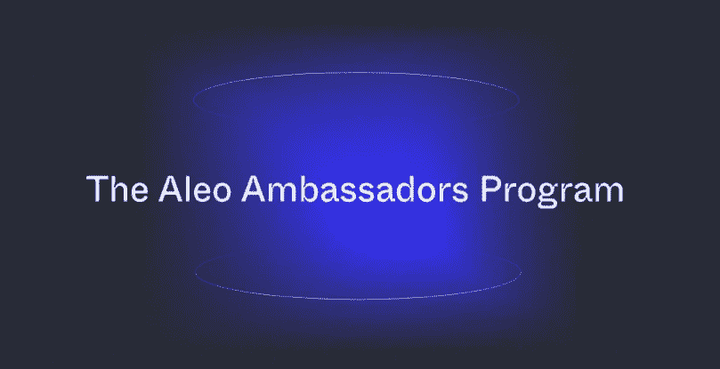

# ALEO。大使遴选的第一阶段结束。

> 原文：<https://medium.com/coinmonks/aleo-the-end-of-the-first-stage-of-the-selection-of-the-ambassador-a18e6de14d6a?source=collection_archive---------59----------------------->

选择并不困难，所需要的是——及时填写表格，这可能是最困难的事情——录制一段视频。其余的都很简单，只需 5 分钟就能完成。

最初，有消息称投票将从 1500 人中进行，最终，团队做出了决定，分配了 2000 人的池。在正确填写了 1700 表格的 2000 人中，竞争已经略有减少。1700 名参与者进入了第二阶段。第二阶段还要求你说明你在区块链各行业的经历，录制一段视频，讲述你的动机，你为什么应该成为大使，以及分享你所做工作的所有链接。在 1，700 名参与者中，974 人成功完成了任务。竞争几乎减半，但仍然相当大。据我所知，只有 10-15 名俄罗斯社区的人会通过。这个很小。

所有结果将在 3-4 周内揭晓。每个参与者都将被告知他的身份:他是否被接受为大使。此外，我想提醒你，团队将有两个以上的选择阶段，很可能与这一阶段完全相同。这将是在五月和八月，所以你现在有很多机会开始做一些工作来增加你在大使计划之前的机会，因为我们知道，团队会评估你为发展他们的社区所做的所有工作。

祝你一切顺利，愿你的头上有一片宁静的天空！

[领英](https://www.linkedin.com/company/aleohq/about/)

[Github](https://github.com/AleoHQ)

[不和](https://discord.gg/aleohq)

[推特](https://twitter.com/aleohq)

[YouTube](https://www.youtube.com/c/AleoHQ)

> *加入 Coinmonks* [*电报频道*](https://t.me/coincodecap) *和* [*Youtube 频道*](https://www.youtube.com/c/coinmonks/videos) *了解加密交易和投资*

# 另外，阅读

*   [3 商业评论](/coinmonks/3commas-review-an-excellent-crypto-trading-bot-2020-1313a58bec92) | [Pionex 评论](https://coincodecap.com/pionex-review-exchange-with-crypto-trading-bot) | [Coinrule 评论](/coinmonks/coinrule-review-2021-a-beginner-friendly-crypto-trading-bot-daf0504848ba)
*   [莱杰 vs n rave](/coinmonks/ledger-vs-ngrave-zero-7e40f0c1d694)|[莱杰 nano s vs x](/coinmonks/ledger-nano-s-vs-x-battery-hardware-price-storage-59a6663fe3b0) | [币安评论](/coinmonks/binance-review-ee10d3bf3b6e)
*   [Bybit Exchange 审查](/coinmonks/bybit-exchange-review-dbd570019b71) | [Bityard 审查](https://coincodecap.com/bityard-reivew) | [Jet-Bot 审查](https://coincodecap.com/jet-bot-review)
*   [3 commas vs crypto hopper](/coinmonks/3commas-vs-pionex-vs-cryptohopper-best-crypto-bot-6a98d2baa203)|[赚取加密利息](/coinmonks/earn-crypto-interest-b10b810fdda3)
*   最好的比特币[硬件钱包](/coinmonks/hardware-wallets-dfa1211730c6) | [BitBox02 回顾](/coinmonks/bitbox02-review-your-swiss-bitcoin-hardware-wallet-c36c88fff29)