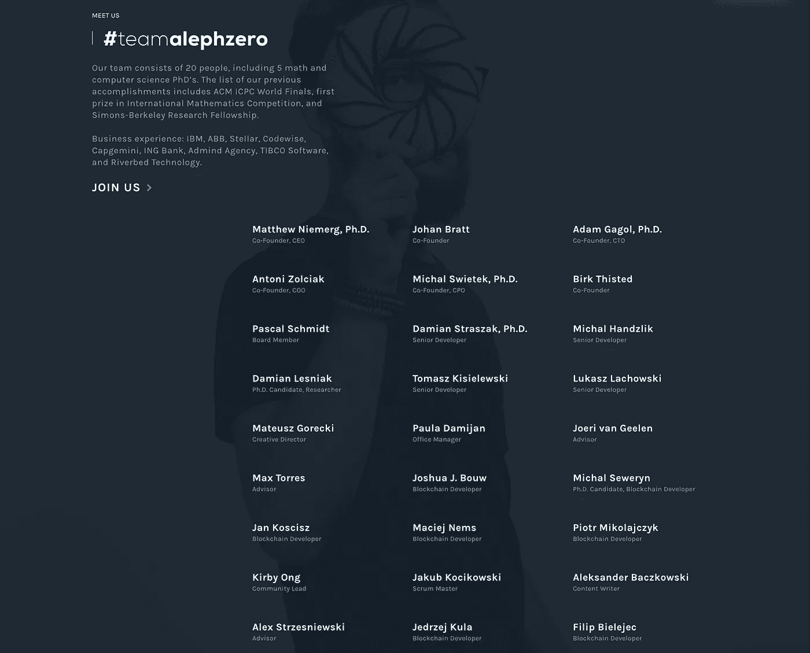

# Aleph Zero |新的第 1 层游戏规则改变者？

> 原文：<https://medium.com/coinmonks/aleph-zero-the-new-layer-1-game-changer-4a328475c4a?source=collection_archive---------5----------------------->

# 介绍

公共区块链提出了许多挑战，这些挑战源于它们的协议的架构设计。这类约束最常见的例子包括速度、验证时间、可伸缩性和安全性。另一方面，其他方面就实现而言不太重要，但仍然是需要的，例如隐私、互操作性、可组合性和业务吸引力。

在我们之前的报告中，我们已经提到了区块链数据结构的主题，根据一些开发人员的说法，这是三难困境的主要原因。

今天，我们将介绍一个名为 Aleph Zero 的新第 1 层协议，该协议旨在创建一个分布式账本系统，可以克服这些限制，同时为客户提供新服务。

# 什么是 Aleph Zero？

Aleph Zero 是一个基于创新的*有向无环图(DAG)的具有增强隐私性的公共区块链，具有 PoS 共识机制和[底层框架](https://alephzero.org/blog/substrate-aleph-zero-consensus/)的交互。*

*Aleph 的新颖的同行评审共识是用基于 ZK-斯纳克斯密码术和安全多方计算(sMPC)的隐私结构开发的:该协议是独特的，因为它主要专注于保护隐私的分布式账本技术(DLT)的创建。该项目旨在为多个领域的现有基础设施障碍提供替代方案，包括 ESG、汽车、物联网(IoT)和医疗保健。*

**

*三个项目组成了 Aleph Zero 生态系统:*

1.  ***Aleph Zero 基础设施层***

*Aleph Zero 是一个第 1 层公共区块链，由创新的异步和拜占庭容错**基于 DAG 的一致协议(**[**AlephBFT**](https://arxiv.org/pdf/1908.05156.pdf)**)**)提供支持。它建立在**利益证明**共识机制之上。AlephBFT 正被整合到衬底堆栈中，以提高采用率。为了对 DAGs 有一个基本的了解，我们已经在关于 AVAX 的最新报告[中介绍了一个技术解释。](/@daolecticresearch/avax-even-the-largest-avalanche-is-triggered-by-small-things-3ea5a94b7525)*

*2. [**阈限层**](https://alephzero.org/blog/liminal-multichain-privacy-layer/) **，隐私层***

*Liminal 是一个本地隐私框架，强调了 ZK-斯纳克法和 T2 安全多方计算的优势。在目前的市场情况下，Limina 的混合解决方案是独一无二的。Liminal 可以作为连接到 Aleph Zero 的其他区块链的独立多链隐私层。*

*Aleph Zero 对 Liminal 所做的事情是真正区分它们的地方。本质上，它是一个 Web 3.0 多链隐私层，可部署在所有主链上。因此，开发者可以利用 Aleph Zero 作为一个生态系统来简单地部署他们的 dApps，或者作为一个层(Liminal)在其他链上使用。*

*它还实现了与其他方连接的定制业务解决方案，并促进了完全分散的分类账结算，验证了集中信息的真实性。它们使用“中心和分支”方法，这使企业能够维护一个分支或私有实例，与主要的分散分类帐进行通信。*

*3.**普通钱包***

*常见的是旨在根除抢注的分散式交易所和暗池。当一个事务在知道一个即将到来的事务的情况下排队时，就会发生抢先运行，前一个事务以后一个事务为代价而受益。*

*如果你想对这一共识有一个大致的了解，Aleph Zero 的联合创始人之一亚当·加戈尔(Adam Gagol)在 2018 年发布了一篇[中期帖子](/aleph-zero-foundation/recycling-the-agreement-distributed-consensus-on-dags-b415e4ebc6d)。*

*可伸缩性被认为是 Aleph Zero 的一个关键特征。根据该项目网站的可扩展性部分，Aleph Zero 的同行评审共识机制(AlephBFT)在一个分散的测试设置中达到了 **89，600 TPS** ，该测试设置有分布在五大洲的 112 个 AWS 节点。[该项目的业务白皮书](https://alephzero.org/wp-content/uploads/A0_BWP.pdf)引用了分布在五大洲 112 个节点的测试环境中的 100，000 个 TPS。*

> *共识机制*

*Aleph Zero 使用 AlephBFT，这是一种经过同行评审的新共识技术:它是一种第 1 层共识机制，驱动公共利益证明(PoS)区块链，即 AlephBFT。*

*Aleph 的原始版本是用 Golang 编写的，但是随着 Aleph 2.0 的更新，它已经与 Rust 和 Substrate 合并了。*

*根据同行评审的技术出版物，创新协议是“基于异步拜占庭容错(ABFT)系统的成熟领域”设计的，这是一种可以容忍异步拜占庭故障的容错系统。*

> ***异步拜占庭容错***

*为了让你深入了解 ABFT，有必要回忆一下拜占庭容错:当所有诚实的节点对一组事务的时间和顺序达成一致(共识)时，分散网络是拜占庭容错的。而不管某些节点是否有意试图通过延迟交易或以其他方式歪曲事实来阻碍共识。这是网络的容错能力，或者说它可以容忍多少恶意节点，同时仍然达成诚实的共识。*

*拜占庭容错的'*异步*'属性解决了一个计时问题。许多拜占庭容错方案假设存在最大消息延迟阈值。*

*ABFT 网络接受通信可能会永远丢失或延迟，假设诚实节点的消息最终会通过。如果一个诚实的节点的通信被无限期延迟，它就更难判断另一个节点是否违反了规则，但这种情况更好地模拟了现实世界中的网络可靠性。*

# *组*

*该基金会位于瑞士楚格的 Crypto Valley，拥有大约 30 名员工，其中许多人都有着出色的学术记录。*

*作为一个瑞士项目，Aleph Zero 希望从世界上最活跃、最受欢迎的区块链和加密国家之一获益，因为瑞士是一个特别友好的加密管辖区。*

*首席执行官**[**Matthew Niemerg**](https://www.linkedin.com/in/matthew-niemerg/)是 Simons-Berkeley 研究员和 IBM 高性能计算卓越中心研究员，他在分布式账本技术方面拥有丰富的专业知识。***

***[**【CC】**](https://cardinals.cc/#hero)管理项目的早期孵化和与项目关键思想相关的科学研究。Cardinal Cryptography 是一个位于波兰克拉科夫的研发团队，负责这项技术。***

***除了技术专长，团队成员还通过与 IBM ABB Stellar Codewise、凯捷、ING Bank、Admind Agency、TIBCO Software 和 Riverbed Technology 等公司的合作获得了宝贵的业务知识。为了完成一个好的项目，这些不同的专业知识是必需的。***

***除了首席执行官 Matthew Niemerg，以下是该团队的一些最重要的成员:***

*   ***[**亚当·加戈尔**](https://www.linkedin.com/in/adam-gągol-b07904154/) 担任公司联合创始人兼首席技术官。他是许多重要研究论文的合著者，这些论文在 Aleph Zero 项目的成功中发挥了关键作用。亚当以优异的成绩毕业于加州大学伯克利分校，获得数学博士学位。***
*   ***[**Antoni Zolciak**](https://www.linkedin.com/in/antonizolciak/) ，Aleph Zero 联合创始人兼首席运营官/首席营销官，在 ing、三星、索尼、奥林巴斯、尼康等知名公司拥有十余年技术营销经验。***
*   ***[**Michal swie tek**](https://www.linkedin.com/in/michał-świętek-40720b168/)**公司的联合创始人兼开发主管，也拥有数学博士学位。*****

*****有趣的是，Aleph Zero 是作为一项学术努力而推出的。创始人[解释了](https://zeroknowledge.fm/episode-203-mpc-and-dags-with-aleph-zeros-adam-gagol-matthew-niemerg/)他们对基于有向无环图的下一代协议感到兴奋，因为与区块链相比，它们具有可扩展性和速度，他们意识到绝大多数系统并没有真正去中心化。*****

**********

# *****$AZERO 及其令牌组学*****

*****该网络的本地公用事业硬币的股票代号是$AZERO。在这里，您可以通过 [CoinMarketCap](https://coinmarketcap.com/currencies/aleph-zero/) 链接跟踪它的发展。*****

*****在 Token Genesis 活动(TGE)期间，团队发行了 3 亿个 Token，初始发行量为 1.8 亿个。TGE 于 2022 年 1 月 27 日举行，通过其在 MEXC 交易所上市。*****

*****项目团队已经收到了瑞士监管机构 FINMA 的不采取行动的信函。根据 A0 的团队，FINMA 已经确认他们的商业模式符合瑞士法律，并表示 AZERO 令牌的发行不受瑞士金融市场立法的任何许可要求的限制。*****

*****令牌的一些实用程序包括:*****

*   *****锁定和验证器节点操作。*****
*   *****为生态系统的服务提供流动性。*****
*   *****对连锁变化进行投票。*****
*   *****为了执行私有计算，对链外工作者进行控制；*****

*****例如，DEX 上的费用减少，以及在隐私层上利用资产包装所需的界限桥和抵押品时的节省。*****

> *****令牌供应:*****

*****AZERO 是一种受通货膨胀影响的象征。作为**赌注奖励**，每年将有预定数量的代币**(3000 万)投入流通。*******

**********

*****团队和基金会都有一年的悬崖，之后有四年的线性归属期，这将导致非常小的通货膨胀。2022 年通货膨胀率将达到 16.7%，2028 年达到完全供应。*****

*****令牌持有者类别有不同的锁定期限和授予日期。密切关注此类发行和授予阶段的时间表至关重要。这将导致通货膨胀，直到全部总供给完全到位。*****

*****整个可行权时间表如下:*****

*   ******预播种:*$ 0.04【5000 万，16.67%】—TGE 50%，15 个月线性 50%。*****
*   ******种子:*$ 0.05714【5000 万，16.67%】—TGE 71.4%，6 个月线性 28.6%。*****
*   ******早期社区:*$ 0.07【1500 万，5%】—14–64 天 100%归属。*****
*   ******公开预售*:0.08 美元至 0.10 美元[5500 万，18.3%] —在 TGE 为 10%至 50%，其余为 12 个月的线性增长。*****
*   ******公共:*$ 0.10[3000 万，10%]—TGE 的 100%*****
*   ******团队:*【30m，10%】—TGE 20%，1 年悬崖，4 年以上线性。*****
*   ******基础*:【70m，23.3%】—TGE 20%，1 年悬崖，4 年以上线性。*****

*****要获得 Aleph Zero network 的验证职位，您必须至少持有 25，000 $AZERO 的股份，并满足硬件标准。*****

*****委员会将由随机挑选的验证者组成。Aleph Zero 打算逐步将委员会的规模增加到 100 名验证员，不想成为验证员的个人将降低股份要求。*****

# *****竞争*****

*****Aleph Zero 的主要竞争对手是其他基于 DAG 的系统。目前， **Fantom** 和 **Hedera Hashgraph** 是最突出的两个。*****

*****值得注意的是，Aleph Zero 的竞争范围更广，包括市场上的大多数智能合约平台。这个领域竞争激烈，人口密集。*****

*****此外，我们还看到了其他具有隐私增强功能的第 1 层网络的引入，如 **Concordium** 和 **ParallelChain** 。*****

*****Aleph Zero 还将与获得许可的区块链竞争商业客户，如最受欢迎的两个商业解决方案 **Hyperledger** 和 **Corda** 。*****

# *****路标*****

*****Aleph Zero 在 2021 年取得了突破性的一年，获得了总计 1500 万美元的融资，并推出了他们 mainnet 的第一个版本。*****

*****尽管 2022 年已经有第一个 DEX 在 MEXC 上市，并且推出了 Aleph Zero Smartnet，但这一年似乎不会放缓。*****

**********

*****以下是他们未来和正在进行的主要里程碑[路线图](https://alephzero.org/roadmap/):*****

*   *****第 3 阶段——实施 **Rust** 中的 **AlephBFT** 共识，本地令牌传输， **polkadot.js** 基于中央控制列表与 A0 和验证器一起运行*****
*   *****阶段 4(现在正在进行):验证者选举、基本的节点更新机制、基本的智能契约功能，以及 Aleph-node 和 AlephBFT 协议的基准。*****
*   *****第 5 阶段将包括社区操作 DevNets、 **bridge 1.0(用于以太坊和草间弥生**)、账户浏览器和自定义网络钱包的能力。*****
*   *****第 6 阶段将包括实验性交易费用、**、桥梁 2.0 (Polkadot、Cosmos 和 BSC)** 、改进的节点更新机制和定制的浏览器等。*****

*****一旦与知名网络的桥梁搭建到位，我们预计将有更多公司在受控交易所和分散交易所上市。*****

# *****结论*****

*****将 Aleph Zero 与其他项目区分开来的无疑是**同行评审**异步拜占庭容错共识机制和基于 ZKPs 和 sMPC 之间**创新链接的 Liminal 解决方案。*******

*****Aleph Zero 是一个免费的开源软件项目。通过提供对 Aleph 软件的免费访问，该项目希望扩展到全世界的开发社区。*****

*****该项目由一个高度专业的团队构建，目标是实现分布式账本技术的主流采用。管理团队打算雇用内部基板开发人员、品牌和内容团队，以及一个外国业务开发团队，所有这些都将由自己的运营部门提供支持。这些方法应该支持他们填补他们所需能力的任何空白。*****

*****尽管如此，对代码库的改进目前是由内部开发团队进行的(考虑到项目的初期阶段，这是合理的)。此外，由于 Aleph Zero 是一个智能合约平台，将来其他项目也可以在它的基础上构建。*****

*****如前所述，未来的开发人员可能会专注于一系列用例。该计划还有一个业务重点，即允许企业使用分布式账本技术创建分散的、可扩展的计划。*****

# *****放弃*****

*****这不是任何情况下的财务建议，我研究的目标将永远是深入项目并从不同角度研究它，我确实包括基于我最近研究的类似项目的经验的个人意见。*****

*****我现在和将来都愿意接受讨论。*****

*******在 Twitter 上关注我们:*******

*******@ Dao Xin*******

*******在投资任何东西之前，请务必做好自己的研究**。*****

> *****加入 Coinmonks [电报频道](https://t.me/coincodecap)和 [Youtube 频道](https://www.youtube.com/c/coinmonks/videos)了解加密交易和投资*****

# *****另外，阅读*****

*   *****[CoinDCX 评论](/coinmonks/coindcx-review-8444db3621a2) | [加密保证金交易交易所](https://coincodecap.com/crypto-margin-trading-exchanges)*****
*   *****[红狗赌场评论](https://coincodecap.com/red-dog-casino-review) | [Swyftx 评论](https://coincodecap.com/swyftx-review) | [CoinGate 评论](https://coincodecap.com/coingate-review)*****
*   *****[Bookmap 评论](https://coincodecap.com/bookmap-review-2021-best-trading-software) | [美国 5 大最佳加密交易所](https://coincodecap.com/crypto-exchange-usa)*****
*   *****[如何在 FTX 交易所交易期货](https://coincodecap.com/ftx-futures-trading) | [OKEx vs 币安](https://coincodecap.com/okex-vs-binance)*****
*   *****[CoinLoan 评论](https://coincodecap.com/coinloan-review) | [YouHodler 评论](/coinmonks/youhodler-4-easy-ways-to-make-money-98969b9689f2) | [BlockFi 评论](https://coincodecap.com/blockfi-review)*****
*   *****[XT.COM 评论](https://coincodecap.com/profittradingapp-for-binance)币安评论 |*****