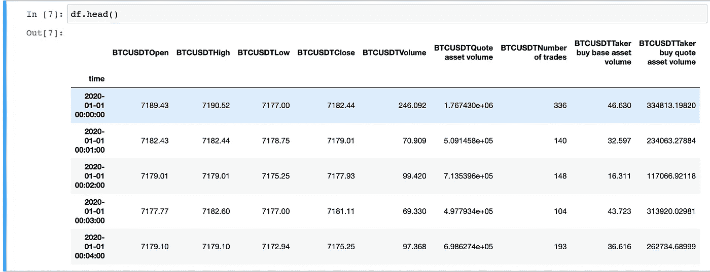
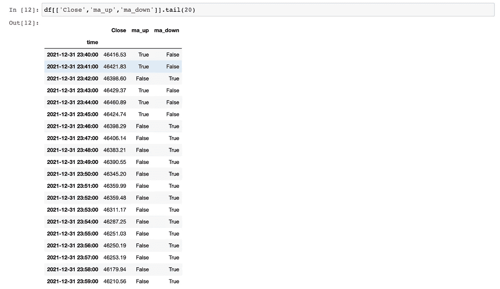
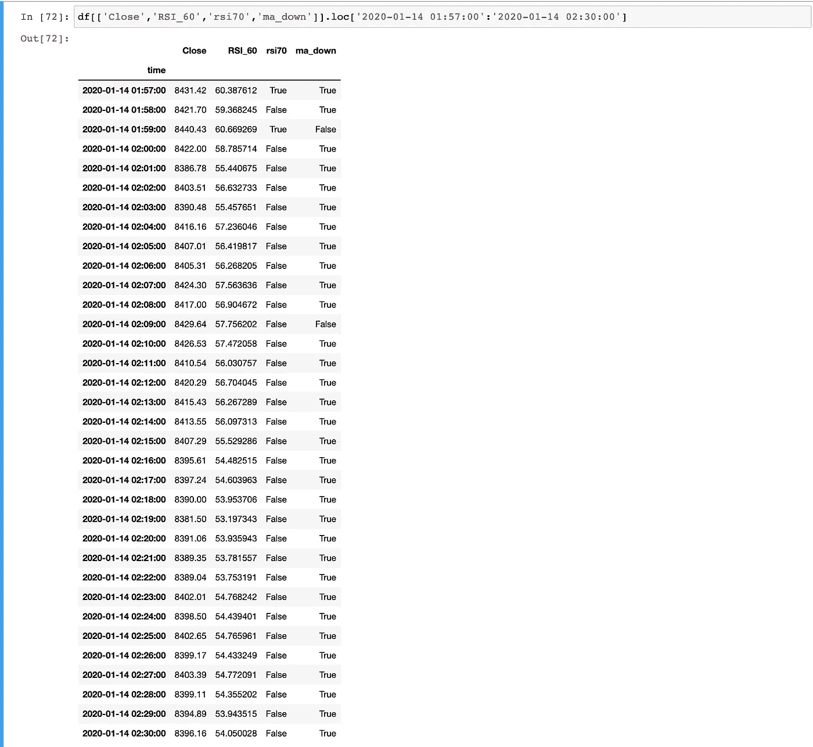
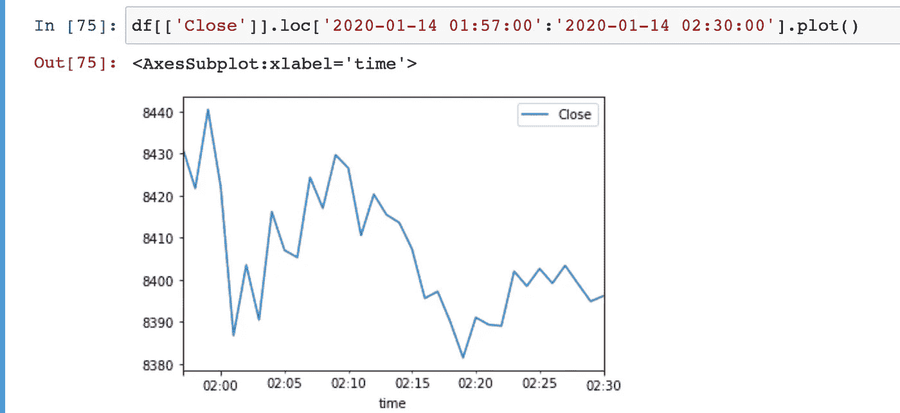
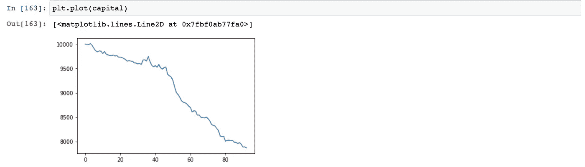
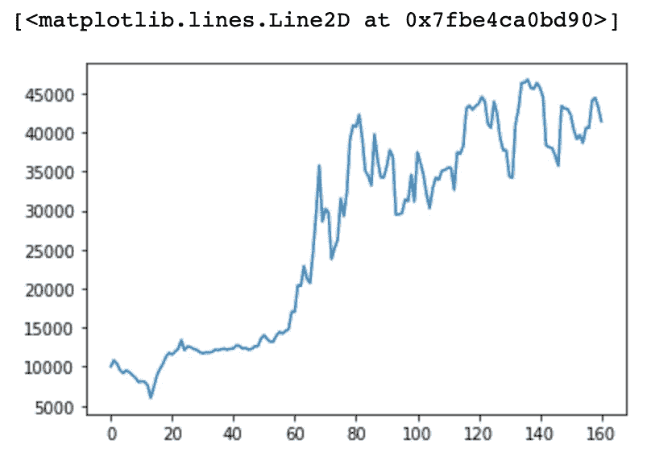

# Python 中的 Algo 交易参数优化

> 原文：<https://medium.com/coinmonks/algo-trading-parameter-optimisation-in-python-c9a0c999d6cd?source=collection_archive---------2----------------------->

在这篇文章中，我将展示如何使用 scikit-optimize 来调整交易策略的参数，并通过一个简单的策略应用 RSI、布林线、均线来说明。他们背后的一些基本原理也将包括在内。

这种策略类似于本文中的策略:

[](https://blog.blockmagnates.com/rsi-and-bollinger-bands-contrarian-strategy-f24cbdb32555) [## RSI 和布林线反转策略

### 我们将研究一种策略，使用 RSI 和布林线加上移动平均线滤波器来产生交易信号。的…

blog.blockmagnates.com](https://blog.blockmagnates.com/rsi-and-bollinger-bands-contrarian-strategy-f24cbdb32555) 

所使用的数据可以像在 [https://medium.com/@Dr .破产/how-to-get-usdt-future-data-from-币安-python-api-13b20d937bdd](/@Dr.Bankruptcy/how-to-get-usdt-future-data-from-binance-python-api-13b20d937bdd) 中那样进行爬取

目的将适用于:

https://scikit-optimize.github.io/stable/install.html

导入包:

```
import numpy as np
import pandas as pd
import matplotlib.pyplot as plt
import pandas_ta as ta
import skopt
```

加载数据:

```
df = pd.read_csv('BTCUSDT-1m.csv', index_col='time', header=0)
df.index = pd.to_datetime(df.index,unit='ms',origin='unix')
df.drop('Close time',inplace=True,axis=1)
df.drop('BTCUSDTIgnore',inplace=True,axis=1)
```



我正在应用 pandas_ta，所以最好将列名改为标准 OHLC:

```
rename={'BTCUSDTOpen':'Open',
     'BTCUSDTHigh':'High',
     'BTCUSDTLow':'Low',
     'BTCUSDTClose':'Close',
     'BTCUSDTVolume':'Volume',
     'BTCUSDTQuote asset volume':'Quote asset volume',
     'BTCUSDTNumber of trades':'Number of trades',
     'BTCUSDTTaker buy base asset volume':'Taker buy base asset volume',
     'BTCUSDTTaker buy quote asset volume':'Taker buy quote asset volume'}df.rename(rename, axis=1, inplace=True)
```

然后我们将插入一个 TEMA 的专栏(60)，有关 TEMA 的更多信息，你可以阅读:

[](https://www.investopedia.com/terms/t/triple-exponential-moving-average.asp) [## 三重指数移动平均线(TEMA)定义

### 三重指数移动平均线(TEMA)的设计是为了平滑价格波动，从而更容易…

www.investopedia.com](https://www.investopedia.com/terms/t/triple-exponential-moving-average.asp) 

我们将检查 TEMA 是向上还是向下移动，因为任何类型的移动平均线的增加通常是上升趋势的指标，因为更多的人在更高的价格买入。

```
ma_len = 60
df['ma'] = df.ta.tema(length=ma_len)
df['ma_up'] = df['ma'] > df['ma'].shift(1)
df['ma_down'] = df['ma'] < df['ma'].shift(1)
```



上图可以感受一下。这是一个众所周知的事实，因此仅仅关注这一点也很难获利。

```
rsi_len = 60
df['RSI_'+str(rsi_len)] = df.ta.rsi(length=rsi_len,append=True)
df['rsi30'] = (df['RSI_'+str(rsi_len)] < 40) & (df['RSI_'+str(rsi_len)].shift(1) > 40)
df['rsi70'] = (df['RSI_'+str(rsi_len)] > 60) & (df['RSI_'+str(rsi_len)].shift(1) < 60)
```

我们在这里添加了一个 RSI 过滤器:如果 RSI 越过一个低值，如 40，基础可能超卖。



rsi70 达到 60 以上后(抱歉我的专栏命名)，ma 也在下降，我们可以看到价格从这一点开始下降:



我们还将添加一个布林滤波器:

```
bb_len = 120
bbsd = 1.0
df.ta.bbands(length=bb_len,std=bbsd,append=True)
df['ma_low'] = df['ma'] <= df['BBL_'+str(bb_len)+'_'+str(bbsd)]
df['ma_high'] = df['ma'] >= df['BBU_'+str(bb_len)+'_'+str(bbsd)]
```

最后，我们定义长信号和短信号，看看它是否顺利

```
df['long'] = (df['rsi30']) & (df['ma_low']) & (df['ma_up'])
df['short'] = (df['rsi70']) & (df['ma_high']) & (df['ma_down'])hold = 30money = 10000
capital = [money]
TP = .2
SL = .2
long = 0
short = 0
entry = 0
com = 0.06/100for i in range(len(df)):
    if money <0:
        break
    if long > 0 :
        if df['Close'].iloc[i] > entry * (1+TP) or df['Close'].iloc[i] < entry * (1-SL) or long == 1 :  
            lot_size = money/entry
            money *= (df['Close'].iloc[i]/entry)
            money -= com*lot_size*(df['Close'].iloc[i]+entry)
            capital.append(money)
            long = 0
        else: long -= 1
    if short > 0 :
        if df['Close'].iloc[i] < entry * (1-TP) or df['Close'].iloc[i] > entry * (1+SL) or short == 1:
            lot_size = money/entry
            money *= (1 + (entry-df['Close'].iloc[i])/entry)
            money -= com*lot_size*(df['Close'].iloc[i]+entry)
            capital.append(money)
            short = 0
        else: short -= 1        
    if df['long'].iloc[i]:
        if short > 0:
            lot_size = money/entry
            money *= (1 + (entry-df['Close'].iloc[i])/entry)
            money -= com*lot_size*(df['Close'].iloc[i]+entry)
            capital.append(money)
            short = 0
        if long == 0:
            entry = df['Close'].iloc[i]
        long = hold
    elif df['short'].iloc[i]:
        if long>0:
            lot_size = money/entry
            money *= (df['Close'].iloc[i]/entry)
            money -= com*lot_size*(df['Close'].iloc[i]+entry)
            capital.append(money)
            long = 0
        if short == 0:
            entry = df['Close'].iloc[i]
        short = hold
if long>0:
    lot_size = money/entry
    money *= (df['Close'].iloc[i]/entry)
    money -= com*lot_size*(df['Close'].iloc[i]+entry)
    capital.append(money)
if short>0:
    lot_size = money/entry
    money *= (1 + (entry-df['Close'].iloc[i])/entry)
    money -= com*lot_size*(df['Close'].iloc[i]+entry)
    capital.append(money)
```



我们可以看到这不是一个好策略。接下来，我们想扭曲一些参数，使战略变得有利可图。

首先，我们定义评估函数

```
def train_evaluate(df,ma_len,rsi_len,bb_len,bbsd,hold,matype):

    #indicator
    if matype == "TEMA":
        df['ma'] = df.ta.tema(length=ma_len)
    elif matype == "VWMA":
        df['ma'] = df.ta.vwma(length=ma_len)
    else:
        df['ma'] = df['Close']

    df['RSI_'+str(rsi_len)] = df.ta.rsi(length=rsi_len,append=True)
    df.ta.bbands(length=bb_len,std=bbsd,append=True)

    #long condition
    df['rsi30'] = (df['RSI_'+str(rsi_len)] < 40) & (df['RSI_'+str(rsi_len)].shift(1) > 40)
    df['ma_low'] = df['ma'] <= df['BBL_'+str(bb_len)+'_'+str(bbsd)]    
    df['ma_up'] = df['ma'] > df['ma'].shift(1)

    #short condition
    df['rsi70'] = (df['RSI_'+str(rsi_len)] > 60) & (df['RSI_'+str(rsi_len)].shift(1) < 60)
    df['ma_high'] = df['ma'] >= df['BBU_'+str(bb_len)+'_'+str(bbsd)]    
    df['ma_down'] = df['ma'] < df['ma'].shift(1)

    df['long'] = (df['rsi30']) & (df['ma_low']) & (df['ma_up'])
    df['short'] = (df['rsi70']) & (df['ma_high']) & (df['ma_down'])money = 10000
    capital = [money]
    TP = .2
    SL = .2
    long = 0
    short = 0
    entry = 0
    com = 0.06/100for i in range(len(df)):
        if money <0:
            break
        if long > 0 :
            if df['Close'].iloc[i] > entry * (1+TP) or df['Close'].iloc[i] < entry * (1-SL) or long == 1 :  
                lot_size = money/entry
                money *= (df['Close'].iloc[i]/entry)
                money -= com*lot_size*(df['Close'].iloc[i]+entry)
                capital.append(money)
                long = 0
            else: long -= 1
        if short > 0 :
            if df['Close'].iloc[i] < entry * (1-TP) or df['Close'].iloc[i] > entry * (1+SL) or short == 1:
                lot_size = money/entry
                money *= (1 + (entry-df['Close'].iloc[i])/entry)
                money -= com*lot_size*(df['Close'].iloc[i]+entry)
                capital.append(money)
                short = 0
            else: short -= 1        
        if df['long'].iloc[i]:
            if short > 0:
                lot_size = money/entry
                money *= (1 + (entry-df['Close'].iloc[i])/entry)
                money -= com*lot_size*(df['Close'].iloc[i]+entry)
                capital.append(money)
                short = 0
            if long == 0:
                entry = df['Close'].iloc[i]
            long = hold
        elif df['short'].iloc[i]:
            if long>0:
                lot_size = money/entry
                money *= (df['Close'].iloc[i]/entry)
                money -= com*lot_size*(df['Close'].iloc[i]+entry)
                capital.append(money)
                long = 0
            if short == 0:
                entry = df['Close'].iloc[i]
            short = hold
    if long>0:
        lot_size = money/entry
        money *= (df['Close'].iloc[i]/entry)
        money -= com*lot_size*(df['Close'].iloc[i]+entry)
        capital.append(money)
    if short>0:
        lot_size = money/entry
        money *= (1 + (entry-df['Close'].iloc[i])/entry)
        money -= com*lot_size*(df['Close'].iloc[i]+entry)
        capital.append(money)

    return money,capital
```

然后，我们定义我们希望使用 skopt 优化参数并优化最终资本的空间:

```
SPACE = [
    skopt.space.Integer(2, 240, name='ma_len', prior='uniform'),
    skopt.space.Integer(2, 240, name='rsi_len', prior='uniform'),
    skopt.space.Integer(2, 240, name='bb_len', prior='uniform'),
    skopt.space.Real(1.0, 4.0, name='bbsd', prior='uniform'),
    skopt.space.Integer(30, 14400, name='hold', prior='uniform'),
    skopt.space.Categorical(['TEMA','VWMA'], name='matype')
][@skopt](http://twitter.com/skopt).utils.use_named_args(SPACE)
def objective(**params):
    score = train_evaluate(df,**params)[0]
    return -1.0 * scoreresults = skopt.forest_minimize(objective, SPACE, base_estimator="RF",n_calls=100, n_initial_points=10,verbose=True,n_jobs=-1)
best_money = -1.0 * results.fun
best_params = results.xprint(best_params)
```

我们有以下内容

```
[130, 20, 74, 2.1550150976202875, 5839, 'VWMA']
```

让我们试试看

```
money, capital = train_evaluate(df, best_params[0],best_params[1],best_params[2],best_params[3],best_params[4],best_params[5])
plt.plot(capital)
```



这样看起来更有希望！当然，这可能是过度配合的结果，这是一个必须认真对待的问题。DYOR！

> 加入 Coinmonks [电报频道](https://t.me/coincodecap)和 [Youtube 频道](https://www.youtube.com/c/coinmonks/videos)了解加密交易和投资

# 另外，阅读

*   [最佳期货交易信号](https://coincodecap.com/futures-trading-signals) | [期交所评论](https://coincodecap.com/liquid-exchange-review)
*   [用于 Huobi 的加密交易信号](https://coincodecap.com/huobi-crypto-trading-signals) | [Swapzone 审查](/coinmonks/swapzone-review-crypto-exchange-data-aggregator-e0ad78e55ed7)
*   最佳[密码交易机器人](https://coincodecap.com/best-crypto-trading-bots) | [购买索拉纳](https://coincodecap.com/buy-solana) | [矩阵导出评论](https://coincodecap.com/matrixport-review)
*   [Coldcard 评论](https://coincodecap.com/coldcard-review) | [BOXtradEX 评论](https://coincodecap.com/boxtradex-review)|[uni swap 指南](https://coincodecap.com/uniswap)
*   [比特币基地评论](/coinmonks/coinbase-review-6ef4e0f56064) | [德里比特评论](/coinmonks/deribit-review-options-fees-apis-and-testnet-2ca16c4bbdb2) | [FTX 评论](/coinmonks/ftx-crypto-exchange-review-53664ac1198f)