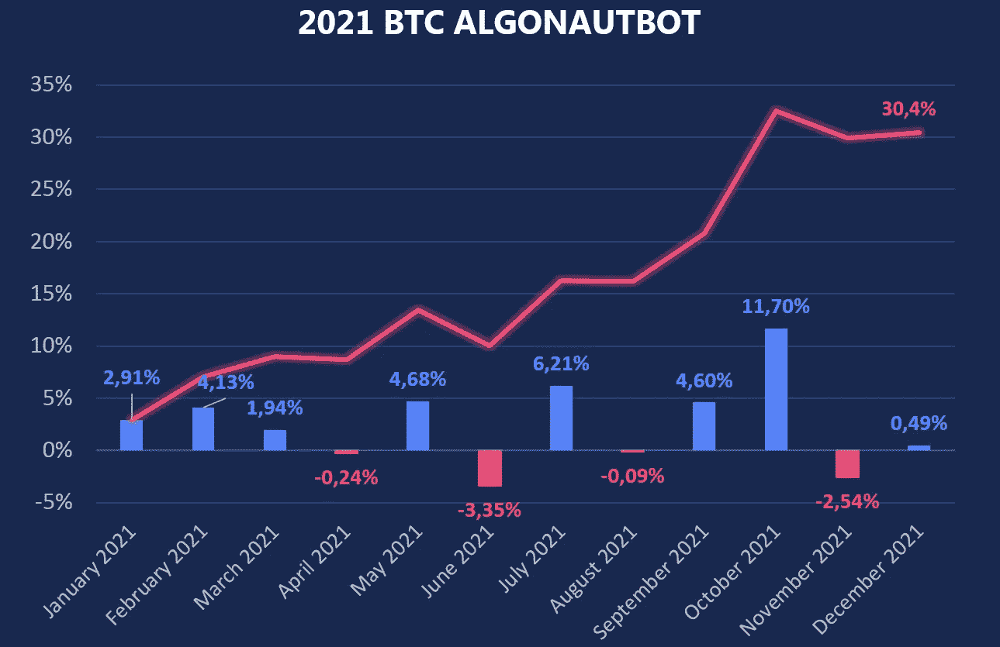

# 2021 年至 2022 年的 AlgonautBot 结果

> 原文：<https://medium.com/coinmonks/algonautbot-results-in-2021-2022-d19d49626a3f?source=collection_archive---------23----------------------->

## 另类硬币时代

2021 年比往年差但仍然盈利:
**BTCUSD+30.4%**
**ETHUSD+68.0%**

有趣的是，ETHUSD 的主要利润在上半年，BTCUSD 的主要利润在下半年。这显示了工具多样化的重要性。

如果我们在 USDT 用抵押品交易，2021 年的回报率是 **97.5%** ，最大下降是-30.6%。下降幅度超过了前几年。我们可能会调整风险水平以获得更稳定的结果。

## 如何稳定成绩？

几个月前，我们还增加了一些替代硬币用于交易，我们计划增加更多(SOLUSD，AVAXUSD，和其他)。加密货币市场正在发展，并将变得越来越有效。这将需要额外的交易工具来降低风险。
对于未来在 USDT 进行抵押品交易的客户，我们希望开发同时交易 5-7 种工具的服务，这将使利润曲线更加平滑。

**2021 年替代币结果如下:**

加密市场传统上是高度相关的资产，但仍然交易多种工具可以降低风险。我们肯定会增加新的替代币来交易。

## 2022

**1 月和 2 月**是比较平淡的月份。Altcoins 表现优于比特币和以太坊:

BTCUSD**+6.1%**
ETHUSD**+3.3%**

XRPUSD**+20.0%**
bn busd**+9.7%**
ADAUSD**+11.3%**
EOS USD**+5.5%**
LTCUSD**+9.6%**

*重要提示:如果交易 2 个以上的工具，建议风险为* ***低***

*AlgonautBot——是加密货币市场中使用自动算法的交易服务——机器人。任何人都可以从他们在交易所的账户连接到机器人，开始赚取高达 140%的年收益。*

*更多关于 AlgonautBot—*【ALGONAUTBOT.COM】

*跟随我们，我们将讨论加密和算法交易。如何创建自己的 bot？如何检查是否有效？如何进行统计分析，预测结果？我们将来一定会报道它。*