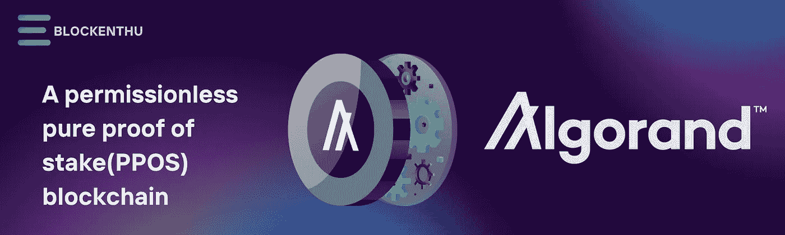
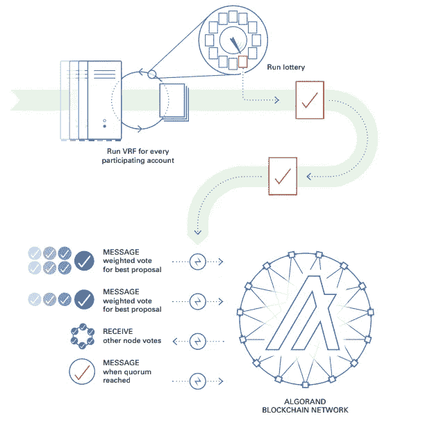
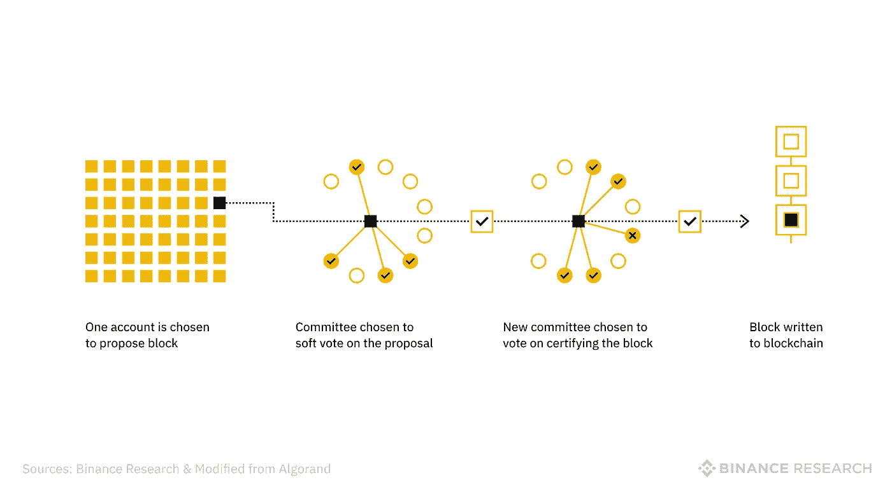
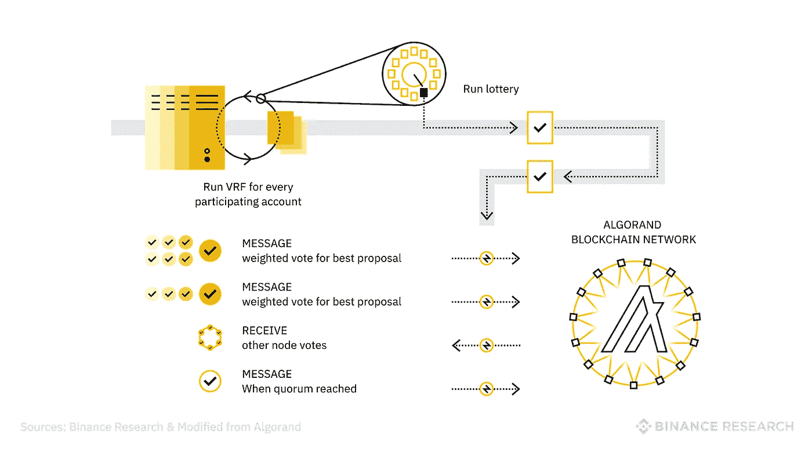
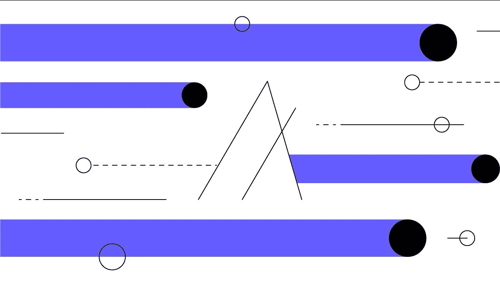

# 阿尔格兰德

> 原文：<https://medium.com/coinmonks/algorand-4018a42025dd?source=collection_archive---------21----------------------->

> 未经许可的纯粹利害关系证明(PPOS)区块链

Algorand 是一个开源的、无许可的、**纯利害关系证明(PPoS)** 区块链协议，用于“下一代金融产品”。因此，Algorand 确保“在一个真正分散的网络中的充分参与、保护和速度”。

Algorand 与大型支付和金融网络竞争，并专注于**工业用例**。此外，algrand 还提供**高度可定制的智能合约** (ASCs)、资产令牌化(algrand 标准资产)以及直接构建在第 1 层的原子转移。

# **简介**

阿尔格兰德是一个相当新的区块链，专注于在不牺牲分散性的情况下提高可扩展性。这个问题是很多第一代和第二代区块链的通病，比如比特币和以太坊。为了实现这一点，Algorand 开发了或许是其最显著的特性:纯粹利害关系证明(PPoS)共识机制。除了被动下注之外，这两个特征都使 Algorand 成为一个大市值项目，受到寻求回报的用户的欢迎。

# **什么是阿尔格兰德？**

Algorand 是一个区块链网络和项目，由麻省理工学院的计算机科学家希尔维奥·米卡利教授在 2017 年创立。mainnet 网络于 2019 年 6 月与其本土加密货币 ALGO 一起推出。如前所述，区块链侧重于提高可伸缩性，并且还支持智能合约。阿尔格兰德网络是一个公共的、分散的、纯利益相关的区块链，支持定制的第一层区块链。这些可用于创建为特定用途定制的区块链。该项目声称其技术对金融服务、分散金融(DeFi)、金融科技和机构特别有用。

# **什么是阿尔格兰德基金会？**

阿尔格兰德基金会是一个非营利组织，成立于 2019 年，资助和发展阿尔格兰德网络。它还在区块链的社区、研究和治理方面开展重要工作。

例如，该基金会在大学中培养开发人员，并通过加速器项目支持其生态系统中的阿尔格朗项目。然而，技术开发工作是由私人公司阿尔格兰德公司进行的。阿尔格兰德基金会也是 ALGO 的大股东，用它来资助自己的活动。

# **algo rand 是如何工作的？**

Algorand 可伸缩性的关键在于其纯粹的利益一致机制的证明。该协议允许 it 快速处理许多事务，而不牺牲分散性。利益证明(PoS)区块链是可扩展的，但通常是以少数验证者为代价的，这些验证者拥有大量的利益，主导着块批准。工作证明(PoW)也有同样的问题，因为大型矿池几乎总是在创造新区块的竞赛中获胜。

相比之下，Alogrand 的 PPoS 共识机制从任何已经下注并生成参与密钥的人中随机选择验证者并阻止提议者。被选中的机会与参与者的赌注占总赌注的比例直接相关。

自然，小持有者被选中的几率会比大持有者低。但与 PoS 区块链不同的是，Algorand 不要求最低持股比例，这对普通用户来说是一个巨大的准入门槛。由于运行一个节点的每一个利益相关者都是可能的验证者，网络的安全性比一组选定的验证者更加分散，例如在委托利益相关证明中。

# **提案步骤**

一旦用户下注并生成了他们的参与密钥，他们就成为了参与节点。这些节点之间的通信通过算法和中继节点进行。然后，区块提议阶段使用可验证的随机函数(VRF)选择多个区块提议者，考虑每个验证者的股份比例。一旦区块提议者被选定，他们的身份将被保密，直到新的区块被提议。这提高了网络安全性，因为不良行为者不能恶意地针对所选择的验证器。但是，提议者可以展示他们的 VRF 产量以及他们提议的区块，以证明他们的合法性。

# **软票阶段**

一旦提交了一个块，随机选择参与节点加入软投票委员会。这个阶段会过滤提议，因此只有一个候选人可以添加到区块链。软委员会的投票权与每个节点的赌注成正比，投票用于选择具有最低 VRF 散列值的提议块。这意味着不可能先发制人地攻击块的提议者，因为最低的 VRF 散列是一个不可能预测的值。

# **报信投票阶段**

接下来，创建一个新的委员会，从软投票阶段开始检查重复支出和交易的完整性。如果委员会认为该作品有效，则添加该区块。如果不是，则拒绝该块，区块链进入恢复模式，并选择新的块。对于提出坏块的领导者没有严厉的惩罚，这使得它成为 PPoS 共识机制中有争议的一部分。与 Algorand 发生分歧的机会非常少，因为一次只有一个 block 提案进入*认证阶段*。一旦添加了该块，所有事务都将被视为最终事务。

# **什么是 ALGO？**

ALGO 是阿尔格兰德的本土硬币，到 2030 年，其总供应量将达到 100 亿枚。新 ALGO 和每个新铸造的积木一起被送到特定的 ALGO 钱包里。您需要在非保管钱包中至少持有 1 ALGO 才能获得这些 ALGO 奖励。这种奖励可以为 ALGO 持有者带来大约 5-8%的 APY，大约每 10 分钟分配一次。这种机制使 ALGO 硬币成为产生被动收入的最简单的加密货币之一，因为你可以“被动地押注”这种代币。

# **ALGO 的用例有哪些？**

像许多其他本地硬币一样，ALGO 有三个主要的使用案例:

1.ALGO 可用于支付阿尔格兰德网络的交易费用。与以太坊(ETH)和比特币(BTC)等网络相比，Algorand 的费用很低。截至 2022 年 1 月，每笔交易仅需 0.0014 美元。

2.可以打赌 ALGO 有机会被选为区块提议者或验证者。

3.ALGO 可以放在一个非保管钱包里，每成功加入一个方块就可以获得奖励。

第三个用例为投资 ALGO 的普通用户提供了巨大的激励。没有必要处理一个分散的应用程序(DApp)来赌你的硬币或锁定期开始赚钱。都是智能合约自动处理的。阿尔格兰德公司还公布了一份采用区块链技术的项目清单，其中许多项目需要使用 ALGO。

# **令牌组学**

ALGO 币是网络的本地货币，也是阿尔格兰德区块链上任何活动的基础。ALGO 在代币生成活动期间铸造的代币上限为 100 亿枚，在 2019 年 6 月 CoinList 上以 2.4 美元的价格首次公开 ICO 期间仅售出 2500 万枚。

私人投资者购买价格与公开价格之间的巨大差异最初造成了巨大的抛售压力，促使该基金会在 2019 年 8 月和 2020 年 6 月为所有受到混乱发行影响的散户投资者提供了两个回购计划，几乎所有的散户投资者都选择赎回，因为它远远高于 ALGO 目前的市场价格。

# **阿尔格兰德生态系统**

碳中和的区块链直到去年才真正加速发展。2020 年初，Algorand 2.0 网络升级引入了一些第一层功能，这些功能构成了区块链核心功能的现有基础，如无状态智能合同、原子传输和 ASA 协议。

然而，正是 2020 年 8 月有状态智能合同的首次亮相为 Algorand 带来了关注，因为它能够服务于目前正在网络之上开发的令人兴奋的新一波 DeFi 项目。在旅程的早期，很少有玩家了解 algrand 的潜力，因为在最初几轮采用中，algrand 与马绍尔群岛建立了合作伙伴关系，以支持其央行数字货币的发行，同时将 USDC 和 USDT 等传统稳定货币集成到网络中，以满足 DeFi 的基本基础。

Algorand 还与意大利最大的文案机构 SIAE 合作，发行了 400 万份 NFT，代表了 95，000 多名创作者和广告客户。这补充了与 planetwatch 的另一个联盟，planet watch 是一种环境监测服务，旨在捕捉数据以操作空气质量传感器，希望维护阿尔格兰德区块链的全球空气质量账本。

# **结论**

Algorand 使用零知识证明算法来解决区块链三难问题。其新的共识机制使该系统既高效又安全，同时又足够分散。理论上，

阿尔格兰德的区块可以在几秒钟内达到最终状态，整个区块链网络的交易吞吐量将与大型金融网络相当。鉴于目前的采用指标，很难想象 Algorand 会对以太坊构成威胁；然而，如果阿尔格兰德公共链完全实现，该项目和整个区块链工业将受益匪浅。

无论从哪个维度分析，项目都不会缺乏市场关注。随着 Circle 等加密公司在阿尔格兰德链上开发解决方案，以及萨尔瓦多政府选择阿尔格兰德作为该国区块链基础设施的主干，长期前景看起来是建设性的。

# 加入我们，轻松进入 WEB 3.0

> *我们的社区*

# WHATSAPP

 [## BLOCKENTHU

### WhatsApp 群邀请

chat.whatsapp.com](https://chat.whatsapp.com/FTKme4XzkOU73ZDv99Oatj) 

# INSTAGRAM

【https://www.instagram.com/blockenthu/ 

# 电报

 [## ⚡·布洛克登胡·⚡

### 可以马上查看并加入@blockenthu。

t.me](https://t.me/blockenthu) 

# 商务化人际关系网

 [## Blockenthu | LinkedIn

### blockenthu | LinkedIn 上有 470 名粉丝。“面向大众的 Web 3.0 福利”加密和区块链| BlockEnthu 是社区…

www.linkedin.com](https://www.linkedin.com/company/blockenthu/) 

使用印度最安全的外汇货币

 [## CoinDCX -加密交易所|购买、出售和交易比特币和顶级替代币

### CoinDCX 是印度最大、最安全的加密货币交易所，在这里你可以买卖比特币和其他…

coindcx.com](https://coindcx.com/) 

# blockenthu # ETH # BTC # coincxpathbreaker #比特币#以太坊# algo # algorand #露娜#区块链

> 加入 Coinmonks [电报频道](https://t.me/coincodecap)和 [Youtube 频道](https://www.youtube.com/c/coinmonks/videos)了解加密交易和投资

# 另外，阅读

*   [BigONE 交易所点评](/coinmonks/bigone-exchange-review-64705d85a1d4) | [电网交易 Bot](https://coincodecap.com/grid-trading)
*   [氹欞侊贸易评论](https://coincodecap.com/anny-trade-review) | [CoinSpot 评论](https://coincodecap.com/coinspot-review)
*   [新加坡十大最佳加密交易所](https://coincodecap.com/crypto-exchange-in-singapore) | [购买 AXS](https://coincodecap.com/buy-axs-token)
*   [投资印度的最佳加密软件](https://coincodecap.com/best-crypto-to-invest-in-india-in-2021) | [WazirX P2P](https://coincodecap.com/wazirx-p2p)
*   [西班牙 5 大最佳文案交易平台](https://coincodecap.com/copy-trading-spain)
*   [Pionex 双重投资](https://coincodecap.com/pionex-dual-investment) | [AdvCash 审查](https://coincodecap.com/advcash-review) | [支持审查](https://coincodecap.com/uphold-review)