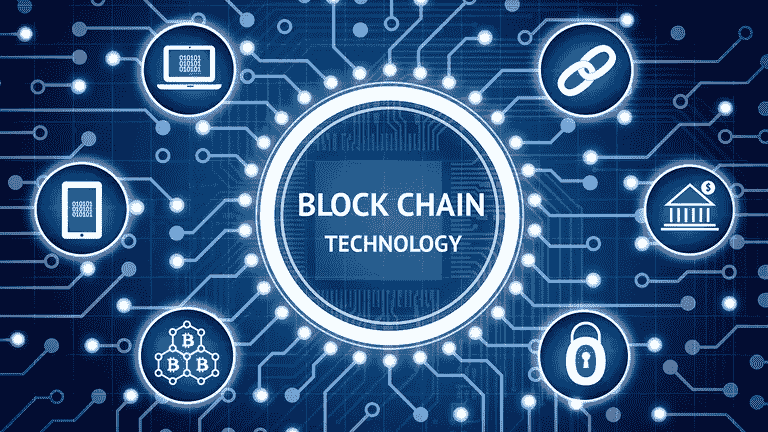
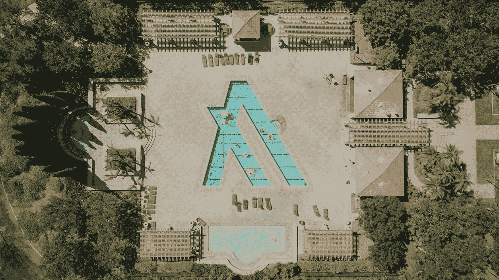
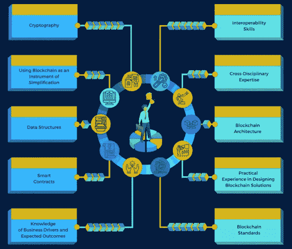
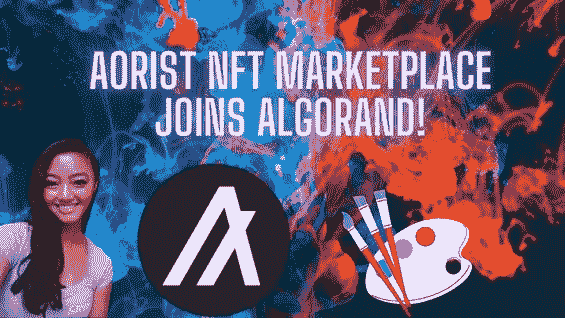

# 阿尔格兰德和企业解决方案

> 原文：<https://medium.com/coinmonks/algorand-and-enterprise-solutions-4fa32aa4174f?source=collection_archive---------19----------------------->

如果你对自己将要做的事情没有任何怀疑，那你就没有给自己足够的压力——**T3【希尔维奥·米卡利】**

*Figure 1.1: Blockchain Ecosystem*

区块链是一项令人兴奋的新技术，有可能颠覆传统的经济和商业范式，堪比蒸汽机和互联网等创新如何刺激了之前的工业革命。它有可能提高各行各业的生产率，包括金融、能源市场、供应链、知识产权管理、“虚拟企业”、公共部门等等。它通过去中介化、提高透明度和增加可审计性来降低交易成本、为当前价值链注入效率、挑战收入模式和打开新市场的能力。区块链在新兴市场经济体中尤其有用。然而，这项技术仍处于早期发展阶段，在广泛采用之前，必须克服大量的技术和监管障碍和危险。可伸缩性、互操作性、安全性、过渡成本、数据隐私和治理都是需要解决的问题。

**什么是阿尔格兰德？**

由于其由麻省理工学院教授希尔维奥·米卡利(顶级计算机科学家和密码学专家)设计的纯利害关系证明(PPoS)算法，Algorand 在加速金融服务革命方面处于独特的地位。

阿尔格兰德是一个区块链平台和一种数字货币。Algorand 平台旨在快速处理各种交易，非常像万事达卡和维萨卡等大型支付处理器。其他加密货币和基于区块链的项目可以托管在 Algorand 上，使其成为比以太坊更全面的解决方案。该平台的本币 ALGO 被用来保护阿尔格兰德区块链，并支付 ALGO 交易的交易费。Silvio 在 2017 年推出了 Algorand，这是一个完全去中心化、安全和可扩展的区块链，作为开发无国界经济产品和服务的共同基础。西尔维奥负责监管所有的阿尔格朗研究，包括理论、安全和加密金融。

*Figure 1.2: Algorand Wallpaper*

分散金融(DEFI)是区块链生态系统中增长最快的行业，但它仍有许多未开发的潜力。区块链生态系统中的开发人员正在为各种金融用例创建复杂的分散式应用程序，旨在创建传统金融机构的可行替代方案。这些应用从简单的交易(如点对点支付)到复杂得多的多方应用，包括贷款、资产交易、保险、交易所、资产令牌化等。金融行业在很大程度上依赖于传统的合同协议，这些协议通常需要可信任的第三方的帮助，以验证是否符合协议随附文件中包含的要求。对今天的金融机构来说，这一体系过时、缓慢，而且最重要的是效率低下。Algorand 的智能合约是记录在区块链上的简单代码行，在满足特定条件时自动运行，允许开发人员创建极具可扩展性、安全性和低成本的去中心化应用。智能合同增加了区块链技术的使用，并促进了整个 DeFi 行业的增长势头。它们是所有区块链开发者的重要工具。

**区块链，一个欣欣向荣的板块。**

企业区块链空间以极快的速度增长。过去 12 个月，收入增长了 3.5 倍，初创企业有望进行首轮和 B 轮融资。经验丰富的创始人领导着坚实的团队，向准备采用区块链解决方案的受过教育的企业销售成熟的产品，这两者的结合推动了增长。

正如下面的 KPI 所示，B2B 区块链初创企业在过去的 12 个月中显著增长。推动这种加速的原因有三个:

(1)区块链初创企业已经磨练了他们的产品市场适应性，并在更短的销售周期内展示了出色的收入增长。为了扩大规模，创始人越来越关注 A 轮和 B 轮融资。

(2)大大小小的企业越来越意识到区块链，并渴望像使用其他技术一样使用它。

(3)经验丰富的企业家、来自世界领先公司的高级管理人员以及经验丰富的开发人员都涌入该行业。

**雇主正在寻找区块链专家。**

令人惊讶的是，根据 LinkedIn 对 2020 年最受欢迎的软硬人才的调查，区块链不仅榜上有名，而且高居榜首。此外，事实上，一家招聘网站报告称，在 2020 年 9 月至 2021 年 7 月期间，加密和区块链招聘广告增长了+116%。此外，该领域的招聘广告已经扩展到传统的采矿和贸易活动之外，公司开始雇用人力资源和营销等辅助角色，这表明该行业正在发展。毫无疑问，雇主会越来越重视理解和应用区块链技术的能力。

*Figure 1.3: Top 10 Blockchain Skills*

**有利于企业解决方案的市场条件。**

在 cryptos 的早期，用于购买、销售和持有 cryptos 的基础设施旨在满足简单的需求，主要是面向散户投资者。从这种零售驱动的需求中获取价值的主要参与者是交易所和托管机构。到 2020 年底，加密世界的总市值从零增长到近 1 万亿美元，这一数字激起了机构资本的兴趣，特别是在已经低收益率的环境下实施货币和财政刺激的时期。在现有的低收益市场环境下，受新冠肺炎问题的经济影响，2020-21 年对加密市场至关重要。市场条件有利于机构资本逐渐进入这一新兴资产类别，与 TradFi(传统金融)相比，DeFi(分散金融)具有诱人的收益率，从稳定硬币(与美元挂钩的加密)的 3-4%到通过提供 DEXes(分散交易所)的流动性的 10%以上。

**顶级行业&企业用例。**

金融科技继续主导着区块链的商业格局。政府和消费者的压力正在推动能源和自然资源领域的采用，食品和农业排在前三位。同样，今年非功能性测试的使用显著增加，许多前景仍然存在。我们也关注新区块链在电影行业、互联网广告和非功能性广告中的应用。

在区块链应用案例方面，fintech 保持了稳固的领先地位。正如去年所见证的那样，金融科技公司继续主导着区块链的商业舞台。这一趋势预计将持续下去，因为金融机构、监管机构和中央银行已经对将区块链技术用于各种应用的概念产生了兴趣，包括取代现金和使老化的基础设施现代化。虽然在西方国家，央行数字货币仍需数年时间，但对于许多现在生产代币或尚未完全自动化支付流程的初创企业来说，它可能会改变游戏规则。能源和自然资源领域以及食品和农业领域的增长是我们今年看到的最重大的变化。客户、最终客户和政府正在向供应商施加额外的压力，要求他们提高透明度、遵守 ESG 要求并最大限度地减少二氧化碳排放。

另一方面，NFT 越来越受欢迎。如果没有听说过 NFTs 或读到新的销售记录，很难度过 2021 年。因此，许多高知名度的投资者纷纷涌向 NFTs 项目，从而产生了非常有吸引力的价值。尽管销量不断上升，但 NFT 最大的统计资源 NonFungible.com 报告称，2021 年第三季度，区块链以太坊有 421，578 个活跃钱包在交易非功能性钱包。虽然 NFT 现在是众所周知的，但是这种数字资产的交换还没有到达一般公众，并且在该领域中仍然有很大的增长空间。

*Figure 1.4: Aorist NFT Marketplace*

*“区块链正在超越加密货币，值得关注——特别是因为成功的原型表明，区块链，也被称为分布式账本技术，将是变革性的。”——****朱丽香***

***继续构造…***

**参考资料:-**

1)[https://ecosystem.algorand.com/](https://ecosystem.algorand.com/)

2)[https://www.algorand.com/resources/blog](https://www.algorand.com/resources/blog)

3)[https://algorand.foundation/governance](https://algorand.foundation/governance)

4)[https://spectrum . IEEE . org/its-a-good-time-to-be-a-区块链开发者](https://spectrum.ieee.org/its-a-good-time-to-be-a-blockchain-developer)

> 加入 Coinmonks [电报频道](https://t.me/coincodecap)和 [Youtube 频道](https://www.youtube.com/c/coinmonks/videos)了解加密交易和投资

# 另外，阅读

*   [如何获得自己的。XYZ 领域？](https://coincodecap.com/xyz-domain)
*   [最佳加密交换平台](https://coincodecap.com/best-crypto-swap-platforms) | [最佳加密交易所](https://coincodecap.com/crypto-exchange)
*   [购买比特币印度](/coinmonks/buy-bitcoin-in-india-feb50ddfef94) | [Pionex 评论](/coinmonks/pionex-review-exchange-with-crypto-trading-bot-1e459d0191ea) | [加密交易机器人](/coinmonks/crypto-trading-bot-c2ffce8acb2a)
*   [n 平均零点评审](/coinmonks/ngrave-zero-review-c465cf8307fc) | [Phemex 评审](/coinmonks/phemex-review-4cfba0b49e28) | [PrimeXBT 评审](/coinmonks/primexbt-review-88e0815be858)
*   最佳[区块链分析](https://bitquery.io/blog/best-blockchain-analysis-tools-and-software)工具| [赚比特币](/coinmonks/earn-bitcoin-6e8bd3c592d9)
*   [Cloudbet 赌场评论](https://coincodecap.com/cloudbet-casino-review) | [点火赌场评论](https://coincodecap.com/ignition-casino-review)
*   [加密套利](/coinmonks/crypto-arbitrage-guide-how-to-make-money-as-a-beginner-62bfe5c868f6)指南| [如何做空比特币](/coinmonks/how-to-short-bitcoin-568a2d0b4ae5)