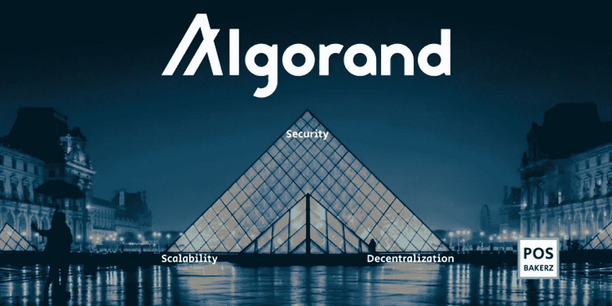

# 阿尔格兰德的价格创历史新高！现在是买 ALGO 的时候了吗？

> 原文：<https://medium.com/coinmonks/algorands-price-is-at-an-all-time-high-is-it-time-to-buy-algo-now-b055816bd349?source=collection_archive---------25----------------------->

Source photo [algorand — Bing images](https://www.bing.com/images/search?view=detailV2&ccid=5m880CKA&id=B7F7628ADCADDC05F4C959FEE5A9BB2B987EB7D2&thid=OIP.5m880CKAnS1qwLZhBoxV4wHaDt&mediaurl=https%3a%2f%2fres.cloudinary.com%2fstartup-grind%2fimage%2fupload%2fc_fill%2cdpr_2.0%2cf_auto%2cg_center%2ch_540%2cq_100%2cw_1080%2fv1%2fgcs%2fplatform-data-algorand%2fblog%2fAlgorand%252520Article%2525202_Q55vD1Q.png&cdnurl=https%3a%2f%2fth.bing.com%2fth%2fid%2fR.e66f3cd022809d2d6ac0b661068c55e3%3frik%3d0rd%252bmCu7qeX%252bWQ%26pid%3dImgRaw%26r%3d0&exph=1080&expw=2160&q=algorand&simid=607994892108771651&FORM=IRPRST&ck=2B8240ECBD9D9E97826EF6ADE2FD2661&selectedIndex=1&ajaxhist=0&ajaxserp=0)

在本帖中，我们将讨论什么是 Algorand 加密货币，并对 ALGO 硬币的价格进行技术分析。

什么是阿尔格兰德区块链项目？Algorand 是一个区块链平台，与以太坊、卡尔达诺和索拉纳有着密切的关系。由 Algorand 驱动的区块链现在每小时可以处理数千笔交易。作为一个…