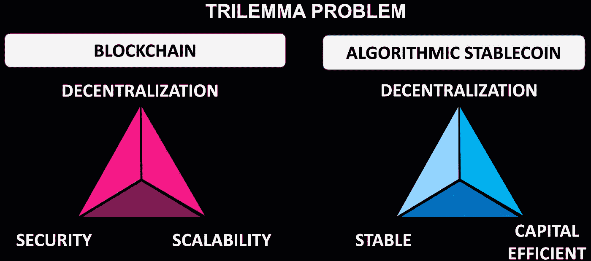

# 阿尔格兰德沉睡的巨人正处于未来的稳定币革命的边缘。

> 原文：<https://medium.com/coinmonks/algorands-sleeping-giant-to-disrupt-the-futuristic-stablecoin-realm-289139b8e855?source=collection_archive---------11----------------------->

区块链战争已经开始，几个玩家争夺全球加密市场的一杯羹。如何赢得这场战争？答案只有一个:创新。然而，就技术、倡议和合作而言，在众多区块链中只有极少数脱颖而出。传统投资者已经在几个生态系统中投入了数百万美元，银行也加大了对区块链业务的关注。

无论发生什么，一个公认的事实是，stablecoin 将很快统治全球，拥有最佳本地 stable coin 模型的区块链平台将繁荣发展。随着 CDP stablecoin 范式的崩溃，算法 stablecoin 协议正在获得广泛的流行。

最近，每个区块链都开始特别关注稳定币的概念，并努力确保它们的成功。为数不多的杰出例子包括来自区块链附近的 USN 和来自区块链的 USDD。

值得注意的是，在最近的稳定新闻中缺席的是**阿尔格兰德**，主要的**CDBC**竞争对手。然而，在阿尔格兰德生态系统中有一些被称为元素的秘密项目的微小传闻。

元素是阿尔格兰德的吗？这篇文章将揭示构建这个关键问题的答案的许多方面。

**揭开团队元素背后的本质**

为了证明该计划的弹性，ELEMENT 在去年 11 月 2021 年赢得了亚洲可持续未来经济 Algorand Hackathon 竞赛，并且基于 GitHub 活动，该团队在两年多的时间里一直在开发新的 stablecoin 平台，有超过 1000 个提交。

**适马实验室(**又名玻色子实验室 **)** 是 project ELEMENT 背后的公司，被 eMerge 评为美国百强企业之一。不仅如此，适马实验室还被 TampaBay 评为银行业 16 大下一代金融科技公司之一。

此外，阿尔格兰德基金会已经批准了项目元素 **$25 万**以加速协议的发布。图灵奖获得者希尔维奥·米卡利的创意产品 Algorand 总是比传统的金融科技选择更胜一筹；因此，从算法的角度来看，ELEMENT 超越 stablecoin 的道路是显而易见的。

**TAU 协议概述**

适马实验室设计了一个名为 TAU 的新模型，这是一个新颖的分数 DeFi stablecoin 协议，它保留了独立于市场方向的购买力，以打击价格稳定。理论战争测试证明 TAU 比任何其他现有的十亿美元协议更稳定，更节省资本。

TAU 协议如何革新 Stablecoin 领域？

对区块链来说，同时实现去中心化、安全性和可扩展性是一个众所周知的挑战。稳定的货币体系，如区块链科技，同时与去中心化、稳定性和资本效率作斗争。过去几年里，人们提出了几种解决方案，但都没有奏效。

为了应对这些挑战， **TAU 协议**开创了一种新的范式，通过结合多种稳健的博弈论经济学来解决一些问题和危险，即所谓的“稳定币三难困境”问题。

更简单地说，TAU 是一种非稀释算法分数稳定协议，通过其革命性的自主需求供应平衡器(ADSB)稳定算法，在一个名为 ELEMENT 的封闭生态系统中使用弹性供应调整、燃烧和结合机制，来正交管理价格动态。

**元素概述**

ELEMENT 是一个基于 Algorand 区块链的多维 DeFi 平台，采用最新的 Web 3.0 架构来发布资本高效的算法稳定积分。

此外，ELEMENT 生态系统渴望成为一个由电子支持的稳定币投资组合，这是将算法分数稳定币动态与 DeFi 2.0 标准合并的首批协议之一，以在加密经济中提供**清算免费贷款和零费用兑换服务**。这两项协议将成为资本效率、稳定性、无风险贷款和流动性的垫脚石，为人民带来更加稳健和开放的金融未来。

此外，ELEMENT 还得到了顶级投资公司的支持，这些投资公司由传统银行机构和 Algorand 的顶级企业家组成。

**解决加密市场难题**

除了三难问题，ELEMENT 还试图解决现有加密业务面临的以下四个关键问题。

*购买力损失(美元通胀* ) —正如预期的那样，由于过去 18 个月前所未有的货币创造，CPI 美元通胀图处于 30 年来的最高水平。大多数法定支持的加密稳定货币都与美元挂钩，这使它们面临与美元相同的“通胀属性”。

*Defi 清算损失(抵押品波动)* —由于市场过度波动，清算损失是投资者不可避免的风险。

*资本无效率(超额抵押)* —用户必须存入至少 150 美元(即，面值的 150 %)来造币或在 DeFi 平台上借入价值 100 美元的 Stablecoin，这既低效又危险。

*公用事业服务的可持续性(缺乏采用)* —虽然 stablecoin 协议渴望成为去中心化金融生态系统的储备货币，但由于缺乏作为能够长期维持钉住的可靠公用事业的关键可接受性，大多数协议都失败了。

**引入多币种挂钩模型**

大多数全球日常本地贸易都需要一种与本国货币挂钩的稳定货币。因此，至关重要的是要有国别稳定的货币，以促进区域内和区域间的贸易。ELEMENT 旨在通过一个支持多个国家的多维稳定货币平台来满足基本的地区货币需求。

从长远来看，ELEMENT 的 Stablecoin 作为一个服务平台将使用 Algorand 的 co-chain 架构，并作为未来贸易融资和中央银行数字货币(CDBC)需求的一站式商店。

**最终判决**

虽然阿尔格兰德生态系统的 stablecoin 项目可能看起来是当前区块链宇宙中有趣的一面，但你忽视它们前所未有的未来潜力是错误的。融合了 Web 3.0 架构和资本高效的算法稳定性，ELEMENT 成为 Algorand 计划的先驱。

凭借其增强的技术能力，TAU 支持的革命性 Stablecoin DeFi 基础设施为未来的金融运营奠定了基础，并解决了加密货币行业最严重的 stablecoin trilemma 问题。此外，ELEMENT 还通过引入区域银行交易要求来解决当地国家面额市场的困难，首先是利用全球第二大加密市场——印度，该市场最近开始支持加密。

这些前景看起来很有希望，对吗？这仅仅是个开始，因为更多的内容将会在未来为 ELEMENT 揭开面纱。通过以下数字渠道，不要错过 ELEMENT 即将推出的任何创新:

拨款:[https://algorand.foundation/news/element-defi-grant](https://algorand.foundation/news/element-defi-grant)

网址:[https://www . elementfi . io](https://www.elementfi.io/)
不和谐频道:[https://discord.com/invite/urquv6EWYs](https://discord.com/invite/urquv6EWYs)
推特:[https://twitter.com/elementdefi](https://twitter.com/elementdefi)
媒体:[https://medium.com/@elementdefi](/@elementdefi)
Reddit:[https://www.reddit.com/r/elementfi](https://www.reddit.com/r/elementfi)
GitHub:[https://github.com/BosonLabs](https://github.com/BosonLabs)
电报频道:[https://t.me/ElementDeFi](https://t.me/ElementDeFi)
git book:[https://docs . elementfi . io](https://docs.elementfi.io/)

领英:[https://www.linkedin.com/company/sigmalabs](https://www.linkedin.com/company/sigmalabs)

> 加入 Coinmonks [电报频道](https://t.me/coincodecap)和 [Youtube 频道](https://www.youtube.com/c/coinmonks/videos)了解加密交易和投资

# 另外，阅读

*   [最佳加密分析或链上数据](https://coincodecap.com/blockchain-analytics) | [Bexplus 评论](https://coincodecap.com/bexplus-review)
*   [NFT 十大市场造币集锦](https://coincodecap.com/nft-marketplaces)
*   [AscendEx Staking](https://coincodecap.com/ascendex-staking)|[Bot Ocean Review](https://coincodecap.com/bot-ocean-review)|[最佳比特币钱包](https://coincodecap.com/bitcoin-wallets-india)
*   [Bitget 评论](https://coincodecap.com/bitget-review) | [双子星 vs BlockFi](https://coincodecap.com/gemini-vs-blockfi) | [OKEx 期货交易](https://coincodecap.com/okex-futures-trading)
*   [美国最佳加密交易机器人](https://coincodecap.com/crypto-trading-bots-in-the-us) | [经常性回顾](https://coincodecap.com/changelly-review)
*   [在印度利用加密套利赚取被动收入](https://coincodecap.com/crypto-arbitrage-in-india)