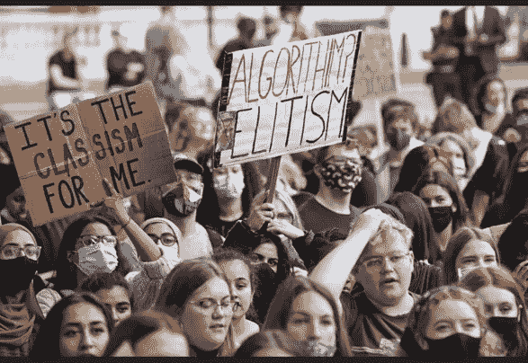
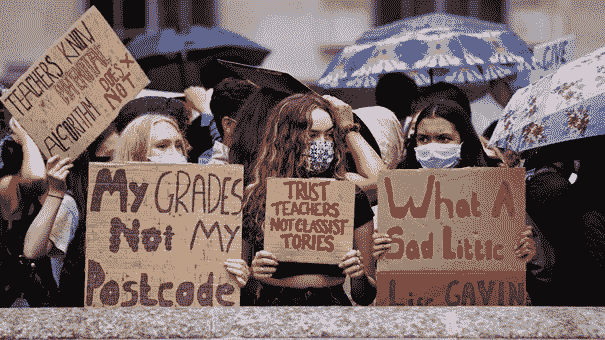

# 算法？精英主义！

> 原文：<https://medium.com/coinmonks/algorithm-elitism-9d5797aa94b2?source=collection_archive---------31----------------------->

***……软件在老师的评价下通过计算来玩弄学生的未来，有多准确？***

由于席卷全球的疫情，2020 年英国大学入学考试被取消。政府承诺通过使用基于人工智能的 A-Level 算法公平计算分数，该算法将在学生申请大学期间使用，而不是考试。当分数公布的那一天到来时，35%的学生的分班分数比他们老师的评估分数低一分。这些学生大多生活在低收入社区或农村地区。算法的工作逻辑是为每个学生录入数据后进行计算，但是数据集很多，包括同班其他学生的成功情况，该学生的考试成绩，以及往年该校其他学生的成绩，该校的分班率。从而*、* ***软件在老师的评价下通过计算来玩转学生的未来有多准确？***

Ofqual 是一款基于人工智能的软件，它通过处理输入的输入来获得结果，这要归功于其开发者向它展示的深度学习能力。这些输入越详细，算法的成功率就越高。所有这些数据，比如学生过去一年的成绩，那个学校其他学生的成绩，那个学校过去几年的成功率，增加了算法的成功率却让结果远谈不上公平。

Teachers know potential, algorithm does not — Trust teachers not classist tories

**发生或可能发生不平等的情况**

*“信任我们的老师，不歧视数据；我们的老师了解我们，而不是算法。”被写在抗议学生举着的横幅上。*问题的主要来源是今天最需要讨论的话题；授权人工智能改变学生的成绩，尽管老师评估。对同一问题的另一个担忧是在评估工作申请时使用人工智能。

***雇主希望根据输入到人工智能中的输入来选择最合适的候选人，但人工智能将如何选择最合适的候选人？***

Solon Barocas 和 Andrew D. Selbst 在 2016 年发表在《加州法律评论》上的文章中进行了模拟，他们从不同的角度看待大数据的影响。使用人工智能输入，哪些员工上班迟到，多久一次，有哪些因素；它对此进行评级，并根据结果评估候选人的申请。诸如因为居住在城市之外而上班迟到的员工的统计数字、没有中介而由于公共交通而上班迟到的员工的统计数字、以及因为居住的地区位于城市的较低部分而因为公共交通系统不发达而上班迟到的员工的统计数字在这个比率中起作用。那些经济条件不太好，住在城外或城市较低地区的人。

巴罗卡斯和塞尔伯斯特指出，人工智能有两种辨别方式。第一个是人工智能对有偏差的数据进行工作，另一个是它对有偏差的数据进行学习。80 年代在英国发生了一件事，同样的事情也发生在 Ofqual A-Level 算法上。一个计算机程序被编码来为医学院选择学生，数据集被输入到计算机程序中，这是过去几年的学生选择数据，是以一种有偏见和分离主义的方式制作的。这个节目歧视妇女和移民。

Ofqual 事件和 80 年代的这种情况说明人工智能工作的数据在人工智能的工作中会产生歧视。在工作应用方面，输入算法的数据中会有犯罪数据。这些数据中难民的高犯罪率将导致人工智能中的学习，即难民容易犯罪，并将导致申请工作的难民被淘汰。在亚马逊的例子中，人工智能开发了一个学习模型，该模型认为女性员工会因上传到算法的数据集而失败，尽管申请该工作的女性候选人简历很好，但人工智能因其性别而淘汰了这些候选人。

pixabay

**人工智能非歧视的建议解决方案**

欧洲委员会反歧视小组在 2018 年编写的报告中指出，应改进现有的反对人工智能歧视的法规，并向人工智能用户和开发者提出建议。同样在 2020 年，有人指出，为了努力实现 CAHAI 制定的人工智能法规，应确定某些红线，应改进现有法规，并应制定关于人工智能的新法规，以防止歧视。在反歧视股 2018 年编写的报告中指出，反歧视和保护个人数据的规定将保护人们免受人工智能的歧视。然而，有人补充说，反歧视条例目前的形式是不够的，因此需要更新。同样，CAHAI 的工作指出，应更新人权并创造新的权利，以便提供保护。

在反歧视小组的建议标题下的报告中，他们表示，应该始终监控人工智能用户，以便他们有组织，没有对平等和人权的攻击。还补充说，在开展这项活动时，学院和当局应共同努力。另一方面，在 CAHAI 准备的报告中，对人工智能开发和使用过程中人的数据的使用，以及人工智能的评价和评分，划了一条直接的红线。还有人指出，数据安全和隐私应作为人权受到监管，人工智能研究和研究结果的透明度应转化为一项权利。人工智能如何工作，它遵循什么样的逻辑，什么影响它的工作原因，以及它对结果产生什么样的变化，都应该得到阐述，这些方面的透明度也应该成为一项人权。

**结论**

我不知道他们是否预见到艾伦·图灵(Alan Turing)开发克里斯托弗(Christopher)或约瑟夫·韦岑鲍姆(Joseph Weizenbaum)开发伊莱扎(Eliza)的这些日子，但这项技术，他们随后解决问题的第一枚钉子，今天开始产生歧视。人工智能开发者的共同目标是赋予机器感知、学习、思考、推理、解决问题、推理的能力，这使我们成为这个星球上最聪明的生物，他们在这方面取得了巨大的进步，但有些东西被遗漏了，如果今天所说的这些担忧是有原因的话。如果找不到解决方案，图灵最先钉钉的这项技术，将来会造成很大的问题…

[*你可以访问链接阅读土耳其语的文章……*](https://www.ikonionhukukvekariyerdernegi.com/post/yapay-zeka-ve-etik)

**参考文献:**

1.  [对人工智能系统的调控，CAHAI 阿夫鲁帕·孔塞伊，2020 年](https://www.coe.int/en/web/human-rights-rule-of-law/-/towards-regulation-of-ai-systems-new-cahai-publication)
2.  [歧视、人工智能和算法决策，欧洲委员会，2018 年](https://rm.coe.int/discrimination-artificial-intelligence-and-algorithmic-decision-making/1680925d73)

**3。**加州法律评论，大数据的不同影响；索隆·巴罗卡斯 ve Andrew D. Selbst，2016

**4。**[https://www.nature.com/articles/d41586-019-00505-2](https://www.nature.com/articles/d41586-019-00505-2)

**5。**[https://www . wired . com/story/an-algorithm-determined-uk-students-](https://www.wired.com/story/an-algorithm-determined-uk-students-grades-chaos-ensued/)

[成绩——混乱——接踵而至/](https://www.wired.com/story/an-algorithm-determined-uk-students-grades-chaos-ensued/)

> *加入 Coinmonks* [*电报频道*](https://t.me/coincodecap) *和* [*Youtube 频道*](https://www.youtube.com/c/coinmonks/videos) *了解加密交易和投资*

# 另外，阅读

*   [AscendEx 保证金交易](https://coincodecap.com/ascendex-margin-trading) | [Bitfinex 赌注](https://coincodecap.com/bitfinex-staking) | [bitFlyer 审核](https://coincodecap.com/bitflyer-review)
*   [麻雀交换评论](https://coincodecap.com/sparrow-exchange-review) | [纳什交换评论](https://coincodecap.com/nash-exchange-review)
*   [支持卡审核](https://coincodecap.com/uphold-card-review) | [信任钱包 vs 元掩码](https://coincodecap.com/trust-wallet-vs-metamask)
*   [Exness 回顾](https://coincodecap.com/exness-review)|[moon xbt Vs bit get Vs Bingbon](https://coincodecap.com/bingbon-vs-bitget-vs-moonxbt)
*   [如何开始用加密贷款赚取被动收入](https://coincodecap.com/passive-income-crypto-lending)
*   [加密货币储蓄账户](/coinmonks/cryptocurrency-savings-accounts-be3bc0feffbf) | [加密交易机器人](https://coincodecap.com/best-crypto-trading-bots)
*   [BigONE 交易所评论](/coinmonks/bigone-exchange-review-64705d85a1d4) | [CEX。IO 审查](https://coincodecap.com/cex-io-review) | [交换区审查](/coinmonks/swapzone-review-crypto-exchange-data-aggregator-e0ad78e55ed7)
*   [最佳比特币保证金交易](/coinmonks/bitcoin-margin-trading-exchange-bcbfcbf7b8e3) | [比特币保证金交易](https://coincodecap.com/bityard-margin-trading)