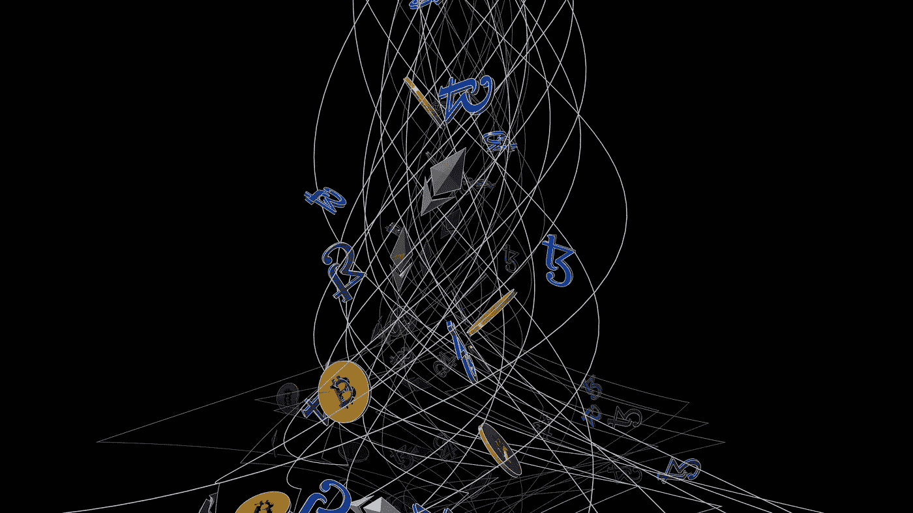

# 算法和抵押稳定资本

> 原文：<https://medium.com/coinmonks/algorithmic-and-collateralized-stablecoins-e4fb62a5c5a4?source=collection_archive---------36----------------------->

[https://unsplash.com/@theshubhamdhage](https://unsplash.com/@theshubhamdhage)

加密货币的成功源于其真实世界的用例，为社会采用金融系统的范式转变创造了不同的方式。Stablecoins 几乎是区块链领域最成功的用例，它将法定货币的价值转化为数字代币。稳定货币是加密货币，其价值与其他储备资产挂钩，如黄金和白银等大宗商品，或美元等法定货币。像系绳(USDT)和美元硬币(USDC)这样的流行硬币保持美元储备，以 1:1 的比例兑换代币。

稳定币允许投资者保护他们的利润免受加密市场波动的影响，而无需将他们的代币兑换回法定美元。如果比特币的价格为每枚 40000 美元，交易 BTC/USDT 货币对的投资者可以兑现他们的利润，并保持与他们以法定美元出售相同的利润。通过将利润数字化，投资者可以避免因出售资产获利而产生的资本利得税。虽然美元支持的稳定货币是最常见的，但它们不是维持价格稳定的唯一解决方案。

**算法稳定积分**

你可能最近听说过， [Terraform Labs](https://www.terra.money) 是一个总部位于区块链的协议，配备了一种本地加密货币(LUNA)和一系列稳定币，利用各种机制来扩大和收缩代币供应，因为稳定币的价值上升和下降低于固定资产的价值。Terra 的稳定货币与多种法定货币挂钩:美元、欧元、人民币、日元、英镑和韩元。每个稳定币对(TerraUSD 和 TerraKRW)可以立即与其他稳定币对交换，而不是持有这些货币的储备。

月神令牌作为一种媒介来维持稳定的硬币稳定性。Terra 协议不是用稳定币兑换法定货币，而是发行等值的 LUNA 代币(出售 25 TerraEUR 将会给你价值 25 EUR 的 LUNA 代币)。算法稳定货币提供了一种更加分散的方法来保持储备货币价值的一致性。

**加密抵押的稳定存款**

与美元支持的稳定货币类似，这类储备货币由其他加密货币支持。由于加密货币容易受到不可预测的波动性的影响，寻求担保其资金的协议必须购买大量的固定货币。Terra 的首席执行官在三月份宣布，他计划最终收购价值近 100 亿美元的 BTC,作为支持 Terra 的稳定资本之一 TerraUSD (UST)。希望兑换 stablecoins 的用户将获得相当于 UST 代币美元金额的比特币 Satoshis。

鉴于目前的储备价值为 16 亿英镑，许多批评者将比特币最近的抛售归咎于 Terra，比特币价格在一夜之间跌破 3 万美元。UST 已经跌破了它与美元挂钩的价值，密码界指责该协议出售或计划出售大量 BTC，试图稳定价格。比特币在加密领域占据 40%的市场主导地位，因此当比特币经历大幅波动时，它也会影响市场的其他部分。Altcoins 在 24 小时内经历了 20%以上的缺陷，Terra 的加密货币 LUNA 下降更多。

**底线**

随着加密货币全线暴跌，投资者将资金配置到稳定的储备中，以避免重大损失。尽管如此，即使是稳定的令牌也可能不再稳定——这绝不仅仅是算法稳定令牌的风险。如果精明的合约利用或监管压力，完全加密甚至法定抵押的稳定债券也可能发生同样的情况。这就是为什么多样化是重要的*即使有稳定的收入*，仅仅因为黑天鹅事件的风险从来不是完全可以忽略的。

> 加入 Coinmonks [电报频道](https://t.me/coincodecap)和 [Youtube 频道](https://www.youtube.com/c/coinmonks/videos)了解加密交易和投资

# 另外，阅读

*   [如何在 FTX 交易所交易期货](https://coincodecap.com/ftx-futures-trading) | [OKEx vs 币安](https://coincodecap.com/okex-vs-binance)
*   [CoinLoan 审查](https://coincodecap.com/coinloan-review) | [YouHodler 审查](/coinmonks/youhodler-4-easy-ways-to-make-money-98969b9689f2) | [BlockFi 审查](https://coincodecap.com/blockfi-review)
*   XT.COM 评论[币安评论](https://coincodecap.com/profittradingapp-for-binance) |
*   [SmithBot 评论](https://coincodecap.com/smithbot-review) | [4 款最佳免费开源交易机器人](https://coincodecap.com/free-open-source-trading-bots)
*   [比特币基地僵尸程序](/coinmonks/coinbase-bots-ac6359e897f3) | [AscendEX 审查](/coinmonks/ascendex-review-53e829cf75fa) | [OKEx 交易僵尸程序](/coinmonks/okex-trading-bots-234920f61e60)