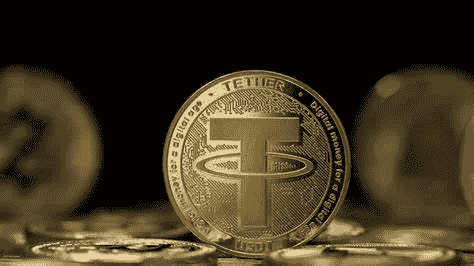

# 算法稳定:支持者和反对者有什么要说的？

> 原文：<https://medium.com/coinmonks/algorithmic-stablecoins-what-do-advocates-and-opponents-have-to-say-4f17db4f108c?source=collection_archive---------36----------------------->

Source photo [usdt — Bing images](https://www.bing.com/images/search?view=detailV2&ccid=PcvPRgZA&id=DA00279C699E828943055A88EDEBB6630794CC46&thid=OIP.PcvPRgZAlYgrr1dN17cYXgHaEK&mediaurl=https%3a%2f%2fbitcoinist.com%2fwp-content%2fuploads%2f2021%2f05%2fbitfinex-cto-tether-is-registered-and-regulated-under-fincen-usdt-not-next-target-of-the-us-sec.jpg&cdnurl=https%3a%2f%2fth.bing.com%2fth%2fid%2fR.3dcbcf46064095882baf574dd7b7185e%3frik%3dRsyUB2O26%252b2IWg%26pid%3dImgRaw%26r%3d0&exph=720&expw=1280&q=usdt&simid=608047350850463675&FORM=IRPRST&ck=8B7DC7C47382D7143F11ACE413361F90&selectedIndex=6&ajaxhist=0&ajaxserp=0)

因此，算法稳定点数的支持者认为它们比传统稳定点数更好。取而代之的是，一个以区块链为基地、依赖全球各地交易员与美元联系的网络被用来管理他们。

在这种情况下，跟踪算法的稳定分数会更加困难。算法…