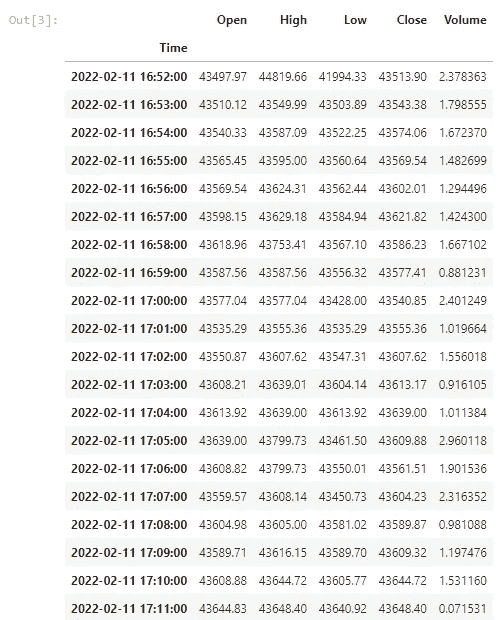
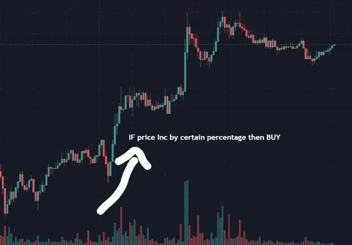
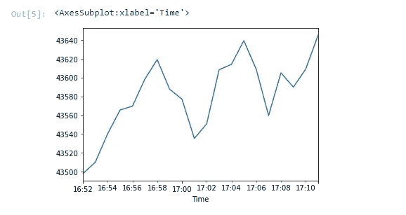

# 算法交易:初学者指南系列。

> 原文：<https://medium.com/coinmonks/algorithmic-trading-a-beginners-guide-series-7ecb4cdd4281?source=collection_archive---------8----------------------->

## 如何使用**币安 API** 开发一个加密货币交易机器人(一步一步来)。

## 什么是算法交易？！

简单来说，算法交易就是利用程序，根据编程语言实现的策略，进行系统的交易。

算法交易可以**全** - **自动化，半自动，或者给出信号手动执行。**

在本文中，我们将使用币安 API 开发一个简单的半自动策略来获取数据和执行交易。

我正在使用木星笔记本，使用 python，pandas 和 NumPy

从导入安装 python-币安连接到币安 API 所需的库开始。

在这篇文章中，我使用**币安测试网 API** 让任何人都能够去执行代码，即使你没有币安帐户。

首先，您必须有一个 API 密匙和秘密密匙来提供给客户机函数以建立连接

要生成 API 密钥和秘密密钥，请到[币安现场测试网络](https://testnet.binance.vision/)用 GitHub 签名并生成 HMAC SHA256 密钥。

最后，用实际的键替换代码中的 APIKEY 和 SECRETKEY 变量。

```
**import** pandas **as** pd
**import** numpy **as** np
!pip install python-binance**from** binance **import** Client

APIKEY **=** 'Your API KEY'
SECRETKEY **=** 'Your Secret KEY'client **=**Client(APIKEY,SECRETKEY)
client**.**API_URL **=** 'https://testnet.binance.vision/api'acc **=** client**.**get_account()
acc 
```

建立连接后，让我们通过使用 **client.get_account()** 函数来查看我们的测试帐户余额信息，下面是结果。

```
{'makerCommission': 0,
 'takerCommission': 0,
 'buyerCommission': 0,
 'sellerCommission': 0,
 'canTrade': True,
 'canWithdraw': False,
 'canDeposit': False,
 'updateTime': 1644598822834,
 'accountType': 'SPOT',
 'balances': [{'asset': 'BNB',
   'free': '1000.00000000',
   'locked': '0.00000000'},
  {'asset': 'BTC', 'free': '1.01300000', 'locked': '0.00000000'},
  {'asset': 'BUSD', 'free': '10000.00000000', 'locked': '0.00000000'},
  {'asset': 'ETH', 'free': '100.00000000', 'locked': '0.00000000'},
  {'asset': 'LTC', 'free': '500.00000000', 'locked': '0.00000000'},
  {'asset': 'TRX', 'free': '500000.00000000', 'locked': '0.00000000'},
  {'asset': 'USDT', 'free': '9449.55739000', 'locked': '0.00000000'},
  {'asset': 'XRP', 'free': '50000.00000000', 'locked': '0.00000000'}],
 'permissions': ['SPOT']}
```

现在是获取加密数据流的时候了

关于如何从币安获取数据，我们有不止一种选择，在这篇文章中，我想让它足够简单，所以我使用

**client . get _ historical _ klines()**函数

为此函数提供的参数有:

**符号—** *在我们的例子中，您想要交易的加密货币符号是 BTCUSDT*

**时间框架**:你要交易的时间框架在我们的例子中，我选择了 1 分钟的时间框架。

T21:在我们的例子中，我选择了 20 分钟。

```
**def** dataorg(symbol):
    data **=** pd**.**DataFrame(client**.**get_historical_klines( symbol ,
                                                      '1m', 
                                                  '20 min ago UTC'))
    df **=** data**.**iloc[:,:6] df**.**columns **=** ['Time', 'Open', 'High' , 'Low' , 'Close','Volume'] df **=** df**.**set_index('Time') df**.**index **=** pd**.**to_datetime(df**.**index,unit**=**'ms') df **=** df**.**astype(float) **return** dfdataorg('BTCUSDT') 
```

我定义了一个函数，它采用一个**符号**参数来组织数据，

并把它做成一个数据框

以下是生成的数据帧，其中包含

时间，开盘价，最低价，收盘价和成交量。



这里我们要计算过去 20 分钟的累计回报，开始交易策略的工作。

**累计回报公式**:(1+1 分钟回报)*(1+最后一分钟累计回报)-1

**pct_change()** :计算最近一段时间的价格变化。

**cumprod()** :计算公式的后半部分。

```
test **=** dataorg('BTCUSDT')
ret **=** (test**.**Open**.**pct_change() **+** 1)**.**cumprod() **-**1
retTime
2022-02-11 16:52:00         NaN
2022-02-11 16:53:00    0.000279
2022-02-11 16:54:00    0.000974
2022-02-11 16:55:00    0.001551
2022-02-11 16:56:00    0.001645
2022-02-11 16:57:00    0.002303
2022-02-11 16:58:00    0.002782
2022-02-11 16:59:00    0.002060
2022-02-11 17:00:00    0.001818
2022-02-11 17:01:00    0.000858
2022-02-11 17:02:00    0.001216
2022-02-11 17:03:00    0.002534
2022-02-11 17:04:00    0.002666
2022-02-11 17:05:00    0.003242
2022-02-11 17:06:00    0.002548
2022-02-11 17:07:00    0.001416
2022-02-11 17:08:00    0.002460
2022-02-11 17:09:00    0.002109
2022-02-11 17:10:00    0.002550
2022-02-11 17:11:00    0.003376
Name: Open, dtype: float64
```

# 战略实施

我们将制定一个简单的趋势跟踪策略:

**如果**比特币价格上涨超过一定比例(0.2%) **则买入**订单，买入后**如果**价格上涨或下跌一定比例(0.2%，-0.2%) **则卖出。**



```
 **def** strategy(symbol,qty,inPosition**=False**): **while** **True**: df **=** dataorg(symbol)
        cumret **=** (df**.**Open**.**pct_change()**+**1)**.**cumprod()**-**1 **if** **not** inPosition: **if** cumret[**-**1] **>** 0.002:
                    ordertime **=** df**.**index[**-**1]
                    order **=** client**.**create_order(symbol**=**symbol,  
                    side**=**'BUY',type**=**'MARKET', quantity**=**qty)

                    print(order)
                    inPosition**=True**
                    **break**
                **else**:
                    print('No trade excuted')
     **if** inPosition:
        **while** **True**:
            df**=**dataorg(symbol)
            afterbuy **=** df**.**loc[df**.**index **>** pd**.**to_datetime(
            order['transactTime'],
            unit**=**'ms')]

            **if** len(afterbuy) **>** 0: afterbuyret **=**  (df**.**Open**.**pct_change()**+**1)**.**cumprod()**-**1                    
                print(afterbuyret) **if** afterbuyret[**-**1]**>**0.002 **or** afterbuyret[**-**1]**< -0.002:** 
                    sellorder **=** client**.**create_order(symbol**=**symbol,
                                        side**=**'SELL',type**=**'MARKET',
                                                 quantity**=**qty)
                    print(sellorder)
                    **break**
```

## 是时候看看最近 20 分钟的价格了。

```
test**.**Open**.**plot()
```



## 看起来我们有上升趋势。

# 交易执行

我们的最后一步是调用 **strategy()** 函数，等待交易被执行，

在这种情况下，我们有一个买入订单，然后是一个交易后的**累积回报**列表，当回报超过我们的阈值( **+0.2%或-0.2%** )时，然后是一个卖出交易

这是一项有利可图的交易😀

```
strategy('BTCUSDT', 0.001){'symbol': 'BTCUSDT', 'orderId': 4982968, 'orderListId': -1, 'clientOrderId': 'oappYtNU1466jYiXCV3URd', 'transactTime': 1644599469117, 'price': '0.00000000', 'origQty': '0.00100000', 'executedQty': '0.00100000', 'cummulativeQuoteQty': '43.65218000', 'status': 'FILLED', 'timeInForce': 'GTC', 'type': 'MARKET', 'side': 'BUY', 'fills': [{'price': '43652.18000000', 'qty': '0.00100000', 'commission': '0.00000000', 'commissionAsset': 'BTC', 'tradeId': 1240296}]}Time
2022-02-11 16:52:00         NaN
2022-02-11 16:53:00    0.000279
2022-02-11 16:54:00    0.000974
2022-02-11 16:55:00    0.001551
2022-02-11 16:56:00    0.001645
2022-02-11 16:57:00    0.002303
2022-02-11 16:58:00    0.002782
2022-02-11 16:59:00    0.002060
2022-02-11 17:00:00    0.001818
2022-02-11 17:01:00    0.000858
2022-02-11 17:02:00    0.001216
2022-02-11 17:03:00    0.002534
2022-02-11 17:04:00    0.002666
2022-02-11 17:05:00    0.003242
2022-02-11 17:06:00    0.002548
2022-02-11 17:07:00    0.001416
2022-02-11 17:08:00    0.002460
2022-02-11 17:09:00    0.002109
2022-02-11 17:10:00    0.002550
2022-02-11 17:11:00    0.003376
2022-02-11 17:12:00    0.003520
Name: Open, dtype: float64{'symbol': 'BTCUSDT', 'orderId': 4983220, 'orderListId': -1, 'clientOrderId': 'OWLlWGmI044UlKEFaURffy', 'transactTime': 1644599521374, 'price': '0.00000000', 'origQty': '0.00100000', 'executedQty': '0.00100000', 'cummulativeQuoteQty': '43.65542000', 'status': 'FILLED', 'timeInForce': 'GTC', 'type': 'MARKET', 'side': 'SELL', 'fills': [{'price': '43655.42000000', 'qty': '0.00100000', 'commission': '0.00000000', 'commissionAsset': 'USDT', 'tradeId': 1240505}]}
```

# 下一步是什么

好了，伙计们，这就是这篇文章的内容。当然，这不是最好的赚钱的交易机器人，而且它缺少很多东西，

特别是数据分析和[回测](/coinmonks/how-to-backtest-a-trading-bot-with-backtrader-b5486277c7dc)，

我将在下一篇文章中提供更多见解，

我希望你喜欢。