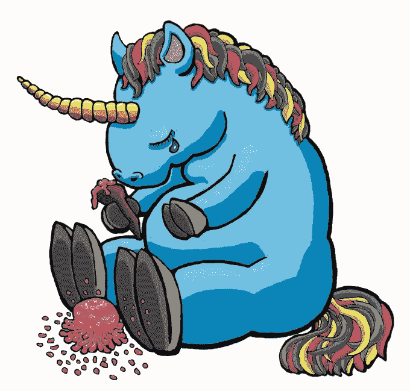

# 全部被加密—2022 年 6 月 10 日第一周

> 原文：<https://medium.com/coinmonks/all-been-crypto-week-10-june-2022-d6b60da9c17e?source=collection_archive---------47----------------------->

这是一个横盘的一周，因为市场仍然处于狭窄的范围内，总市值坚守在 1.3 万亿美元的关口。BTC，ETH 下降了低个位数，统治地位徘徊在 44-45%左右。本周表现较好的股票是 LINK +20%，此前该公司发布了赌注路线图，ADA +7%，因预期即将推出 Vasil hard fork。在+ve 方面的新闻中，我们看到以太坊在 Robsten 上完成了首次成功的 Testnet 合并，Paypal 最终使用户能够撤回在其平台上购买的加密，更多的 Tradfi 玩家更深入地进入加密领域，以及美国推出了一项关键的两党加密法案。在看跌方面，我们看到了一个令人担忧的例子，一家高调的加密独角兽进行了一轮痛苦的下跌，乐观的象征在与做市商发生纠纷后面临压力，韩国交易所因新的隐私功能将 LTC 退市。享受阅读！

蝙蝠太极—【btc21@mail.com 

[Crying Unicorn Vinyl Sticker](https://www.kickstarter.com/projects/puzzledungeon/crying-unicorn-vinyl-sticker)

# **头条:**

## [ETH Ropsten Testnet 成功合并](https://fortune.com/2022/06/08/ethereum-ropsten-test-network-merge-proof-of-stake/)

这可以被认为是第一次 testnet 彩排，所以难怪成功的合并会成为新闻。在我们使用 Mainnet 之前，他们还有两个测试网络，但是 Vitallik 在几周前的 ETH 上海 Web 3.0 开发者峰会上说，如果一切顺利，合并可以在 8 月进行。现在，由于在实际的 testnet 合并之前完成了许多影子分叉，技术方面的一些东西会下降的预期很低，但风险总是存在的。这里的问题更多的是，在人的方面，一些关键基础设施的参与者，甚至是一大堆家庭验证器，在过渡中遇到了问题。当然，这是在 testnet 环境中的训练轮，当真正的美元摆在桌面上时，参与者和动态可以表现得非常不同。这是一个可以在接下来几周清楚观察的空间，如果你还不了解合并对 ETH 作为一项资产意味着什么，请点击此处查看。

## [BlockFi 加注下一轮](https://www.theblockcrypto.com/post/150377/blockfi-is-raising-a-down-round-at-1-billion-valuation-sources)

公开市场的估值已经大幅下降，因此认为私人市场不会受到影响有点不切实际。是的，我们在过去几周看到了大规模的融资，但这些交易需要几周时间，所以你会有延迟效应。随着 LUNA 崩溃的几个星期后，我们开始看到对私人回合的第一次影响。大约一年前，他们以 30 亿英镑的估值进行了融资，并以传言中的 50 亿英镑进行了第二轮融资。据 block 消息来源称，新一轮融资达到 10 亿英镑，然而 BlockFis 的故事并不简单。今年 2 月，该公司同意[向 SEC 和几个州监管机构支付总计 1 亿美元的罚款](https://www.coindesk.com/policy/2022/02/12/blockfi-will-pay-100m-halt-high-yield-offering-in-settlement-with-sec-state-regulators-report/)，作为对其高收益贷款产品是否是证券发行的调查的和解的一部分。因此，我不认为这意味着私人估值将全面下降 60-80%，但会有压力，市场将开始区分盈利和“只增长”的商业模式。

## [美国一对参议员发布了期待已久的加密法案](https://www.barrons.com/articles/senate-bill-lummis-gillibrand-crypto-bill-51654615580)

一位民主党和共和党参议员提出了迄今为止最全面的加密法案，旨在为我们的市场建立一个监管框架。这项两党法案通常被视为+ve，因为 Lummis-Gillibrand 法案将绝大多数数字资产归类为商品。现在，随着议员们为 11 月的中期选举做准备，该法案今年不太可能取得进展。但业内许多人认为，这是 2023 年监管推动的一个重要平台。我们将会看到很多关于这项法案的讨论和辩论，当然还有很多修正案和提案，但这表明美国的监管者正在非常严肃地对待这件事。

# **语录:**

> 不幸的是，攻击者能够在恢复操作完成之前使用不同的初始化参数将 multisig 部署到 L2，并控制了 2000 万个 OP 令牌

**乐观基金会**

> 交易量将会下降，对冲基金将不得不重组。实际上有 1900 家秘密对冲基金。我的猜测是三分之二会倒闭。

**迈克·诺沃格拉茨，银河数码公司的创始人兼首席执行官**

> 授予 CFTC 对加密的管辖权就像纽约市将打击犯罪的工作外包给了一个小镇的警察部队。你可能会不时看到警察，但总的来说，罪犯将会控制这个地方。

**Dennis Kelleher，Better Market(一个著名的金融改革倡导团体)的联合创始人**

> 加入 Coinmonks [电报集团](https://t.me/joinchat/Trz8jaxd6xEsBI4p)，了解加密交易和投资