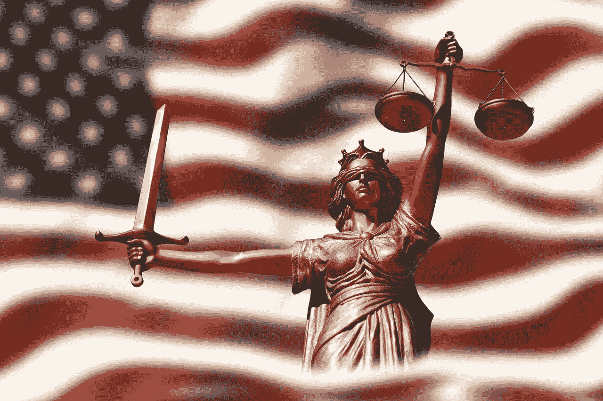

# 全部被加密—2022 年 3 月 11 日第 11 周

> 原文：<https://medium.com/coinmonks/all-been-crypto-week-11-mar-2022-e916be29910e?source=collection_archive---------60----------------------->

全面下跌的一周主要是由风险和乌克兰局势导致的持续地缘政治僵局引发的。宏观经济正在主导我们的资产类别，随着战争的爆发，它对通货膨胀的影响(昨天创下的 40 年来最高纪录的美国 CPI 同比增长+7.9%)以及随之而来的中央银行的反应是最重要的。在 crypto world 中，我们有一个领导开发人员不幸离开，导致 FTM 生态系统遭受损失，并看到人们对隐私硬币的兴趣在一段时间内首次回归，XMR 和 ZEC 表现出色。拜登发布了期待已久的关于加密的行政命令，在机构方面，我们取得了重大进展，TradFi 巨头进入监管范围，并宣布了多项融资和交易。很难看到一个秘密的冬天带着持久的机构兴趣到来。享受阅读！

蝙蝠太极—[btc21@mail.com](mailto:btc21@mail.com)

# 标题:

## 领导开发离开坦克整个 ALT L1 生态系统

如果你曾经参与过 Fantom，Andre Cronje 对你来说肯定不是陌生人，但即使对外人来说，他也是一个受人尊敬的开发人员，并且为多个项目做出了贡献——例如，渴望金融是最成功的项目之一。本周，他的业务伙伴安东·内尔在推特上宣布，他们将停止对他们支持的大约 25 个应用和服务的贡献。这导致了对动机的各种各样的猜测，当然也导致了许多人对代币掉落感到不安。生态系统中的 FTM 和[TLV](https://defillama.com/chain/Fantom)都下降了> 30%，许多较小的项目更是如此。芬顿基金会和渴望很快指出，项目背后有更大的团队，安德烈的离开不会有实质性的影响，但市场似乎有不同的想法。我读过关于他为什么辞职的多种观点，但是在我们开始之前，你必须问自己这样的问题:如果一个主要的开发人员辞职了，那么这个项目真的失败了吗？那么，它的哪一部分是分散的呢？我们这样做不是为了避免单点故障吗？我认为该行业的许多新进入者还没有真正意识到真正分权的重要性，在我看来，这是我们行业的核心价值主张之一。
但现在让我们推测一下原因。有些人很快就称之为地毯，我认为事实并非如此，实际上只是向你展示了它背后的真正原因。一段时间以来，安德烈一直公开抱怨 devs 的有毒文化。整整两年前，他已经在 Medium 上写了一个博客，名为 [Building in #DeFi 糟透了](https://andrecronje.medium.com/building-in-defi-sucks-b8fdfda0ef58)在那里他抱怨用户的权利意识和社区内的敌意。所以你可以说文字已经在墙上了。Defi Edge 有一个很好的[线索](https://twitter.com/thedefiedge/status/1500465651076374530)关于我在 1 月 28 日的[周刊上讨论的仙境的麻烦可能也在触发他现在的决定中扮演了一个角色。其他人指出，监管变得越来越严格，也将涵盖 DeFi，所以首席开发人员肯定会受到影响，这加上他已经财务独立的事实也可能有助于他的决定。我们无法确定，这可能是多种因素的混合。我只希望这能成为权力下放和降低关键人物风险重要性的一个例子。我也有一个浪漫的愿望，希望他能以匿名开发者的身份回来。他毕竟喜欢建筑——他只是(可以理解)讨厌随之而来的一切。所以如果你读了这篇文章，安德烈只是想再次感谢你所有不可思议的工作，请继续你最擅长的事情——只是建造！](https://btc21.medium.com/all-been-crypto-week-28-jan-2022-c0e85a3a6e62)

## [拜登关于加密的行政命令](https://www.whitehouse.gov/briefing-room/presidential-actions/2022/03/09/executive-order-on-ensuring-responsible-development-of-digital-assets/)

好吧，那么首先我必须承认我没有阅读论文的全部内容，只是阅读了[的概况介绍](https://www.whitehouse.gov/briefing-room/statements-releases/2022/03/09/fact-sheet-president-biden-to-sign-executive-order-on-ensuring-responsible-innovation-in-digital-assets/)和媒体对此的评论。总的来说，我得到的印象是，它试图包括一切。就第一句话'*概述了第一个保护消费者、金融稳定、国家安全和应对气候风险的整体政府战略'*你可以看到他们走得很远。这可能是它被推迟多次的原因——因此可以说它对每个人都有好处。对于批评者来说，它谈到了对消费者保护、金融稳定和非法使用金融资产的挑战，这些都是对国家安全的威胁。对于支持者来说，我们有关于美国在技术上的领导地位和促进安全和平等的语言，以及美国 CBDC 的重要性。因为这并不奇怪，我更倾向于专业加密阵营，所以我的观点可能有点偏颇，但总的来说，我喜欢该命令概述的整体方法，这告诉我他们正在认真对待它。我感到欣慰的第二点是研发重点，我们正在教育领域(希望是整个领域)走下去，基本上跨越了所有可能触及数字资产的部门。也许我有点太乐观了，但我希望通过更多的科学研究，我们能够说服更多的美国立法者相信我们的资产类别可以产生积极的影响。在韩国，这位新当选的总统把解除对加密的管制作为他竞选承诺的一部分。

## [Crypot 是如何(不)分散的](https://fortune.com/2022/03/04/opensea-metamask-block-users-sanctions/)

好的，是的，我们不是在谈论像[Crypto . com](https://cointelegraph.com/news/crypto-com-gives-users-in-excluded-countries-one-week-to-repay-loans)这样的 cex，我们是在谈论 Open Sea 和 Metamask，它们因严格遵守美国的制裁政策而受到批评，例如禁止伊朗的用户访问。两家公司都证实他们正在[封锁和删除位于美国制裁国家的账户](https://www.vice.com/en/article/g5qkb7/ethereum-companies-suddenly-ban-users-in-certain-countries)。许多 Web3 的新加入者对这种可能性感到惊讶，尽管他们相信他们正在处理分散的未经许可的网络。这提醒我们，即使你交易的基础区块链是未经许可的，这些 API 也是“私有”的，这些总部在美国的公司没有机会不遵守美国的法规。还记得上周加拿大卡车司机抗议期间，CEX 主要的首席执行官是如何告诉用户从交易所获取代币以避免资产被扣押的吗。不是你的钥匙，不是你的硬币。

# **行情:**

> 我们认为每个人都应该获得基本的金融服务——除非法律另有规定

**Brian Armstrong，首席执行官比特币基地**

> 俄罗斯规避所有金融制裁所需的规模几乎肯定会让加密货币成为该国无效的主要工具

**美国国家安全委员会网络安全主任卡罗尔·豪斯**

> 一些军事供应商有加密账户。事实上，他们中的一些人在允许加密的司法管辖区有公司和银行账户。他们可以在以太坊、比特币，当然，还有一些稳定的硬币中获得密码

**乌克兰数字转型部副部长 Alex Bornyakov**

> 作为全球最大的托管公司之一，道富银行正在创建一种新的数字资产服务，这对于机构参与这种新的资产类别是一个非常重要的发展，”

**Copper.co 首席运营官的塞布丽娜·威尔森**