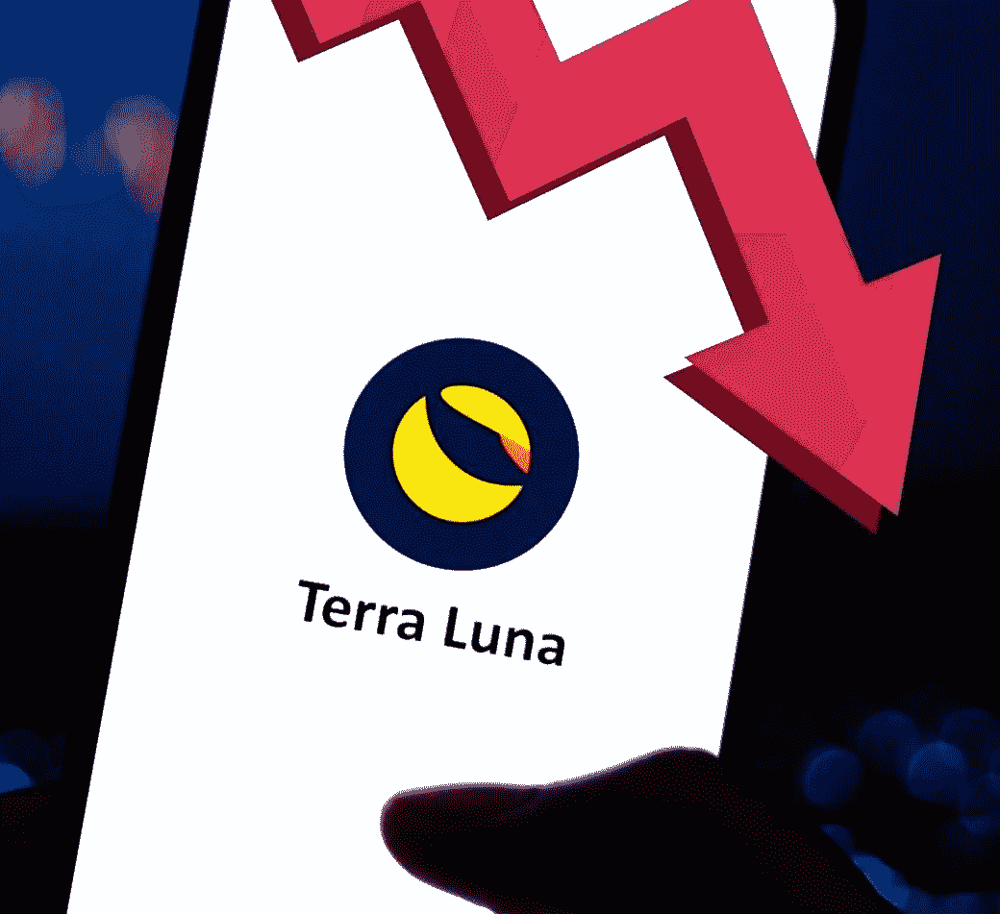

# 全部被加密—2022 年 5 月 13 日第一周

> 原文：<https://medium.com/coinmonks/all-been-crypto-week-13-may-2022-d35c09c4c919?source=collection_archive---------40----------------------->

这就是你所说的街头流血——对 crypto 来说，这是残酷的一周，在 Terra/Luna 生态系统崩溃后，我们的市值蒸发了 5000 亿美元，现在降至 1.3 万亿美元(仅市值就达 500 亿美元)。自然，在这种风险环境下，我们看到避险资金和 BTC 的优势从 4%上升到 43%，尽管 BTC 也下降了-20%。整个加密市场都感受到了痛苦，尤其是在 cosmos 生态系统和风投支持的 ALT L1s 中。本周唯一跑赢大盘的是，在过去 24 小时令人难以置信的+50%的反弹后，上涨了+17%，戴仍然是唯一经过战斗考验的“分散”稳定的硬币位置。在新闻中，我们将更详细地消化 UST/卢娜发生的事情以及对我们行业的影响。现在，对稳定硬币的监管审查再次加强。即使你认为其他新闻几乎不值得一提，因为这个故事已经占据了主导地位，尤其是在这样的时候，不要失去对更大画面的关注是很重要的。已经完成了几轮融资，在澳大利亚，我们获得了 BTC EFT 批准的第一个现货，上海的一家法院裁定 BTC 为产权所有，NFT 最著名的项目之一志那都红豆也获得了一些启示。我希望你能安然度过这些艰难的市场，这本周刊能帮助你理解市场。

蝙蝠太极—[btc21@mail.com](mailto:btc21@mail.com)

# 标题:

## 地球真空

Terra 消失了，令牌在几天内从 100 多美元降到了几分之一美分，蒸发了整个生态系统。昨晚，该连锁甚至不得不暂停，以防止治理攻击。怎么会这样，怎么会发生的这么快？为了理解这一点，我们首先需要知道 UST 和露娜的关系是如何运作的。基本上，Luna 的整个生态系统是以算法稳定的硬币 UST 为核心和薄荷/燃烧机制构建的。如果你需要补上[机制](https://www.youtube.com/watch?v=KqpGMoYZMhY)，这里就有。这不是什么新鲜事，事实上算法稳定的硬币被称为加密的[圣杯](https://twitter.com/zhusu/status/1508603726143328256?s=20&t=fmRPrZm8_KOj0zIuf2dTdg)已经有很长时间了。到目前为止，他们中没有一个人成功了，许多人认为这甚至是不可能的(尤其是在 terra 惊人的失败之后)。所以警告的声音总是存在，只是可能没有我们希望的那么大。至少我记得上一次“重大”事件还不到一年。现在露娜有了更大的规模，他们正积极地试图在 BTC 建立国库以避免这种死亡螺旋，但这实际上可能是它失败的原因。批评者还说，这在某种程度上是道权(该项目的负责人)承认，钉住机制有可能通过死亡螺旋而失败。这里有一个很好的事件发生的时间表。现在还不是 100%清楚，但是大多数人认为有一个相当大的参与者发现了弱点和交易机会，就像 1992 年乔治·索罗斯和英格兰银行一样。其中的关键是从 3 池到 4 池的过渡，这在短时间内给市场留下了非常少的流动性。这些池基本上是你从一个稳定的硬币交换到另一个稳定的硬币的方式，通常是 1:1 的交易。如果资金池失衡，比率会发生变化，资金池中的流动性越低，就越容易向一个方向推进。一旦挂钩在资金池中被打破，接下来就是在 CEXs 上，与此同时，机构开始变得紧张，并从锚中撤回他们的 UST。LFG 设法击退了佩格，但从未能恢复信心。死亡螺旋已经开始了。UST 仍有 100 亿英镑未偿债券，但由于目前的通胀率如此之高，同时每个人都想退出，因此创造赎回机制不再正常运转。正因如此，UST 目前的市盈率为 0.1 倍，甚至可能进一步下降。这种放松正在进行，故事还没有完全写好，但结果已经很明显了。另一个失败的 algo 稳定硬币的历史书。剩下的是许多损失惨重的零售商，因此监管者将注意力转向了马厩。

## [耶伦在稳定硬币上](https://www.wsj.com/articles/yellen-renews-call-for-stablecoin-regulation-after-terrausd-stumble-11652208165) s

美国财政部长珍妮特·耶伦(Janet Yellen)很快注意到了围绕 UST·德佩格发生的事件，并重申了这将给金融稳定带来的风险。现在我们知道财政部不喜欢加密，但似乎不可避免的是，对稳定的硬币会有更多的审查。一种猜测是，美国交易所可能必须非常谨慎地选择允许它们提供哪些稳定的硬币交易对。我们只能希望有抵押和超额抵押的稳定硬币与 UST 和阿尔戈稳定硬币(承担更高的风险)之间有所区别。我非常喜欢 [Arthur Heyes](https://cryptohayes.medium.com/luna-brothers-inc-712ec5abe199) 所说的过度抵押的稳定硬币(即戴)已经奏效，但不可扩展，因此市场将继续试验 algo 或其他类型的稳定硬币。我们已经看到市场对剩余的稳定硬币变得非常紧张，由于担心另一个稳定的硬币银行挤兑，USDT 一度交易到 97c，而[3 号池](https://curve.fi/3pool)看起来仍然不是很健康。但是，USDT 的风险不是二元的，它是一个中央集权的实体，他们坐在非加密的资产上。因此，即使那里出现银行挤兑，也可能导致短期的脱钩，但在理发时，一些演员会选择 USDT，因此，阿尔戈稳定硬币死亡螺旋(类似 UST)最有可能被避免。与此同时，(目前为止被认为是所有稳定的硬币资产中最安全的)和戴甚至的交易价格相对于美元有 1-2%的溢价，这表明市场正在经历何种程度的压力。监管将出现在稳定的硬币上，但让我们希望它不会削弱该行业和创新。

## [志那都红豆创作者透露了他的过去——导致拉地毯的指控](https://blockworks.co/trading-volumes-spike-on-azuki-nfts-after-creator-admits-to-failed-projects/)

志那都红豆是 NFT 十大工程之一。然而，在周一，这位广受欢迎的志那都红豆·NFT 项目的匿名创始人透露了他的废弃项目的令人担忧的历史，这让 NFT·推特陷入了疯狂，藏品的底价也下降了。这是在整个市场因为 UST/卢娜事件而暴跌之前。他可能选择了正确的时间，因为它没有得到太多的报道，但话说回来，为什么要宣布呢？也许他已经受到威胁，只是先发制人。

# **语录:**

> 我认为这只是说明这是一种快速增长的产品(稳定的硬币),金融稳定存在风险

**美国财长珍妮特·耶伦**

> 接近宣布$UST 的恢复计划。抓紧了。

**跆拳道(5 月 10 日)**

> MicroStrategy 有一笔 2.05 亿美元的定期贷款，需要保持 4.1 亿美元作为抵押品。$MSTR 有 115，109 BTC 可以抵押。如果#BTC 的价格跌至 3562 美元以下，该公司可能会提供一些其他抵押品

**迈克尔·塞勒，微软公司的首席执行官**

> 在实际审判实践中，人民法院对比特币的法律地位形成了统一意见，认定其为虚拟财产比特币具有一定的经济价值，根据财产的属性，适用物权法治进行保护

**上海市高级人民法院裁定**

> 加入 Coinmonks [电报频道](https://t.me/coincodecap)和 [Youtube 频道](https://www.youtube.com/c/coinmonks/videos)了解加密交易和投资

# 另外，阅读

*   [3 商业评论](/coinmonks/3commas-review-an-excellent-crypto-trading-bot-2020-1313a58bec92) | [Pionex 评论](https://coincodecap.com/pionex-review-exchange-with-crypto-trading-bot) | [Coinrule 评论](/coinmonks/coinrule-review-2021-a-beginner-friendly-crypto-trading-bot-daf0504848ba)
*   [莱杰 vs Ngrave](/coinmonks/ledger-vs-ngrave-zero-7e40f0c1d694) | [莱杰 nano s vs x](/coinmonks/ledger-nano-s-vs-x-battery-hardware-price-storage-59a6663fe3b0) | [币安评论](/coinmonks/binance-review-ee10d3bf3b6e)
*   [Bybit Exchange 审查](/coinmonks/bybit-exchange-review-dbd570019b71) | [Bityard 审查](https://coincodecap.com/bityard-reivew) | [Jet-Bot 审查](https://coincodecap.com/jet-bot-review)
*   [3 commas vs crypto hopper](/coinmonks/3commas-vs-pionex-vs-cryptohopper-best-crypto-bot-6a98d2baa203)|[赚取加密利息](/coinmonks/earn-crypto-interest-b10b810fdda3)
*   最好的比特币[硬件钱包](/coinmonks/hardware-wallets-dfa1211730c6) | [BitBox02 回顾](/coinmonks/bitbox02-review-your-swiss-bitcoin-hardware-wallet-c36c88fff29)