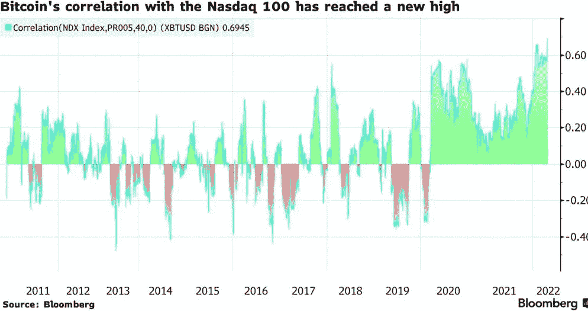

# 全部被加密—2022 年 4 月 16 日第一周

> 原文：<https://medium.com/coinmonks/all-been-crypto-week-16-apr-2022-6d6641973db4?source=collection_archive---------55----------------------->

又是一个熊市周，市值再次跌破 2 万亿美元，因通胀担忧在美国创纪录的 CPI 公布后再次承压。我还在旅行，所以这将是另一个更短的每周版本。DOGE 的表现优于 Elon，对 Twitter 出价过高，我们继续看到 XMR 跟踪熊市趋势。然而，总的来说，我们已经看到与股票和整个加密的相关性达到创纪录的水平。对于 BTC 纳斯达克 100 指数和 BTC 联邦交易所来说都是如此。在新闻中，我们让 Meta 透露他们的 NFT 定价模式向创作者收取高达 47.5%的费用，Circle 从蓝筹股 TradFi 再筹集 400ml，USDT 进入 Polkadot 生态系统，Ethereums 最受欢迎的混合器正在向 KYC 迈出一大步。享受阅读和快乐的复活节周末！

蝙蝠太极—[btc21@mail.com](mailto:btc21@mail.com)

# 标题:

## [从 TradFi 巨人那里圈起 400 毫米](https://www.bloomberg.com/news/articles/2022-04-12/blackrock-fidelity-back-circle-in-400-million-funding-round)

Circle 的背后是市值 500 亿美元的稳定硬币 USDC，鉴于其规模和比其更大的兄弟 USDT(820 亿美元)更好的披露者，它被许多加密界人士视为最安全的选择。贝莱德(Blackrock)和 FMR、Marchall Wace 等公司的 4 亿英镑投资极大地提振了投资者的信心，这笔投资来自 Tradfi 中最优秀的蓝筹股基金经理。贝莱德还将充当“USDC 现金储备的主要资产管理者”

## [KSM 发布后波尔卡多特生态系统上的系绳](https://www.coindesk.com/business/2022/04/13/tethers-usdt-stablecoin-enters-polkadot-ecosystem-with-kusama-launch/?outputType=amp)

本着同样的想法，USDT 也在继续扩张，现在已经是第 10 家连锁店了——位于草间弥生县波尔卡多的金丝雀连锁店。Polkadot developer Parity Technologies 的公共事务负责人 Peter Mauric 表示，USDT 的加入对 Kusama 来说是一个里程碑，因为可访问性和互操作性是这两个网络的首要目标。重要的协议升级和其他创新总是首先发生在草间弥生网络(一种煤矿中的金丝雀)上，然后才出现在更保守的波尔卡多特生态系统上。在发布时，USDT 将拥有一个资产标签，允许 Polkadot 和 Kusama 的规则操作中继链识别除各自本地加密货币 dot 和 KSM 之外的令牌。因此，stablecoin 将推动 Kusama 的 Statemine(相当于 Polkadot 上的 Statemint parachain)上的交易，这是一种所谓的“公共商品 parachain”，用于资产部署和保持区块链网络上流动的可替代和不可替代代币( [NFTs](https://www.coindesk.com/learn/what-are-nfts-and-how-do-they-work/) )的平衡。Tether 的 USDT 也在以太坊、Solana、Algorand、EOS、Liquid Network、Omni、Tron 和比特币现金的标准总账协议上直播。波尔卡多特将在草间弥生之后加入这个名单

## [龙卷风现金将 OFAC 钱包从混乱中移除](https://www.theblockcrypto.com/post/142081/ethereum-mixer-tornado-cash-now-blocks-sanctioned-addresses)

龙卷风现金是以太坊上最受欢迎的混合器，主要是因为它的规模。它的工作方式很简单，它帮助你获得隐私，通过存放 ETH，然后与其他做同样事情的人“混合”,这样当你取款时就不能将资金与来源联系起来。这显然是监管机构不喜欢的，因为它可以被用来洗钱，难怪最近大多数主要黑客通过 tornado 发送他们的战利品来混合(清洗)它。现在 Tornado 今天说他们将依靠 Chainalysis oracle 来阻止 OFAC 批准的地址。新闻发布的前一天，美国财政部声称朝鲜黑客组织 Lazarus 与 Axie Infinity 的 Ronin bridge 价值 6 . 25 亿美元的盗窃案有关。该部门在其制裁名单中添加了一个以太坊地址，据称与 Ronin 漏洞有关，Tornado Cash 现已封锁了该地址。然而，值得注意的是，Tornado Cash 的联合创始人罗曼·谢苗诺夫(Roman Semenov)表示，这些变化只发生在前端，即分散应用程序(dapp)级别。“智能合同是不可改变的，”谢苗诺夫周五在一条推文中说。"协议(onchain 智能合约)和前端(dapp)是不同的东西."

## [T3【比索银行】是葡萄牙第一家获得加密许可的银行 ](https://decrypt.co/97944/bison-bank-lands-first-crypto-license-in-portugal)

葡萄牙，尤其是利萨邦，正在逐步成为欧洲的加密中心。他们对远程工作有税收优惠，对加密收益有免税。有趣的是，中央银行现在也向银行发放了第一张加密许可证。该银行已获得授权推出 Bison Digital Assets，这是一家专门从事加密货币托管和兑换服务的公司。

# 报价:

> 绝对的。我认为 100%[就市值而言，NFT 将大于比特币],因为 NFT 市场可以有许多不同的东西，我真的认为，例如，所有的艺术品都将有 NFT 或细分的 NFT，每一件艺术品都与之相关联，简称为每一件艺术品，不是现在，而是 10 年后，我几乎可以肯定。

**Gate.io 的首席营销官玛丽·塔蒂布埃**

> 我们收购和持有比特币的平行策略取得了巨大成功

**MicroStrategy 首席执行官迈克尔·塞勒**

> 我们可能还没有接近在我们的零售业务中加入加密作为支付机制，但我相信随着时间的推移，你会看到加密变得越来越大。

亚马逊首席执行官安迪·杰西

> 加入 Coinmonks [电报频道](https://t.me/coincodecap)和 [Youtube 频道](https://www.youtube.com/c/coinmonks/videos)了解加密交易和投资

# 另外，阅读

*   [如何匿名购买比特币](https://coincodecap.com/buy-bitcoin-anonymously) | [比特币现金钱包](https://coincodecap.com/bitcoin-cash-wallets)
*   [瓦济克斯 NFT 评论](https://coincodecap.com/wazirx-nft-review)|[Bitsgap vs Pionex](https://coincodecap.com/bitsgap-vs-pionex)|[Tangem 评论](https://coincodecap.com/tangem-wallet-review)
*   [如何使用 Solidity 在以太坊上创建 DApp？](https://coincodecap.com/create-a-dapp-on-ethereum-using-solidity)
*   [币安 vs FTX](https://coincodecap.com/binance-vs-ftx) | [最佳(SOL)索拉纳钱包](https://coincodecap.com/solana-wallets)
*   如何在 Uniswap 上交换加密？ | [A-Ads 评论](https://coincodecap.com/a-ads-review)