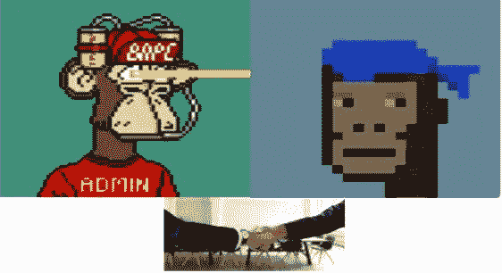

# 全部被加密—2022 年 3 月 18 日第一周

> 原文：<https://medium.com/coinmonks/all-been-crypto-week-18-mar-2022-805196718203?source=collection_archive---------25----------------------->

又是相对平淡的一周，因为我们仍保持在 2 万亿以下，并受到宏观经济的推动。本周，所有人都在关注美联储，它没有让市场感到意外，仅降息 25 个基点。ETH 在新的合并谈判中表现优于 BTC，而选定的 DeFi 项目获得两位数的回报。Maker +16%和 Aave +26% WoW，前者在 tokenomics 中浮动调整，后者宣布它是 V3 升级。在新闻中，他让欧洲事实上的战俘禁令法案被更有利的东西取代，NFT 空间的一笔大 M&A 交易，另一个屈服于压力的隐私钱包，以及中东国家发放加密许可证，以成为下一个中心。享受阅读！

蝙蝠太极—[btc21@mail.com](mailto:btc21@mail.com)

# **头条:**

## [欧盟投票通过无 PoW 禁令的加密法案](https://www.coindesk.com/policy/2022/03/14/eus-sweeping-crypto-regulations-package-one-step-closer-to-ratification/)

周一对加密资产新市场(MiCA)框架的投票是一个相当紧张的事件。最初的语言有一条规定，将限制使用依赖能源密集型共识机制(即工作证明)的加密货币。实际上，这一规则本可以禁止 BTC 和 ETH 以目前的形式存在。幸运的是，来自行业的游说改变了这一进程。相反，该委员会投票赞成一项替代条款，该条款要求负责提出新立法的欧盟委员会(European Commission)在 2025 年 1 月 1 日前提出“一项立法提案，将任何对气候变化有重大影响的秘密资产采矿活动纳入欧盟可持续活动分类(分类系统)。”所以基本上他们理解拥抱新技术的重要性，并让它为绿色革命服务。本周我又进行了许多讨论，我想再次与你分享 Ark/Square 的[比特币能源白皮书](https://assets.ctfassets.net/2d5q1td6cyxq/2D2BnksJjavw4a6SUvAPwZ/c42a9e3a520b0cc3b230cda3b43eead5/BCEI_White_Paper_.pdf)，它概述了 BTC 如何实际推动清洁能源的采用。

## [猿买朋克](https://fortune.com/2022/03/11/bored-ape-yacht-club-yuga-labs-buys-cryptopunks-meebits-nft/)

这是 NFTs 的年度交易。第二名的创造者 NFT 项目委员会 Ape 游艇俱乐部(BAYC)从幼虫实验室购买了 CryptoPunks (#1)和 Meebits (#10)，使该公司控制了市场上最受欢迎的三个  系列。这些都是头条新闻，如果你想问自己，等等，这些是 NFT 的，它们属于个人所有，一个实验室怎么可能得到它们？这是它的要点。他们基本上收购了 423 个密码朋克和 1711 个密比特，收购金额未披露，同时他们也获得了密码朋克和密比特的品牌和标识。但他们很快表示，他们将免费向个人 NFT 持有者转让商业和独家许可权。人们的期望是，宇迦可以帮助 CryptoPunks 和 Meebits 成为更大的品牌，也许其中一些角色会在游戏或奢侈品上首次亮相。宇迦最近与 Animoca Brands 达成了一项[协议](https://www.animocabrands.com/bored-ape-yacht-club-and-animoca-brands-join-forces-to-make-blockchain-nft-game)，开发一款使用 BAYC 角色的游戏。BAYC 的所有者可以获得独家商品和独家活动。这项交易本周也引起了一些争议，来自 Animoca 的 Yat Siu 在[推特](https://twitter.com/ysiu/status/1502372180302045185?s=20&t=j7ExzD9gkfxUxKefW_ghaQ)上解释了为什么 KYC 对猿类主人很重要。但是我猜随着一个[硬币](https://decrypt.co/95398/apecoin-what-is-bored-ape-ethereum-token-who-gets-it)的循环，谁能抗拒 doxxing？虽然这些都是*官方*发布的 ApeCoin DAO 而不是 Yugo Labs(规定？).ApeCoin DAO 已经从加密社区招募了一些知名人士加入其初始董事会，包括 Reddit 的联合创始人亚历克西斯·奥哈尼安(Alexis Ohanian)和 FTX 的艾米·吴(Amy Wu)，他们将在 APE 持有者每年投票选举下一届成员之前服务六个月。在顶端看到集中是很自然的，宇迦实验室在生态系统中定位他们的猿类方面做了非凡的工作，但我的感觉是朋克是不同的。他们中的大多数人都不是在 12 个月前进入 NFTs 的人，所以你有一个非常不同的观众。

## [KYC？另一个弯曲膝盖](https://www.coindesk.com/tech/2022/03/14/wasabi-wallets-coinjoin-coordinator-to-blacklist-certain-bitcoin-transactions/)

Wasabi wallet 本周宣布，它将禁止某些 BTC 地址访问开源协议 CoinJoin。Wasabi 的一名开发者表示，此举是必要的，以防止黑客和骗子使用该服务，并使公司远离未指明的“麻烦”(可能是法律问题)。这一举动凸显了提供服务以促进与分散生态系统互动的集中化公司所面临的挑战。它还提醒人们，可替代性——一种货币的任何单位都可以与另一种货币互换的性质——很难通过比特币的可审计性来维持。这个声明可能是一个巧合，但 Chainalysis 上周提供了一个用于制裁筛选的免费工具。胡萝卜加大棒？

## [中东新枢纽——币安和 FTX 获得许可](https://decrypt.co/95120/crypto-exchanges-ftx-binance-gain-licenses-in-middle-east)

合法交易取得了成功，两家领先的加密交易所本周获得了迪拜和巴林的批准。[币安](https://www.binance.com/en/blog/ecosystem/binance-awarded-cryptoasset-service-provider-license-in-the-kingdom-of-bahrain-421499824684903563)已经在 12 月表示，他们已经从巴林中央银行获得了“原则上”的批准，现在他们获得了完全的加密资产服务提供商许可证。迪拜本周也很友好，不仅向 Binace 和 FTX 发放了许可证。 [FTX](https://www.prnewswire.com/news-releases/ftx-europe-enters-the-worlds-first-prudentially-regulated-virtual-asset-jurisdiction-in-dubai-301502546.html) 欧洲&中东和北非地区宣布，它已经获得了在迪拜建立和运营虚拟资产交易和清算服务的许可。迪拜一直在努力复制 Zug 模式并发展成为一个加密中心。这些正好赶上币安和他们本月底在迪拜举办的大型全球区块链周——你猜在哪里。

# **行情:**

> 我们正努力在近期将 NFTs 引入 Instagram

脸书创始人马克·扎克伯格

> 拥有 100 多亿美元 BTC 储备的 UST 将开启比特币标准的新货币时代。更易消费、更易持有的 P2P 电子现金#btc

**道权 Terra 的联合创始人**

> 《虚拟资产法》今天签署了！现在加密在乌克兰是合法的。谢谢主席的支持。我们相信密码产业提供了新的经济机会。我们将尽我们最大的努力，让光明的新未来越来越近。

**乌克兰数字转型部副部长 Alex Bornyakov**

> *加入 Coinmonks* [*电报频道*](https://t.me/coincodecap) *和* [*Youtube 频道*](https://www.youtube.com/c/coinmonks/videos) *了解加密交易和投资*

# 另外，阅读

*   [3 商业评论](/coinmonks/3commas-review-an-excellent-crypto-trading-bot-2020-1313a58bec92) | [Pionex 评论](https://coincodecap.com/pionex-review-exchange-with-crypto-trading-bot) | [Coinrule 评论](/coinmonks/coinrule-review-2021-a-beginner-friendly-crypto-trading-bot-daf0504848ba)
*   [莱杰 vs n rave](/coinmonks/ledger-vs-ngrave-zero-7e40f0c1d694)|[莱杰 nano s vs x](/coinmonks/ledger-nano-s-vs-x-battery-hardware-price-storage-59a6663fe3b0) | [币安评论](/coinmonks/binance-review-ee10d3bf3b6e)
*   [Bybit Exchange 审查](/coinmonks/bybit-exchange-review-dbd570019b71) | [Bityard 审查](https://coincodecap.com/bityard-reivew) | [Jet-Bot 审查](https://coincodecap.com/jet-bot-review)
*   [3 commas vs crypto hopper](/coinmonks/3commas-vs-pionex-vs-cryptohopper-best-crypto-bot-6a98d2baa203)|[赚取加密利息](/coinmonks/earn-crypto-interest-b10b810fdda3)
*   最好的比特币[硬件钱包](/coinmonks/hardware-wallets-dfa1211730c6) | [BitBox02 回顾](/coinmonks/bitbox02-review-your-swiss-bitcoin-hardware-wallet-c36c88fff29)
*   [block fi vs Celsius](/coinmonks/blockfi-vs-celsius-vs-hodlnaut-8a1cc8c26630)|[Hodlnaut 审核](/coinmonks/hodlnaut-review-best-way-to-hodl-is-to-earn-interest-on-your-bitcoin-6658a8c19edf) | [KuCoin 审核](https://coincodecap.com/kucoin-review)