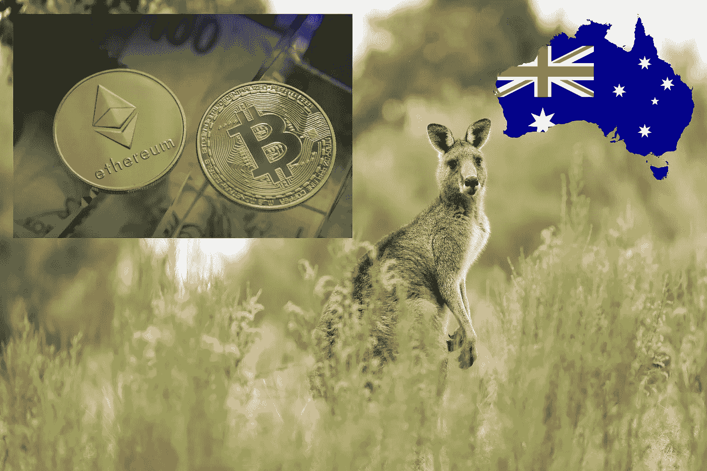

# 全部被加密—2022 年 4 月 22 日第一周

> 原文：<https://medium.com/coinmonks/all-been-crypto-week-22-apr-2022-a87de50c142?source=collection_archive---------47----------------------->

这是一个更加横盘的一周，波动性显著压缩，市值徘徊在 2 万亿以下，大多数主要公司的个位数较低。Luna 是主要例外，与 TRON 一起+15%，证明稳定的硬币交易仍在进行，XMR 在确认[即将到来的硬分叉](https://www.getmonero.org/2022/04/20/network-upgrade-july-2022.html)后+14%。在+ve 方面，澳大利亚批准了首批加密 ETF，宣布了一些新的融资和合作伙伴关系，以及更大规模的并购。不过，在更悲观的方面，我们也看到乌克兰禁止用本币购买加密产品，以及美国财政部制裁俄罗斯矿商。喜欢阅读

蝙蝠太极—【btc21@mail.com 

# **头条:**

## [澳大利亚接受首批加密 ETF](https://forkast.news/australia-pulls-a-fast-one-us-approves-btc-eth-etfs/)

21Shares 和 ETF Securities 将于下周推出澳大利亚首批比特币和以太的现货交易所交易产品。Blockworks 推测，10 亿美元可能会在推出时进入加密产品。这使得澳大利亚成为另一个可以通过传统金融工具访问加密的主要司法管辖区。加拿大和欧洲已经有类似的产品(ETF/etn ),美国仍然依赖期货支持的 ETF。

## [创也拉着卢娜](https://www.theblockcrypto.com/post/142867/justin-sun-to-launch-algorithmic-stablecoin-usdd-on-tron-will-use-10-billion-of-crypto-as-collateral)

在 Luna 及其算法稳定的硬币取得成功后，UST 现在已经将 BTC 和 AVAX 加入其国库，支持其他连锁店。 [FRAX](https://www.theblockcrypto.com/post/141099/frax-finance-may-buy-large-amounts-of-major-cryptos-to-back-its-stablecoin) 已经推测将 L1 加入国库，我们现在看到附近的[在 testnet 上发布 USN，TRON 谈论 USDD 和 algo stable coin 由加密抵押品支持。预计会有更多的协议来做同样的事情。我们总是在 crypto 中看到这一点，市场很快就会复制成功的策略。与此同时，Maker 并没有睡觉，并在](https://cryptobriefing.com/near-launches-usn-stablecoin-testnet/) [StarkNet](https://decrypt.co/98252/ethereum-makerdao-launch-starknet-10x-lower-gas-costs) 上宣布了部署。这些项目一方面应该为 BTC 提供一个地板，但也增加了系统性风险。如果出现整体崩盘，我会认为，即使是卢纳的 UST 也没有出现重大压力事件，因此会带来系统性风险，甚至比集中稳定的硬币更大。

## [乌克兰禁止用本国货币购买密码](https://cointelegraph.com/news/ukraine-bans-bitcoin-purchases-with-local-currency-amid-martial-law)

乌克兰国家银行继续采取措施，通过对加密货币购买实施重大限制，防止戒严期间的资本外流。乌克兰人现在只能用外币购买比特币和其他加密货币，每月购买总额不得超过 10 万 UAH(合 3300 美元)。相关限制也适用于国际点对点交易。这些限制显然令人惊讶，因为乌克兰政府一直在戒严期间积极努力使加密货币合法化。三月，乌克兰总统沃洛季米尔·泽伦斯基签署了一项法律，为该国运营受监管的加密市场建立法律框架。

## [美国财政部制裁俄罗斯矿工](https://www.forbes.com/sites/jasonbrett/2022/04/20/us-treasury-sanctions-russian-crypto-mining-operation-amid-new-token-launch/?sh=5ddb93fe20b4)

美国财政部正在对俄罗斯虚拟货币采矿业的公司采取行动。巧合的是，国际货币基金组织本周早些时候也就此警告过 T1。外国资产管制处(OFAC)指认 Bitriver AG 是一家总部设在瑞士的控股公司，从事一项加密采矿业务，在俄罗斯有三个办事处，以及十个子公司，原因是"正在或曾经在俄罗斯联邦经济的技术部门开展业务"财政部的这一里程碑式的指定标志着加密采矿业务首次受到美国的制裁。这很有趣，因为财政部一直承认，到目前为止，俄罗斯没有大规模使用加密技术来逃避制裁，这标志着他们的观点首次发生潜在的变化。记得俄国是[排名前三的 BTC 矿业国家](https://ccaf.io/cbeci/mining_map)

# **语录:**

> 我不相信自我监管的金融部门

**法国总统埃马纽埃尔·马克龙**

> 继 2021 年 5 月 DMCC 加密中心启动后，DMCC 加入其自由区的加密和区块链企业数量激增。仅在 2022 年第一季度，所有公司注册中就有 16%是与加密相关的活动

**迪拜多种商品中心执行主席兼首席执行官 Ahmed Bin Sula YEM**

> 在我们看来，这真的是一个(是否存在比特币现货 ETF)的时间问题。如果证券交易委员会不能从同一个角度看待两个类似的问题，期货交易所交易基金和现货交易所交易基金，那么，事实上，这是违反行政程序法的潜在理由

**Michael Sonnenshein，灰度投资公司首席执行官**

> 加入 Coinmonks [电报频道](https://t.me/coincodecap)和 [Youtube 频道](https://www.youtube.com/c/coinmonks/videos)了解加密交易和投资

# 另外，阅读

*   [Blockfi vs 比特币基地](https://coincodecap.com/blockfi-vs-coinbase) | [BitKan 评论](https://coincodecap.com/bitkan-review) | [Bexplus 评论](https://coincodecap.com/bexplus-review)
*   [南非的加密交易所](https://coincodecap.com/crypto-exchanges-in-south-africa) | [BitMEX 加密信号](https://coincodecap.com/bitmex-crypto-signals)
*   [MoonXBT 副本交易](https://coincodecap.com/moonxbt-copy-trading) | [阿联酋的加密钱包](https://coincodecap.com/crypto-wallets-in-uae)
*   [雷米塔诺评论](https://coincodecap.com/remitano-review)|[1 英寸协议指南](https://coincodecap.com/1inch)