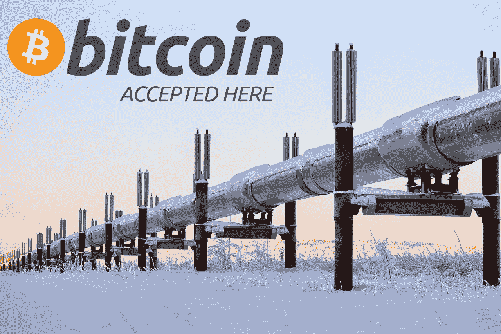

# 全部被加密—2022 年 3 月 25 日第一周

> 原文：<https://medium.com/coinmonks/all-been-crypto-week-25-mar-2022-52085ffba8cb?source=collection_archive---------70----------------------->

这是看涨的一周，我们收回了 2 万亿美元的市值，Alts 普遍表现出色，将主导地位短暂推低至 40%以下。ETH 上涨了 11%,因为关于今年晚些时候即将进行的合并和过渡的传言越来越多。在这种阴影下，我们还看到 ETC 带来了一个+73%的怪物周，随后是 BCH +25%。我们还有 APE 硬币+50%的列表，并立即进入前 100 名硬币，交易量巨大，ADA 记录了+34%的移动，比特币基地现在提供赌注，TLV 增加了 37%，哇，尽管仍然只有 300 毫米。在新闻中，我们再次进行了多次融资和融资，第一家美国银行进行了场外加密衍生交易，第一家澳大利亚银行铸造了稳定的硬币，以及更多关于宇迦实验室即将推出元宇宙计划的新闻，当然还有一些漏洞和黑客攻击。享受阅读！

蝙蝠太极—[btc21@mail.com](mailto:btc21@mail.com)

# 标题:

## [俄国考虑接受 BTC 作为能源出口的付款方式](https://www.cnbc.com/2022/03/24/russia-might-take-bitcoin-as-payment-for-oil-and-gas-as-sanctions-rise.html)

俄罗斯国会能源委员会主席帕维尔·扎瓦尼(Pavel Zavalny)在周四的新闻发布会上表示，俄罗斯愿意接受比特币用于其自然资源出口。虽然对于一些声称这一发展只是在美元武器化的世界中采用比特币作为无许可硬通货的自然进展的人来说，这可能并不奇怪，但我认为公平地说，对我们大多数人来说，这仍然是一个相当大的声明。如果真的实施，它可能会带来美国方面对加密的更多审查，试图对俄罗斯施加经济压力，甚至可能把我们推向最终失去可替代性的方向。但是请注意，这实际上已经被其他美国制裁的国家以间接的方式做过了，比如伊朗。他们为 BTC 开采石油，而不是出售石油，但效果是一样的，将能源转化为数字资产。我毫不怀疑俄罗斯也希望这样，但由于显而易见的原因，在技术进口事实上被禁止的情况下，这在短期内是不可能的。让这份声明变得更加复杂的是，这些加密支付只允许像中国和土耳其这样的“友好”国家使用。这两个国家在密码监管方面相对敌对，所以我认为不太可能立即接受他们的提议。很难说这份声明背后的动机是什么，但它肯定会在美国引发关于加密帮助避免和淡化制裁的进一步辩论。

## 厌倦猿猴了吗？圆形的；循环的

我通常不会有一个话题在连续几周内出现两次，但这个故事中有太多东西需要解开，而且很明显仍然是头条新闻，有很多移动的部分。宇迦实验室的幻灯片被广泛泄露，有人猜测这是故意的，他们“发布”了一个视频[取笑他们计划推出的元宇宙游戏，然后当然有围绕硬币掉落的炒作。截至发稿时，APE 的市值为 13 美元，比首次上市时增长了 50%，市值约为 20 亿英镑，24 小时营业收入为 100 亿美元，排名第 61 位。)交易量为 16 亿英镑。这里有很多猜测，因为即使甲板泄漏和视频和公告，我们真的不知道太多的计划前进。在治理、游戏玩法等方面。以商业成功来衡量，猿类无疑是迄今为止最成功的 NFT 项目，但它们并不是唯一建造元宇宙的动物，我想提醒大家，它们甚至还没有过一周年纪念日。宇迦实验室成立还不到一年。然而，这并不妨碍他们本周以 40 亿英镑的估值为](https://www.youtube.com/watch?v=wcOyqZtZs8g)[筹集 4.5 亿英镑的资金——当然是为了扩建元宇宙。
现在转到我想强调的另外两个方面，这两个方面在某种程度上与整个 Ape 传奇有关，但也更广泛地与 NFTs 和一般加密有关。首先是关于“某人”(因为缺乏更好的词)的故事，他足够聪明，根据你在“代码就是法律”光谱中的位置找到了一个利用或套利机会，借了 5 只在金库里的猿](https://www.coindesk.com/business/2022/03/22/bored-apes-owner-yuga-labs-raises-450m-led-by-a16z/)，要求空投猿代币，并在一次交易中全部归还。这是可能的，因为空投资格不是由过去所有权的快照决定的(像大多数空投一样)，而是由现场状态决定的。在声明发布之前，Meebits[还有关于内幕交易的指控。
我觉得有必要分享的另一个故事是关于 Arthur Cheong，DeFiance Capital 的创始人，他是一次](https://www.thefashionlaw.com/insider-trading-claims-are-coming-as-nft-space-starts-to-consolidate/)[黑客攻击的受害者](https://fortune.com/2022/03/22/millions-stolen-nfts-scam-crypto-arthur-cheong/)，这次攻击使他损失了价值 170 万美元的 NFTs。我提出这个问题是为了提醒大家 opsec 是多么重要，Arthur 对这个行业来说绝不是新手，他对加密技术了如指掌，知道自己在做什么。消息是它的野生在那里，所以尽你所能保护自己和你的资产——不是你的钥匙不是你的硬币

## 银行走向加密——[高盛首笔场外交易](https://www.bloomberg.com/news/articles/2022-03-21/goldman-conducts-its-first-over-the-counter-crypto-options-trade)， [ANZ 印刷首枚澳元稳定硬币](https://www.reuters.com/business/finance/anz-becomes-first-australian-bank-mint-stablecoin-2022-03-23/)

该国第三大贷款机构 ANZ 表示，它已经通过智能合约铸造了 3000 万澳元的 DC。他们使用消防栓作为保管人，为总部位于澳大利亚的大型家族企业 Victor Smorgon Group 创造了 stablecoin，计划用它在总部位于墨尔本的交易所 Zerocap 进行交易。硬币在双方之间转移，后来兑换回法定货币，这更多的是一种概念验证，但显然是朝着数字资产成为主流的方向迈出了一大步。坚持澳大利亚 [FTX 本周宣布](https://www.prnewswire.com/news-releases/ftx-establishes-local-presence-in-australia-301506261.html)在澳大利亚建立一个新的实体。在美国，高盛是第一家宣布与银河数码成功进行场外加密期权交易的银行。加密衍生品的规模大幅增长，在总交易量中所占的份额越来越大，我预计这一趋势将会继续。

# **语录:**

> 过去三周情况的一个积极方面是，它提醒了加密市场的许多人，加密货币的最终目的不是玩价值百万美元的猴子图片，而是在现实世界中做一些能取得有意义结果的事情

**维塔利克·布特林**

> 精心设计的全球数字支付系统可以增强国际交易的结算，同时降低洗钱和腐败的风险。数字货币也有助于降低跨境支付的成本，例如，当外籍工人将收入汇回家中时

**贝莱德首席执行官拉里·芬克**

> 我们正在努力——我已经告诉各州机构——找出如果一家企业想用加密货币向佛罗里达州纳税，我们应该愿意接受的方法

佛罗里达州州长罗恩·德桑蒂斯

> 加入 Coinmonks [电报频道](https://t.me/coincodecap)和 [Youtube 频道](https://www.youtube.com/c/coinmonks/videos)了解加密交易和投资

# 另外，阅读

*   [如何购买 Monero](https://coincodecap.com/buy-monero) | [IDEX 评论](https://coincodecap.com/idex-review) | [BitKan 交易机器人](https://coincodecap.com/bitkan-trading-bot)
*   [CoinDCX 评论](/coinmonks/coindcx-review-8444db3621a2) | [加密保证金交易交易所](https://coincodecap.com/crypto-margin-trading-exchanges)
*   [红狗赌场评论](https://coincodecap.com/red-dog-casino-review) | [Swyftx 评论](https://coincodecap.com/swyftx-review) | [CoinGate 评论](https://coincodecap.com/coingate-review)
*   [Bookmap 评论](https://coincodecap.com/bookmap-review-2021-best-trading-software) | [美国 5 大最佳加密交易所](https://coincodecap.com/crypto-exchange-usa)
*   [如何在 FTX 交易所交易期货](https://coincodecap.com/ftx-futures-trading) | [OKEx vs 币安](https://coincodecap.com/okex-vs-binance)
*   [CoinLoan 评论](https://coincodecap.com/coinloan-review) | [YouHodler 评论](/coinmonks/youhodler-4-easy-ways-to-make-money-98969b9689f2) | [BlockFi 评论](https://coincodecap.com/blockfi-review)