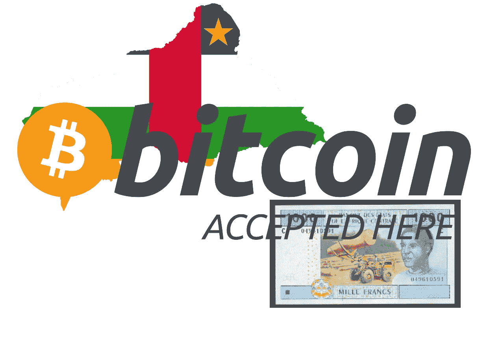

# 全部被加密—2022 年 4 月 29 日第一周

> 原文：<https://medium.com/coinmonks/all-been-crypto-week-29-apr-2022-28f22e8cc73a?source=collection_archive---------43----------------------->

月底，随着美国科技股的下跌，我们迎来了又一周的下跌。市值降至 1.85 万亿，BTC 略胜一筹，再次将主导地位推近 40%。最大的痛苦是在 ALT L1s 上，SOL 下降了 7%，LUNA、ADA、DOT、AVAX 都下降了 15%左右，接近 28%。很少有赢家在元宇宙土地拍卖启动时上涨 51%，在宣布 coinbase 上市后上涨 20%。退一步说，我们不得不承认，比特币的波动性继续降低，而采用率继续稳步上升。然而，新闻流相当乐观。我们有另一个让 BTC 成为法定货币的国家，一家提供 BTC 抵押贷款的主要华尔街银行，一家允许向 BTC 分配 401(k)计划的主要美国养老金提供者。除了比特币，我们还乐观地宣布推出代币，更多主要行业参与者宣布搬到迪拜。享受阅读！

蝙蝠太极—[btc21@mail.com](mailto:btc21@mail.com)

# 标题:

## [中非共和国采用比特币作为官方货币](https://www.reuters.com/world/africa/central-african-republic-adopts-bitcoin-an-official-currency-2022-04-27/)

我们都有这种宾果卡，更多的发展中国家采用埃尔萨尔瓦多雷模式，毫不奇怪，贫穷和不发达国家正在带头。汽车是一个典型的例子。它是一个内陆国家，拥有丰富的资源，如黄金和铀，但仍然是世界上最贫穷的国家之一。自 2012 年以来，它一直受到内战的破坏，480 万人口中只有 11%的人可以访问互联网。与埃尔萨尔瓦多雷相似的地方是，中非共和国是非洲六个使用中非法郎作为其货币的国家之一，根据贝克·麦肯齐律师事务所的说法，[是“一种受法国支持并与欧元挂钩的区域货币”。这就是一个民族国家，它甚至不使用自己的“货币”,就像(萨尔瓦多雷使用美元)做出选择，一个分散的无许可版本比一个由主要发达国家支持的版本更好。他们承担货币贬值的负担，却没有任何与印钞相关的好处，这是有道理的。预计会有更多的州跟进。](https://www.lexology.com/library/detail.aspx?g=0b82e826-20a2-42f8-a376-f3dbe1adadc7)[巴拿马](https://bitcoinmagazine.com/business/panama-assembly-passes-bill-regulating-bitcoin-crypto)也批准了一项法案，规范比特币和加密货币的支付使用，比特币投资将不会征收资本利得税。投资竞争已经开始。

## [富达允许 401(k)计划分配给比特币](https://www.wsj.com/articles/fidelity-to-allow-retirement-savers-to-put-bitcoin-in-401-k-accounts-11650945661?mod=article_inline)

在所有主要的 tradfi 资产管理公司中，Fidelity 可能是对加密最友好和最开放的，因此他们率先推出这一新产品也就不足为奇了。他们已经宣布并计划在今年晚些时候推出，以应对劳工部的批评，这仍然表明他们有多么自信。他们还表示，他们计划将 401(k)账户余额和工资缴款的上限设定在 20%，远高于一些其他资产管理公司习惯的传统浮动个位数百分比。更重要的是，他们很清楚他们只允许比特币(目前？).给你一个规模的概念——根据[投资公司研究所](https://www.ici.org/401k#:~:text=401(k)%20plans%20hold%20%247.3,of%20former%20employees%20and%20retirees.)的数据，2021 年，超过 7.3 万亿美元的资产储存在 401(k)计划中，代表着大约 6000 万在职参与者和数百万退休人员和前雇员

## [高盛提供首笔 BTC 担保贷款](https://www.bloomberg.com/news/articles/2022-04-28/goldman-offers-its-first-bitcoin-backed-loan-in-crypto-push)

现在，许多较新的数字化/金融科技银行已经开始提供加密抵押贷款，但高盛现在进入这个市场是向主流迈出的又一步。这表明比特币与 TradFi 的关系已经根深蒂固。现在没有给出任何条款，我们也没有更多的细节，但我们知道几周前 Microstrategy 从 Silvergate 那里得到了什么条款。

## [乐观令牌掉落](https://cryptobriefing.com/ethereum-layer-2-network-optimism-dropping-token/)

这是一个保守得最糟糕的秘密之一，以太网 L2 网络的乐观主义者将发起空投。我们在 crypto 中一次又一次地看到这种动态，尤其是在 ETH L2s 上。Polygon 从一个令牌开始，并设法更快地扩大规模(现在我知道这不是苹果对苹果，但我认为足够接近)。Polygon 获得 37 亿[TVL](https://defillama.com/chains)vs Arbitrums 20 亿<乐观 0.5 亿。该团队还与[分享了空投资格的标准列表](https://community.optimism.io/docs/governance/airdrop-1/#airdrop-1-allocations)，其中包括从乐观用户到更高级标准的项目，如 DAO 投票者或 multisig 签名者。他们说还会有更多..继续关注，也许会更多地使用网络？

# **语录:**

> 从目前的角度来看，我们不认为比特币符合货币储备的要求，这就是为什么我们直到现在才决定不把比特币放在我们的资产负债表上

**瑞士国家银行主席托马斯·乔丹**

> 迪拜数字资产行业的能量现在是电力。我们已经决定将我们的三箭总部搬到迪拜，我期待着与更多的科技创业公司会面

**三箭资本联合创始人苏竹**

> 一旦我们发布了在 Terra 上访问 DeFi 的能力，我们就看到了这种疯狂的需求。因此，在最初的 72 小时内，超过 2.5 亿美元被部署，我认为现在正好是一周，从我们的平台进入 Terra 的交易已经有 5 亿美元

**Fireblocks 首席执行官迈克尔·肖洛夫**

> *加入 Coinmonks* [*电报频道*](https://t.me/coincodecap) *和* [*Youtube 频道*](https://www.youtube.com/c/coinmonks/videos) *了解加密交易和投资*

# 另外，阅读

*   [3 商业评论](/coinmonks/3commas-review-an-excellent-crypto-trading-bot-2020-1313a58bec92) | [Pionex 评论](https://coincodecap.com/pionex-review-exchange-with-crypto-trading-bot) | [Coinrule 评论](/coinmonks/coinrule-review-2021-a-beginner-friendly-crypto-trading-bot-daf0504848ba)
*   [莱杰 vs n rave](/coinmonks/ledger-vs-ngrave-zero-7e40f0c1d694)|[莱杰 nano s vs x](/coinmonks/ledger-nano-s-vs-x-battery-hardware-price-storage-59a6663fe3b0) | [币安评论](/coinmonks/binance-review-ee10d3bf3b6e)
*   [Bybit 交易所评论](/coinmonks/bybit-exchange-review-dbd570019b71) | [Bityard 评论](https://coincodecap.com/bityard-reivew) | [Jet-Bot 评论](https://coincodecap.com/jet-bot-review)
*   [3 commas vs crypto hopper](/coinmonks/3commas-vs-pionex-vs-cryptohopper-best-crypto-bot-6a98d2baa203)|[赚取加密利息](/coinmonks/earn-crypto-interest-b10b810fdda3)
*   最好的比特币[硬件钱包](/coinmonks/hardware-wallets-dfa1211730c6) | [BitBox02 回顾](/coinmonks/bitbox02-review-your-swiss-bitcoin-hardware-wallet-c36c88fff29)