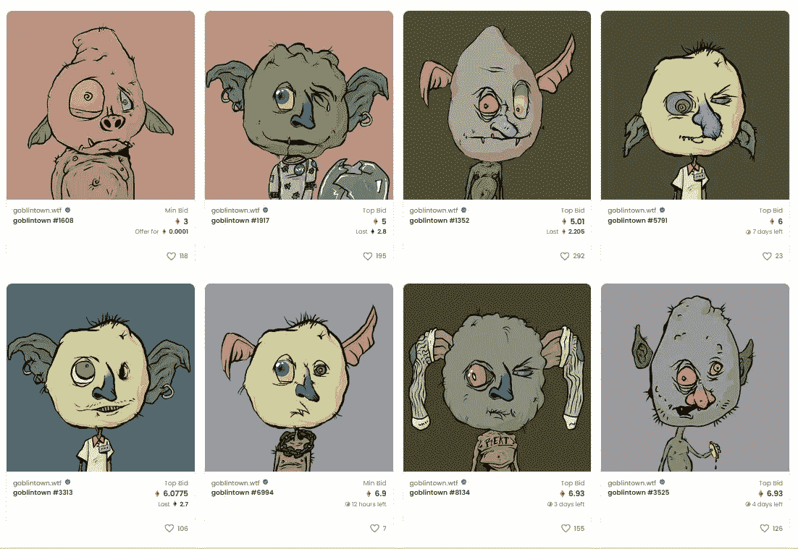

# 全部加密—2022 年 6 月第 3 周

> 原文：<https://medium.com/coinmonks/all-been-crypto-week-3-june-2022-e940def2f682?source=collection_archive---------60----------------------->

BTC 经历了有记录以来最长的下跌后，终于迎来了一周。我们本周收盘上涨 4%，使我们回到 30k，ALTs 跟随最著名的 ADA +23%，而唯一表现不佳的是 SOL -5%，经历了另一次愤怒和停机时间。我们有一个“动荡”的乐观空投，并开始看到我们进入熊市的第一个迹象，两个 CEX 宣布第一轮裁员。另一方面，币安实验室关闭了一个 5 亿美元的 Web3 基金，一些创意团队剥离了一个名为“妖精镇”的真正熊市 NFT 项目，以同情当前的环境。他们可以自由铸造，但是我看到现在的地板在 7 ETH 的开阔海面上..不管怎样，享受阅读吧！

蝙蝠太极—[btc21@mail.com](mailto:btc21@mail.com)

# 标题:

## [**前 Opensee 员工被控内幕交易**](https://www.coindesk.com/policy/2022/06/01/us-charges-ex-opensea-exec-with-nft-insider-trading/)

前公海产品负责人 Nate Chastain 被指控电信诈骗和洗钱。这是 DOJ 第一次指控某人从事数字资产内幕交易。因此，两次 20 年的判决可以解释为杀鸡儆猴。所以发生了什么——他是产品负责人，所以在他的职位上，他有一些内幕消息，比如哪些 NFT 系列将被列在他们网站的首页。他只是在上市前买入这些股票，然后卖出获利。这里的问题是，在区块链上这一切都是透明的，即使使用不同的账户，迟早有人会发现。这是去年的一个大丑闻，考虑到系统中有多少欺诈，预计会有更多这样的判决。

## [动荡乐观空投](https://thedefiant.io/optimism-airdrop-demand-surges/)

乐观首次空投的第一阶段发生在 5 月 31 日，但它被需求淹没，导致网络经历性能问题。乐观表示，他们大大低估了一旦其合同部署后试图访问其索赔链接的流量，尽管该团队尚未宣布下降是实时的。对于一些人来说，他们花了几个小时才得到空投，但这只是故事的一面。乐观主义者试图更有选择性地选择空投对象，以便利用真正的用户，而不仅仅是农民。因此，毫不奇怪，现在看到这个[提案](https://gov.optimism.io/t/users-who-sold-the-initial-op-airdrop-should-become-ineligible-for-all-future-airdrops/2143?u=axlvaz)后，下降建议，垃圾倾倒应被禁止在未来的下降。听起来空投农业在未来会变得更加困难。再给你一个例子，看看宇宙链[朱诺](https://www.coindesk.com/layer2/2022/04/29/juno-blockchain-community-officially-votes-to-revoke-whales-tokens/)发生了什么。社区投票决定追溯冻结一条鲸鱼的空投资产，这条鲸鱼正在考虑采取法律行动。

## [中国杂凑率是‘回](https://www.coindesk.com/layer2/2022/05/22/china-cant-seem-to-stop-bitcoin-mining/)

在最新的剑桥比特币电力消耗报告中，中国以约 20%的全球散列电力再次跃居第二，这让人不禁质疑这怎么可能。不是有一个采矿禁令和哈希率下降到 0 吗？这是一个有趣的问题，我喜欢《比特币》杂志中的辩论，为什么挖掘数据非常难以准确收集。新成立的比特币采矿委员会建立的类似采矿数据集也因其方法的准确性受到了一些[公众的批评。如果说有什么不同的话，CCAF 报告采矿数据的持续工作暴露了许多从比特币采矿中收集准确和有代表性的数据时不可避免的问题。考虑到精心策划中国经济复苏的现实世界的物流，证实了 CCAF 最新数据的不可靠性。一年前离开中国的近一半 hash rate 决定放弃其在世界其他地方新获得的采矿设施，并迁回中国，这在操作上完全不可能。当然，中国不太可能恢复以前在全球比特币杂凑利率市场的份额。行业领袖和学者都同意这一点。中国官员仍在没收](https://twitter.com/nic__carter/status/1410769371232878600)[数百](https://cointelegraph.com/news/chinese-police-busts-illegal-crypto-mining-farm-seizes-190-miners)和[数千](https://www.yahoo.com/video/china-seizes-over-3-500-050100677.html)钻井平台的采矿设备，许多大型矿商已经永久搬迁到世界其他地方。但中国地下采矿业将永远不会消亡。

# **语录:**

> 在我们所处的环境中，我们会问，‘新的资金是什么？’？“我们可以在国家之间转移的货币类型是什么，是交换媒介还是财富储存手段？”比特币在过去的 11 年里取得了巨大的成就。

**布里奇沃特联合公司创始人雷伊·达里奥**

> 在这一点上，比特币和任何加密货币都没有真正成为一种可信的机构投资

**古根海姆合伙公司的斯科特·米纳德**

> 没有所谓的“bscgem”链条上的每个令牌都是垃圾。每一个提到“bscgem”的账号都是诈骗机器人，卑鄙小人，或者白痴

**DOGE 的联合创始人比利·马库斯**

> 加入 Coinmonks [电报频道](https://t.me/coincodecap)和 [Youtube 频道](https://www.youtube.com/c/coinmonks/videos)了解加密交易和投资

# 另外，阅读

*   [3 商业评论](/coinmonks/3commas-review-an-excellent-crypto-trading-bot-2020-1313a58bec92) | [Pionex 评论](https://coincodecap.com/pionex-review-exchange-with-crypto-trading-bot) | [Coinrule 评论](/coinmonks/coinrule-review-2021-a-beginner-friendly-crypto-trading-bot-daf0504848ba)
*   [莱杰 vs n rave](/coinmonks/ledger-vs-ngrave-zero-7e40f0c1d694)|[莱杰 nano s vs x](/coinmonks/ledger-nano-s-vs-x-battery-hardware-price-storage-59a6663fe3b0) | [币安评论](/coinmonks/binance-review-ee10d3bf3b6e)
*   [Bybit Exchange 审查](/coinmonks/bybit-exchange-review-dbd570019b71) | [Bityard 审查](https://coincodecap.com/bityard-reivew) | [Jet-Bot 审查](https://coincodecap.com/jet-bot-review)
*   [3 commas vs crypto hopper](/coinmonks/3commas-vs-pionex-vs-cryptohopper-best-crypto-bot-6a98d2baa203)|[赚取加密利息](/coinmonks/earn-crypto-interest-b10b810fdda3)
*   最好的比特币[硬件钱包](/coinmonks/hardware-wallets-dfa1211730c6) | [BitBox02 回顾](/coinmonks/bitbox02-review-your-swiss-bitcoin-hardware-wallet-c36c88fff29)
*   [BlockFi vs 摄氏度](/coinmonks/blockfi-vs-celsius-vs-hodlnaut-8a1cc8c26630) | [Hodlnaut 审核](/coinmonks/hodlnaut-review-best-way-to-hodl-is-to-earn-interest-on-your-bitcoin-6658a8c19edf) | [KuCoin 审核](https://coincodecap.com/kucoin-review)