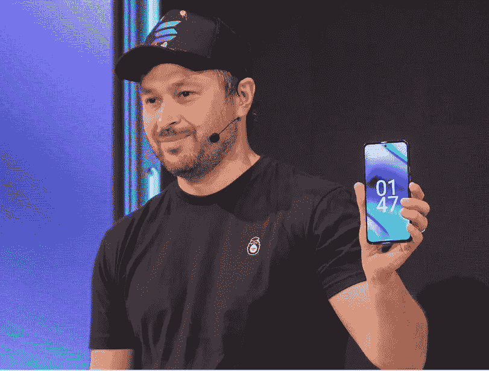

# 2022 年 6 月 30 日第一周

> 原文：<https://medium.com/coinmonks/all-been-crypto-week-30-june-2022-b1cf5601dfff?source=collection_archive---------54----------------------->

回到我们上周结束的地方，20k BTC。我们经历了短暂的反弹，但很快就消失了，并继续在 1 万亿市值以下徘徊。市场继续对更多的停止提款和破产问题的出现感到紧张，我们还没有走出困境。然而，在价格行为之下，我们本周实际上有一些有趣的发展。Solana labs 发布了一款手机，Maker 正在就他们应该购买多少美国国债进行投票，Microstrategy 又获得了 480 BTC，Gavin Wood 发布了一项针对网络生态系统的新治理提案，而 gray 正在就比特币现货 ETF 被拒一事向 SEC 提起诉讼。从来没有一个无聊的时刻。享受阅读，并保持安全！

蝙蝠太极—[btc21@mail.com](mailto:btc21@mail.com)

# 标题:

## [索尔电话](https://solana.com/news/solana-mobile-stack-reveal)

索拉纳实验室展示了一个名为 SMS 的移动平台和一款 Android 智能手机设备。这是一个相当大的消息，因为这意味着进入硬件领域，在一个拥挤且增长缓慢的市场中与三星和谷歌等公司竞争。我真的很喜欢在移动设备中内置一个安全的私人密钥库的想法，但这远远超出了我的想象。然而，他们想进入太空是一个非常有趣的举动。这款设备看起来很高端，我的猜测是很难在这一领域获得市场份额，对于没有渗透的发展中国家来说，这是一个廉价版本，对我来说更像是一个未开发的市场。也不要指望得到一般对外来者怀有敌意的 iOS 的支持。不过，有一点值得关注，那就是熊市

## [庄家道买入国债](https://beincrypto.com/makerdao-voting-to-allocate-500-million-treasury-funds/)

DAOs 的 OG 已经通过了一项向流动性债券策略投资 5 亿英镑的提案。是的，这是正确的分散的自治组织，背后的唯一主要分散稳定硬币戴是把他们的国库到美国政府债券。让那件事过去一会儿。精确的分配仍有待投票，但看起来都将进入[国债](https://forum.makerdao.com/t/signal-request-asset-allocation-of-mip65-clydesdale/15922)。我知道我们正处于动荡的时代，他们也在为生存而挣扎，这似乎只是在当前的背景下有争议，但记得当他们开始接受 USDC/USDT 作为抵押品时，基本上远离了只有加密支持的稳定硬币。现在，如果你希望拥有与美元最相关的资产，那么你的主要资产当然是美国国债，只是你正在成为另一个圈子，并创造了许多真实世界的攻击媒介，我们希望通过分散化来摆脱这些媒介。但话说回来，如果你资产中的大垃圾已经是其他稳定的硬币，我们已经离那很远了，而且他们也不是不考虑在资产负债表上获得贷款。在 Luna 之前，无抵押贷款平台 [Maple](https://maplefinance.medium.com/maker-x-maple-a-partnership-to-scale-the-digital-economy-38f6ce0fce1b) 和 [TrueFi](https://forum.makerdao.com/t/signal-request-onboard-d3m-for-truefi/14563) 已经通过了董事会投票，建立资金池，向更多“传统信贷”机会放贷。

> 交易新手？尝试[加密交易机器人](/coinmonks/crypto-trading-bot-c2ffce8acb2a)或[复制交易](/coinmonks/top-10-crypto-copy-trading-platforms-for-beginners-d0c37c7d698c)

## 救助和破产更新

因此，我们上周对 SBF 进行了一轮救助，现在看来，这一轮救助更值得接受。BlockFi 的主要投资者之一摩根克里克(Morgan Creek)泄露的一个电话让我们了解到这家贷款机构的实际情况有多糟糕。根据泄露的通话内容，FTX 是唯一一个愿意将债务债权置于用户提款之后的公司，作为交换，它将获得“以基本上为零的价格”购买 BlockFi 的选择权。毫不奇怪，他们匆忙试图提出一个还价。这一泄露还表明，BlockFi 对 3AC 有 10 亿英镑的贷款敞口，由 BTC 和 GBTC 的抵押品支持。谈到 3AC， [BVI 法院](https://blockworks.co/three-arrows-capital-ordered-into-liquidation-by-bvi-court-report/)本周早些时候命令他们进行清算， [Voyager Digital](https://www.prnewswire.com/news-releases/voyager-digital-provides-market-update-301575492.html#financial-modal) 向他们发出了拖欠 15250 BTC 和 3 . 5 亿 USDC 贷款的通知。但压力不仅仅来自市场的贷款方，我们开始看到不断上涨的能源价格和“廉价”的 BTC 也在影响着矿商。Compass Mining 被指控未能支付水电费和其他每月费用，他们否认了指控，但他们的首席执行官/首席财务官仍然辞职。矿工们承受压力的另一个迹象是他们出售的 BTC 数量——5 月份已经是 100 %, 6 月份也不可能好到哪里去。因此，随着所有这些不良资产进入市场，基金也准备逢低买入也就不足为奇了。高盛似乎正在评估 Web3 加密基金、专门从事不良资产的基金以及手头有大量现金的传统金融机构的兴趣，并寻求它们的承诺。他们显然正试图为 Celsius 资产筹集 20 亿英镑。我猜会有更多

## [俄罗斯议会批准对数字资产发行商减税](https://www.reuters.com/technology/russian-parliament-approves-tax-break-issuers-digital-assets-2022-06-28/)

受到西方制裁重创的俄罗斯正在探索数字资产的选择。他们批准了一项法案草案，免除加密货币发行者的增值税，以促进该行业的发展，减少对西方支付轨道的依赖。为了说明这一点，他们在 6 月 27 日拖欠了一笔[1 亿美元的国际债券利息，这是 100 多年来的第一次。克里姆林宫表示，由于石油和天然气收入，它有能力履行自己的义务，他们正在积极尝试使用加密技术进行国际支付。](https://www.reuters.com/markets/europe/russia-slides-towards-default-payment-deadline-expires-2022-06-26/)[见四月 ABC](/coinmonks/all-been-crypto-week-29-apr-2022-28f22e8cc73a) 。我预计这将导致加密货币进一步出现 KYC 和可替代性问题。

# **行情:**

> 我们愿意在这里做一个有点糟糕的交易，如果这是稳定局势所需要的

**山姆·班克曼-弗里德**

> Governance v2 展示了 Polkadot 的无分叉升级能力，甚至能够在没有硬分叉的情况下升级自己的治理机制

**罗伯特·哈伯迈尔，波尔卡多特的联合创始人**

> 我认为所有自尊的国家都会在三年内拥有一种国家数字货币。[……]我们应该尽快做好准备。此外，这将解决被 SWIFT 屏蔽的问题，因为这一整合将使 SWIFT 变得不必要

**Olga Skorobogatova，俄罗斯央行第一副行长**

> 加入 Coinmonks [电报频道](https://t.me/coincodecap)和 [Youtube 频道](https://www.youtube.com/c/coinmonks/videos)了解加密交易和投资

# 另外，阅读

*   [投资印度的最佳密码](https://coincodecap.com/best-crypto-to-invest-in-india-in-2021)|[WazirX P2P](https://coincodecap.com/wazirx-p2p)|[Hi Dollar Review](https://coincodecap.com/hi-dollar-review)
*   [加拿大最佳加密交易机器人](https://coincodecap.com/5-best-crypto-trading-bots-in-canada) | [库币评论](https://coincodecap.com/kucoin-review)
*   [火币的加密交易信号](https://coincodecap.com/huobi-crypto-trading-signals) | [HitBTC 审核](/coinmonks/hitbtc-review-c5143c5d53c2)
*   [TraderWagon 回顾](https://coincodecap.com/traderwagon-review) | [北海巨妖 vs 双子星 vs BitYard](https://coincodecap.com/kraken-vs-gemini-vs-bityard)
*   [如何在 FTX 交易所交易期货](https://coincodecap.com/ftx-futures-trading)