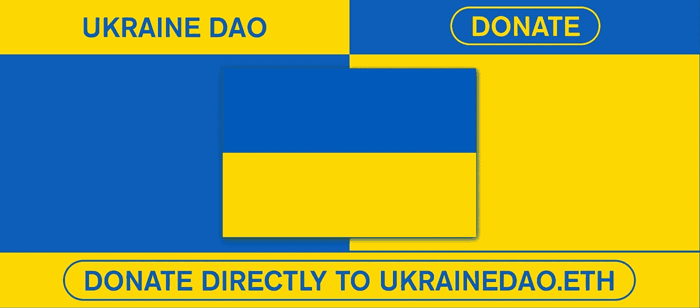

# 全部加密—2022 年 3 月第 4 周

> 原文：<https://medium.com/coinmonks/all-been-crypto-week-4-mar-2022-6313ce6c3e0f?source=collection_archive---------60----------------------->

加密市场回到 2tr，似乎摆脱了上周与股票市场同步的抛售。尽管反弹，我们看到 BTC 的优势继续上升，现在回到 41%以上。基差交易保持平稳，芝加哥商业交易所的交易价格甚至自 2020 年以来首次高于币安，杠杆偏好仍然较低。有一些关于 NFTs 的头条新闻，尽管一些项目在当前环境下以及持续的机构采用方面也推迟了发布。然而，推动市场、叙事和监管前景的主要事件是乌克兰战争，因此本周将略有不同，主要关注这一主题。形势复杂且瞬息万变，但极其重要，因此我将尽力解读过去一周发生的事情，尤其是这些事情对我们资产类别的影响。

蝙蝠太极—[btc21@mail.com](mailto:btc21@mail.com)

# 标题:

## 乌克兰战争及其对加密的意义

我想坦白说，战争总是不好的。它破坏了经济活动，牺牲了生命，所以我理解谈论对加密的影响可能听起来有些愤世嫉俗，尤其是在冲突仍在进行的时候。然而，这是一个加密周刊，我仍然希望我们的技术和资产类别将有助于避免未来的这种冲突。

所以让我们退一步，来分析一下。首先是战争本身，然后是战争的经济影响。我们将把重点放在后面的部分，特别是 crypto 如何能够并且已经解决了一些出现的问题(并且也提出了新的问题)。西方对俄罗斯实施了严厉制裁，包括冻结俄罗斯央行外汇储备，以及将俄罗斯银行踢出 SWIFT。这导致卢布暴跌 30%，不出所料，导致许多俄罗斯人拼命想得到“硬通货”。银行前排起了长队，BTC 的交易量激增——同样的事情也发生在 T2 和乌克兰。我们还记得俄罗斯和乌克兰在冲突前几周都将加密合法化。现在人们担心，正如[政客](https://www.politico.com/news/2022/02/25/russia-crypto-sanctions-00011886?_amp=true)所称，美国制裁中一个秘密大小的漏洞冲淡了影响。OFAC 的规则没有挑出加密资产，但重申了拜登的行政命令，该命令规定禁止规避规则的数字交易。 [NYT 附和了](https://www.nytimes.com/2022/02/23/business/russia-sanctions-cryptocurrency.html)这一观点，并强调了切断加密轨道以避免制裁的重要性，而[区块链协会](https://cointelegraph.com/news/experts-reject-concerns-russia-will-use-crypto-to-bypass-sanctions-totally-unfounded)则认为大规模使用加密技术对俄国来说是不可行的。辩论就在那里。许多人担心这会导致更严厉的监管和限制。《华尔街日报》也有一篇很好的文章，讨论了这场辩论可能会被误导，尽管所有这些金融制裁可能只会在短期内有效。他们认为俄罗斯的储备不是真正的钱，而是自然资源，美元的武器化实际上可能导致中期/长期的非美元化——这是支持加密的一个理由？

然而，在乌克兰的地面上，我们必须处理更紧迫的问题。随着战斗的进行，基础设施和金融轨道显然受到了影响。为了更好地保护互联网接入，埃隆向乌克兰政府捐赠了卫星互联网 Starlink。因为支付轨道也受到影响，缓慢的乌克兰政府已经开始接受加密捐款。这被证明是非常成功的，到目前为止他们已经筹集了超过[5400 万的资金](https://www.cnbc.com/2022/03/03/ukraine-raises-54-million-as-bitcoin-donations-surge-amid-russian-war.html)。主要在 BTC 联邦理工学院和相当大的垃圾在 DOT(540 万来自加文伍德自己)。促使部分成功的是向捐赠者宣布[空投](https://fortune.com/2022/03/03/ukraine-nft-fundraising-crypto-airdrop/)，然后[后来](https://twitter.com/FedorovMykhailo/status/1499348177002151937?ref_src=twsrc%5Etfw%7Ctwcamp%5Etweetembed%7Ctwterm%5E1499348177002151937%7Ctwgr%5E%7Ctwcon%5Es1_&ref_url=https%3A%2F%2Fwww.bloomberg.com%2Fnews%2Farticles%2F2022-03-03%2Fukraine-cancels-planned-crypto-airdrop-rewards-for-donations)为了支持 NFTs 而被取消。还有道也在筹集资金，乌克兰道是最引人注目的一个。他们通过在 NFT 出售乌克兰国旗筹集了 600 万英镑。我想谈的最后一个角度是，即使在美国，加密交易所也拒绝对俄罗斯公民实施全面禁令。我认为区分俄罗斯政府和它的人民是很重要的。对于针对克里姆林宫和强大寡头的制裁，区块链的透明度实际上有助于监控资金流动，同时获得加密可能会减轻普通俄罗斯人因卢布快速通胀而承受的压力。

## [Pixelmon 价值 7000 万美元的 NFT 地毯——炒作、拙劣的艺术、欺骗](https://cryptobriefing.com/hype-bad-art-deception-pixelmons-70m-rug-unpacked/)

更多的是一个象征性的例子，许多糟糕的低努力项目仍然得到资助。像许多项目一样，他们承诺月亮，但最初的下降是如此之低的努力，以至于脸开始崩溃。Pixelmon 是 NFT 的一个游戏项目，本月初销售了价值 7140 万美元的 NFTs，被指控欺骗买家。该项目的劣质艺术和利用开发基金购买蓝筹 NFT 的做法引发了对 Pixelmon 创始人马丁·范·布雷克的强烈反对。NFT 的价格比薄荷低了近 90%。

## [Citadel 暗示加密](https://cointelegraph.com/news/billionaire-admits-he-was-wrong-about-bitcoin-as-citadel-looks-to-crypto-markets)

公司创始人肯·格里芬收回了他的反加密立场，并希望他的公司今年向客户提供数字资产。[在接受大卫·鲁宾斯坦采访时，Citadel 创始人肯·格里芬谈到了最近地缘政治冲突下的市场现状，称市场正处于“非常不稳定的拐点”
当采访转向数字资产时，格里芬透露，该公司今年将涉足加密资产市场。格里芬此前曾警告年轻一代远离数字资产，并表示“没有必要使用加密货币”。](https://www.bloomberg.com/news/articles/2022-03-01/what-citadel-s-ken-griffin-thinks-of-russia-ukraine-sanctions-markets-crypto)

# **行情:**

> 可以合理地假设，在未来几个月，你会看到我们参与加密货币市场的创建

**肯·格里芬 Citadel 首席执行官**

> (乌克兰与俄罗斯的冲突)凸显了国会对包括加密货币在内的数字金融采取行动的必要性

**美联储主席杰莫·鲍威尔**

> 我要求所有主要的密码交易所封锁俄罗斯用户的地址。至关重要的是，不仅要冻结与俄罗斯和白俄罗斯政客相关的地址，还要冻结对普通用户的破坏

**乌克兰副总理费多罗夫**

> *加入 Coinmonks* [*电报频道*](https://t.me/coincodecap) *和* [*Youtube 频道*](https://www.youtube.com/c/coinmonks/videos) *了解加密交易和投资*

# 另外，阅读

*   [Bookmap 评论](https://coincodecap.com/bookmap-review-2021-best-trading-software) | [美国 5 大最佳加密交易所](https://coincodecap.com/crypto-exchange-usa)
*   最佳加密[硬件钱包](/coinmonks/hardware-wallets-dfa1211730c6) | [Bitbns 评论](/coinmonks/bitbns-review-38256a07e161)
*   [新加坡十大最佳密码交易所](https://coincodecap.com/crypto-exchange-in-singapore) | [收购 AXS](https://coincodecap.com/buy-axs-token)
*   [红狗赌场评论](https://coincodecap.com/red-dog-casino-review) | [Swyftx 评论](https://coincodecap.com/swyftx-review) | [CoinGate 评论](https://coincodecap.com/coingate-review)
*   [投资印度的最佳加密软件](https://coincodecap.com/best-crypto-to-invest-in-india-in-2021)|[WazirX P2P](https://coincodecap.com/wazirx-p2p)|[Hi Dollar Review](https://coincodecap.com/hi-dollar-review)
*   [加拿大最好的加密交易机器人](https://coincodecap.com/5-best-crypto-trading-bots-in-canada) | [库币评论](https://coincodecap.com/kucoin-review)
*   [用于 Huobi 的加密交易信号](https://coincodecap.com/huobi-crypto-trading-signals) | [HitBTC 审查](/coinmonks/hitbtc-review-c5143c5d53c2)
*   [如何在 FTX 交易所交易期货](https://coincodecap.com/ftx-futures-trading) | [OKEx vs 币安](https://coincodecap.com/okex-vs-binance)
*   [OKEx vs KuCoin](https://coincodecap.com/okex-kucoin) | [摄氏替代品](https://coincodecap.com/celsius-alternatives) | [如何购买 VeChain](https://coincodecap.com/buy-vechain)