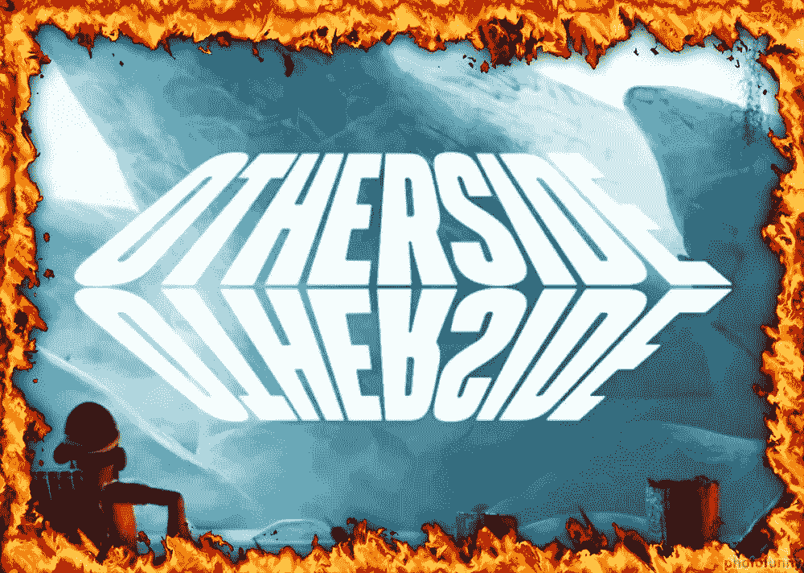

# 全部被加密—2022 年 5 月 6 日第六周

> 原文：<https://medium.com/coinmonks/all-been-crypto-week-6-may-2022-dbeaa4a73ace?source=collection_archive---------53----------------------->

另一个由宏观和美联储主导的动荡的一周，加密市场在市值方面下跌了 7.5%，加密和股票市场之间的相关性继续徘徊在历史高点附近。我们现在正在全面关注红色海洋，在网络的另一次愤怒之后，SOL 甚至下降了-15%，本周唯一的主要上涨是 TRX 在他们的 USDD stablecoin 发布会上拉动了 Luna。说到 Luna，他们宣布 LFG 财政部又增加了价值 15 亿美元的 BTC，目前在 BTC 持有约 35 亿美元(UST 为 180 亿美元)。在监管方面，币安得到了法国的批准，阿根廷的银行受到了中央银行的警告，迪拜的密码监管机构在元宇宙设立了总部。当然，Twitter 和 Elon 上也有一些更新。享受阅读！

蝙蝠太极—[btc21@mail.com](mailto:btc21@mail.com)

# **头条:**

## [**币安在伊隆推特上下注**](https://www.ft.com/content/e2c6123b-eb42-41df-bc82-111f67882ac3)

你已经看到了头条新闻，伊隆以 440 亿美元收购 Twitter。由于多种原因，整个传奇对 crypto 来说很有趣。埃隆热爱 DOGE，Twitter 是该领域新闻和更新的主要来源之一，但也是开源替代方案的发展和 Stani 担任首席执行官的整个传奇，而其他人则建议空投。所有这些都将打破这个星期的范围，但是我想把重点放在这个故事的一个新的方面。即使对世界首富来说，440 亿美元也是一大笔钱，因此埃隆正在为自己的出价寻找合作伙伴。加入号召的人中有币安。CZ 承诺了 500 美元，他称之为收购的“空白支票”,当然他也是公司令牌化的支持者。与 CZ 和 Elon 过去更复杂的关系(见 11 月【13】期)和 Balance 今年早些时候购买的《福布斯》股份相比，这很有意思。在加密中，声誉就是一切，所以我想对消息控制施加一些影响是很重要的。

## [**彼岸的彼岸**的彼岸](https://thedefiant.io/yuga-labs-otherside-land-sale-gas-fees/)

上周末，许多人花时间试图打造 other deed NFTs——瑜伽实验室正式推出他们的元宇宙“The Otherside”。下降是如此热切地期待，一场天然气战争是不可避免的，我猜，如果薄荷不成功，天然气将被退还的预期进一步增加了天然气的火灾(原谅双关语)。因此，根据你的谈话对象，你可以说这是一次成功的发布。他们在几个小时内卖出了 5 万辆 NFT，价值超过 3 亿美元，但价格高得惊人。 [60，234 ETH](https://dune.com/hildobby/Otherside) 被用于铸造其他契约 NFT，大约 14k 交易失败。现在，该项目确实宣布他们将退还这些用户因不成功交易而花费的 16k ETH 中的一部分。《天然气之战》的这一整集也让他们公开提出了自己的连锁店的想法。这反过来又受到了批评，因为当然可以预见，这个备受期待的铸币厂将引发一场天然气战争，从以太坊连锁店转向自己的连锁店可能会有失去分散化的风险。作为这种努力的一个例子，OpenSea 表示他们将接受 APE 作为他们平台上的其他非功能性交易的货币。

## [**阿根廷的银行被禁止使用密码**](https://www.bloomberg.com/news/articles/2022-05-05/argentina-slams-brake-on-crypto-banning-purchases-through-banks)

中国央行昨日宣布，已禁止国内银行为客户使用加密资产提供便利。就在两天前，该国最大的两家银行——加利西亚银行和布鲁班克银行表示他们将允许加密。尽管这一举措不应令我们感到惊讶，因为 3 月份批准的 450 亿美元国际货币基金组织债务方案包括一项不鼓励使用加密货币的条款。我们知道中央银行普遍反对加密，在俄罗斯也发生了同样的事情，俄罗斯银行反对 BTC，支持由总统亲自实施禁令。考虑到阿根廷对国际货币基金组织的依赖以及他们对加密公开的敌意，我们对加利西亚银行和布鲁班克实际上推进加密有点惊讶。也许阿根廷会得到很好的建议以萨尔瓦多为例，在那里，由于对比特币的依赖，该国积极抵制来自国际货币基金组织的压力

# **语录:**

> 从华尔街拿回 Twitter 是正确的第一步

**前 Twitter 首席执行官杰克·多西**

> 维基媒体基金会决定停止直接接受加密货币作为捐赠手段。我们在 2014 年开始直接接受加密货币，这是基于我们的志愿者和捐助者社区的要求。我们是根据这些社区最近的反馈做出这个决定的。具体来说，我们将关闭我们的 Bitpay 账户，这将取消我们直接接受加密货币作为捐赠方式的能力。

**维基媒体基金会首席进步官 Lisa Seitz-gru well**

> FTX 的到来强调了巴哈马已经准备好成为加密领域全球领导者的家园

**巴哈马总理戴维斯**

> 我们增加了一个乐观的 doge，每个人都有 1 个 Doge，可以无限发布。如果有人质疑一个帖子，并且有人确认它是垃圾邮件，他们就会得到垃圾邮件发送者的 Doge。垃圾邮件发送者必须发布 100 倍以上的 Doge，如果不是垃圾邮件，参赛者将失去他们的 Doge。DogeDAO FTW！

**马克·库班**

> 加入 Coinmonks [电报频道](https://t.me/coincodecap)和 [Youtube 频道](https://www.youtube.com/c/coinmonks/videos)了解加密交易和投资

# 另外，阅读

*   最佳[区块链分析](https://bitquery.io/blog/best-blockchain-analysis-tools-and-software)工具| [赚比特币](/coinmonks/earn-bitcoin-6e8bd3c592d9)
*   [Cloudbet 赌场评论](https://coincodecap.com/cloudbet-casino-review) | [点火赌场评论](https://coincodecap.com/ignition-casino-review)
*   [加密套利](/coinmonks/crypto-arbitrage-guide-how-to-make-money-as-a-beginner-62bfe5c868f6)指南| [如何做空比特币](/coinmonks/how-to-short-bitcoin-568a2d0b4ae5)
*   [如何在加拿大购买加密货币？](https://coincodecap.com/how-to-buy-cryptocurrency-in-canada)
*   [无聊猿游艇俱乐部(BAYC)回顾](https://coincodecap.com/bored-ape-yacht-club-bayc-review) | [拜比特 vs 比特币基地](https://coincodecap.com/bybit-vs-coinbase)
*   [5 款最佳加密交易终端](https://coincodecap.com/crypto-trading-terminals) | [最佳 DeFi 应用](https://coincodecap.com/best-defi-apps)