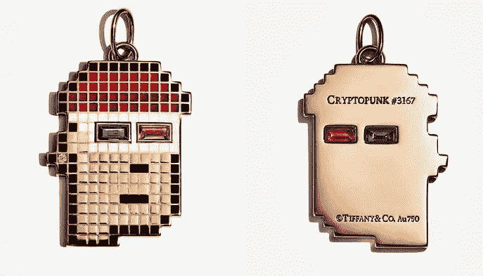

# 全部被加密—2022 年 4 月 8 日第 8 周

> 原文：<https://medium.com/coinmonks/all-been-crypto-week-8-apr-2022-91e1b4fd9120?source=collection_archive---------54----------------------->

向忠实的 ABC 粉丝道歉，这是疯狂的一周。我出去旅行了(你可以想象去哪里)，所以这周的更新会比平常稍微晚一点，也稍微短一点。总体来说，这是一个下跌的一周，BTC 表现不佳-7%。在关于其自身稳定硬币 USN 的传言冲击市场后，顶级表现者已经接近，但你知道这是一个奇怪的一周，在其他 5 大涨幅者中，你有 XMR(上次发生是什么时候？)总督和 CVX。在 Bitmex 收购一家德国银行失败的消息中，花旗(Citi)对蒂芙尼(Tiffany)的元宇宙和朋克主题珠宝进行了 13 万亿美元的市值估值。我们还看到 BTC 采矿难度创下历史新高，UST 将 AVAX 加入国库，以及 Tradfi 和 crypto 之间的许多集成以及融资。再次为迟来的和更短的周刊道歉。

蝙蝠太极—[btc21@mail.com](mailto:btc21@mail.com)

# 标题:

## [UST 将 AVAX 加入财政部](https://twitter.com/stablekwon/status/1512291571332308995)

权道告诉我们，他想把变成新的戴，这样财政部就不会只有了。AVAX 是一种战略合作伙伴关系，也是一个有趣的选择。大量的讨论和[对卢娜和 UST 的批评声也越来越大。](https://twitter.com/jackniewold/status/1512578913259737092?s=21&t=bdRwChM50V5-GWHfYEIHlw)

## [又一枚 20% APY 稳定币临近](https://captainkole.substack.com/p/the-future-is-near?s=r)

你知道，如果某种东西在加密中起作用(价格行为),那么创新就会扩散。因此，毫不奇怪，其他协议正在追求 20% APY 稳定硬币流动性挖掘噱头，以将流动性引导到网络上。4 月 20 日，Near 将宣布与其他资本雄厚的 stablecoin 合作推出自己的本地算法 stablecoin $USN。他们将提供极具吸引力的~20%的 APR，这将点燃 DeFi 资本循环进入附近的生态系统，从其他替代的第一层协议中吸走锁定的总价值。随着吸引人的稳定硬币收益的叙述激增，这将导致对“接近地球”(“月球”)的比较。Terra 目前的市值约为 400 亿美元，Near 为 100 亿美元。上述催化剂将在短期和长期内加强 Near 的基本面，并可能导致其市值在未来几个月内至少升值 100%。

## [罗宾汉变得真实——发布加密钱包并谈论闪电集成](https://www.coindesk.com/business/2022/04/07/robinhood-releases-crypto-wallet-to-2m-users-plans-integration-with-bitcoin-lightning-network/)

他们周四在迈阿密表示，他们已经为 200 万名“合格”客户激活了加密钱包，使数字资产转移在长期防火墙投资应用程序中广泛成为可能。但该网页称，每天向外转账的上限为 5000 美元，新获得的密码在交易完成前保持不变。此外，用户必须接受身份检查并启用双因素身份验证才能访问钱包。
因此，虽然标题听起来不错，但感觉更像是营销，目前不是真正的选择，但肯定是朝着正确方向迈出的一步！朝着正确方向迈出的另一步是他们关于在闪电网络上增加比特币交易支持的声明。支持 lightning 的交易所仍处于起步阶段，尽管大多数交易所都表示了广泛的采用意愿。[闪电实验室本周也将](https://www.axios.com/lightning-labs-raises-70m-to-bring-defi-to-bitcoin-2e541991-0777-4073-91f9-416fb2c65908.html)的高度提高了 70 毫米

# **行情:**

> 在*报告*中，我们估计*元宇宙*经济的目标目标市场(TAM)在 10 万亿美元以上

Ronit Ghose，花旗银行、金融科技和数字资产全球主管

> 甚至可以选择用 Doge 支付 Twitter Blue ]?

埃隆·马斯克，现在拥有推特 9.2%的股份

> *加入 Coinmonks* [*电报频道*](https://t.me/coincodecap) *和* [*Youtube 频道*](https://www.youtube.com/c/coinmonks/videos) *了解加密交易和投资*

# 另外，阅读

*   [3 商业评论](/coinmonks/3commas-review-an-excellent-crypto-trading-bot-2020-1313a58bec92) | [Pionex 评论](https://coincodecap.com/pionex-review-exchange-with-crypto-trading-bot) | [Coinrule 评论](/coinmonks/coinrule-review-2021-a-beginner-friendly-crypto-trading-bot-daf0504848ba)
*   [莱杰 vs n rave](/coinmonks/ledger-vs-ngrave-zero-7e40f0c1d694)|[莱杰 nano s vs x](/coinmonks/ledger-nano-s-vs-x-battery-hardware-price-storage-59a6663fe3b0) | [币安评论](/coinmonks/binance-review-ee10d3bf3b6e)
*   [Bybit 交易所评论](/coinmonks/bybit-exchange-review-dbd570019b71) | [Bityard 评论](https://coincodecap.com/bityard-reivew) | [Jet-Bot 评论](https://coincodecap.com/jet-bot-review)
*   [3 commas vs crypto hopper](/coinmonks/3commas-vs-pionex-vs-cryptohopper-best-crypto-bot-6a98d2baa203)|[赚取加密利息](/coinmonks/earn-crypto-interest-b10b810fdda3)
*   最好的比特币[硬件钱包](/coinmonks/hardware-wallets-dfa1211730c6) | [BitBox02 回顾](/coinmonks/bitbox02-review-your-swiss-bitcoin-hardware-wallet-c36c88fff29)