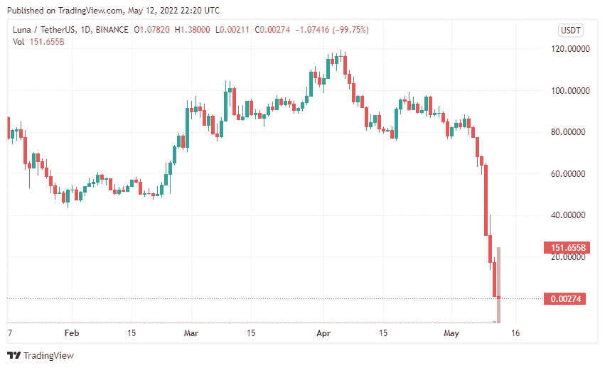
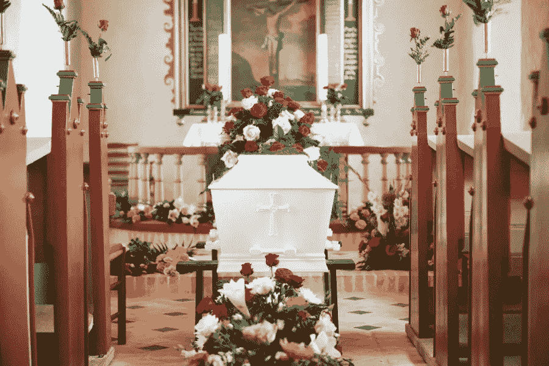
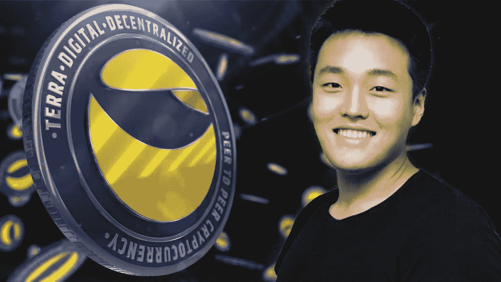
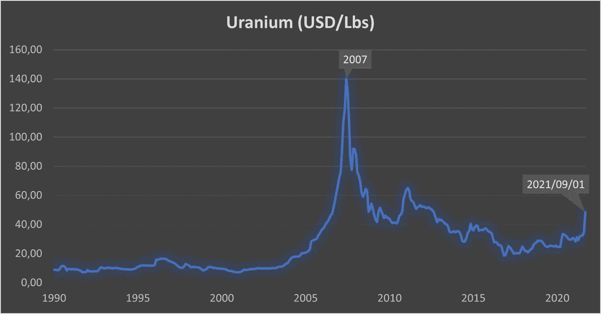
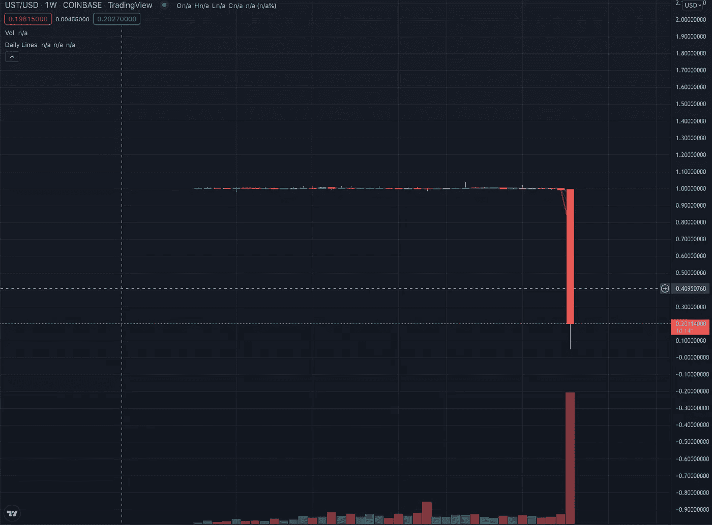
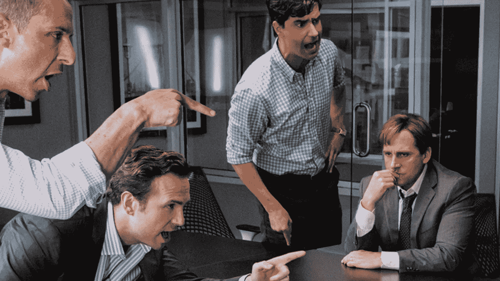

# 一切都变了——完全变了——一种可怕的美诞生了

> 原文：<https://medium.com/coinmonks/all-changed-changed-utterly-a-terrible-beauty-is-born-f3a7fc2463f?source=collection_archive---------9----------------------->

《月神》(Terra Luna)——一部短剧？

当我对整个*【crypto】*(以*为基本出发点，开发了****【Solalgo Group】****和它的令牌* ***SLGO*** )进行深入的尽职调查时，我开始了一次关联之旅。

我试图将这种金融交易的新概念与我所知道的——股票市场和传统货币(*或“法定货币”，如果你更喜欢*)——联系起来，并运用我辛苦学到的原则，不只是问难或容易的问题，而是试图问所有的问题。

我很快就找到了一些共同点。事实证明，Crypto 中夹杂着复杂思想的应用，这些复杂思想被发展成我们习惯于打着哈欠称之为。 **' *金融工具架构*。**

多年来，我一直坐在那里听经济学学位人士的推销——喋喋不休地谈论从怀疑和不怀疑的人身上赚钱的“新”销售方式——这只会让我的愤世嫉俗的情绪上升几度(当我看到鲜花时，我更经常地寻找葬礼)。

“稳定币”的出现吸引了我的注意力，因为我费力地阅读了一百万首缩写词和令人费解的白皮书。

所以我问了这些问题，所有的问题——不是特别问任何人，而是问我自己好奇的愤世嫉俗。

首先，我研究了实质问题——谁在背后支持他们——他们是如何得到支持的——他们是如何报告的——他们是如何被治理/监管的——底层技术有多好——他们将如何应对攻击——他们在财务上对自己和第三方参与者有多有效——仅列举了初步调查的 7 个领域。

不要误解我的意思，我完全理解那些承诺对大量非常直接的(*和经常考虑不周的*)项目进行一定程度的控制的实体的需要和价值，这些项目吸引了大量的投资，并导致了大量的伤亡。

我发现最难得到答案的问题是:价值的基础是什么，技术能否应对最有可能遇到的情况？

为了不陷入成为“马后炮”的陷阱，我引用过去几天发生在一个马童身上的事情来强调我的观点:

**、** ( *的股票代码为 UST* )是一种稳定的货币，旨在维持 1 美元的市场价格，因此对比特币等资产的价值大幅波动具有*的免疫力。*

*2018 年由韩国人创立并投放市场；Terraform 实验室的 Daniel Shin 和 Do Kwon 发表了一份值得称赞的声明；*

**“我们的使命是通过使用区块链技术提供稳定性和电子商务平台的采用，将人们从日常国际支付中隐藏的费用中解放出来，并消除低效率。”**

**

*前提和应用足够简单；*

*UST 本质上是一种分为两部分的加密货币:stable coin**Terra**—**Luna**，一种更加“传统”的加密货币。*

*Terra 被设计成在菲亚特中始终值美元。月神是一种可交易的硬币，随市场波动。潜在的前提是，一个 Terra 将总是让交易者得到价值 1 美元的 Luna，而价值 1 美元的 Luna 将总是让交易者得到一个 Terra。*

*因此，理论上，如果 Terra 的交易价格超过 1 美元，交易者可以获得价值 1 美元的 Luna，并将其兑换成价值超过 1 美元的 Terra，从而获利。如果 Terra 的交易价格低于 1 美元，人们可以买一个 Terra，用它换 1 美元的 Luna——从而获利*

*因此，如果其中一个价值暴跌，交易者将简单地用他们的持有物交换硬币的另一半，获得利润并恢复等式另一半的价格——如果你愿意，这是对*‘看跌’*和*‘看涨’*期权交易的一种变体。*

***瞧吧**！密码交易中的一种自我调节机制，其潜力可与炼金术士之石相媲美！*

*但是这里有第一件事…..*

*稳定币应该是加密货币，其价值与有价值的有形资产挂钩——例如全球交易的法定货币(主要是美元)，或者是可变现的交易商品，如黄金或铀，因此，通过这样的设计和识别，比其他加密货币更不稳定(顺便提一下，我知道铀是不稳定的)。*

**

*它们之所以存在和繁荣，是因为交易者在某种程度上可以对冲其他加密货币的大范围价格下跌，因为他们知道稳定的货币是由真实世界的储备担保的。*

**(* ***旁注*** *:这种类型的架构导致了我和 Barry 如何设计和开发 Solalgo 及其传统的有价值资产和产生利润的商业业务)**

*还有一件事……*

*UST 是一个算法稳定的硬币。*

*这意味着它不同于其他稳定币，因为它没有有形储备的担保；硬币根据一种算法保持其价值，该算法自动在稳定硬币和伙伴硬币之间取得平衡。*

*因此，当世界上第三大最受欢迎的 stablecoin 项目( *yes TerraUSD* )达到 400 亿美元的市值，并几乎在一夜之间暴跌至不到 6 亿美元的价值时，人们必须提出一个问题，即*“算法”*，以及这种技术在*“平衡行为”*背后的稳健性。*

**

**(当然，我也意识到与 TerraUSD 参与****【Anchor】****的关系和持续的批评——其价值从 140 亿美元跌至 112 亿美元(也是在一夜之间)，许多人认为 Anchor 的收益率被支持者大大夸大——其中一人恰好是 TerraUSD 的创始人)。**

*然而，另一种可能的情况正在上演，可能不涉及创始人的其他兴趣或可能有缺陷的算法的模糊谣言:*

***Coin Desk 报道称，2022 年 5 月 7 日，一个加密钱包在以太坊上倾倒了价值 8400 万美元的 UST，在币安交易所倾倒了 1.08 亿美元。***

*现在，作为一个冷酷的股市愤世嫉俗者，我不得不认为那个周末上演了一部*【短剧】——这是一部*【热门】*电影，有人赚了很多钱——我想知道这是否与这部电影有关；*《大空头》*？**

****

> **加入 Coinmonks [电报频道](https://t.me/coincodecap)和 [Youtube 频道](https://www.youtube.com/c/coinmonks/videos)了解加密交易和投资**

# **另外，阅读**

*   **[分散交易所](https://coincodecap.com/what-are-decentralized-exchanges) | [比特 FIP](https://coincodecap.com/bitbns-fip) | [宾邦评论](https://coincodecap.com/bingbon-review)**
*   **[用信用卡购买密码的 10 个最佳地点](https://coincodecap.com/buy-crypto-with-credit-card)**
*   **[加拿大最佳加密交易机器人](https://coincodecap.com/5-best-crypto-trading-bots-in-canada) | [Bybit vs 币安](https://coincodecap.com/bybit-binance-moonxbt)**
*   **[阿联酋 5 大最佳加密交易所](https://coincodecap.com/best-crypto-exchanges-in-uae) | [SimpleSwap 评论](https://coincodecap.com/simpleswap-review)**
*   **[购买 Dogecoin 的 7 种最佳方式](https://coincodecap.com/ways-to-buy-dogecoin) | [ZebPay 评论](https://coincodecap.com/zebpay-review)**
*   **[最佳期货交易信号](https://coincodecap.com/futures-trading-signals) | [流动性交易所评论](https://coincodecap.com/liquid-exchange-review)**
*   **[火币加密交易信号](https://coincodecap.com/huobi-crypto-trading-signals) | [Swapzone 审查](/coinmonks/swapzone-review-crypto-exchange-data-aggregator-e0ad78e55ed7)**