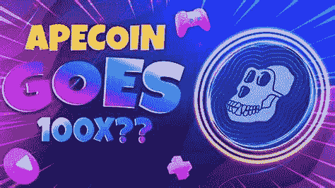

# 投资 ApeCoin (APE)前需要的所有信息

> 原文：<https://medium.com/coinmonks/all-information-that-you-need-before-investing-in-apecoin-ape-9a801581c4c9?source=collection_archive---------9----------------------->

Source photo [apecoin news — Bing images](https://www.bing.com/images/search?view=detailV2&ccid=f7XlUN%2fm&id=F7D64C1A52AB485E795F8879B6F83965EB285822&thid=OIP.f7XlUN_mHL0EC07ikvtgfQHaEK&mediaurl=https%3a%2f%2fworldnftnews.com%2fwp-content%2fuploads%2f2022%2f03%2f1648105435_maxresdefault-1024x576.jpg&cdnurl=https%3a%2f%2fth.bing.com%2fth%2fid%2fR.7fb5e550dfe61cbd040b4ee292fb607d%3frik%3dIlgo62U5%252bLZ5iA%26pid%3dImgRaw%26r%3d0&exph=576&expw=1024&q=apecoin+news&simid=608041694364523897&FORM=IRPRST&ck=3B2B7FFBAF758EB0934B8F91225E054E&selectedIndex=5&ajaxhist=0&ajaxserp=0)

今天投资 10 美元到 ApeCoin(猿)会有什么后果？如果你现在向 ApeCoin 投资 10 美元，你将为你的投资组合增加另一种加密货币，具有巨大的上升潜力。这样，你可以补充你现有的收入来源。由于加密货币的可分性，你可能只需花 10 美元甚至更少就能买到一枚硬币。