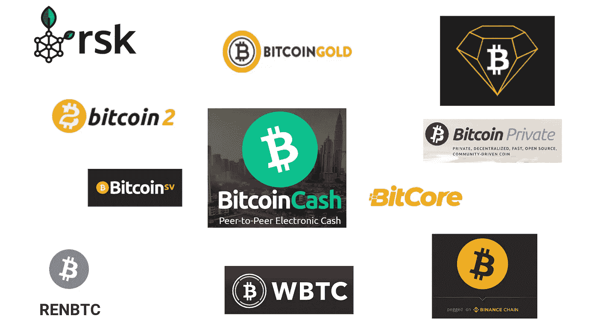

# 关于比特币变体，你需要知道的一切——BCH | BTG | BCD | BTX | BSV | BTCP | RBTC | WBTC | BTCB | Bt C2 | ren BTC

> 原文：<https://medium.com/coinmonks/all-you-need-to-know-about-bitcoin-variants-bch-btg-bcd-btx-bsv-btcp-rbtc-wbtc-c5c97657e3c?source=collection_archive---------8----------------------->

## 你需要知道的 11 种比特币变体。哪个才是真正的比特币？

Bitcoin Variants — BCH | BTG | BCD | BTX | BSV | BTCP | RBTC | WBTC | BTCB | BTC2 | RENBTC

如果你回顾加密项目，你会注意到有许多硬币和令牌与主要的比特币协议相关。这些项目是…