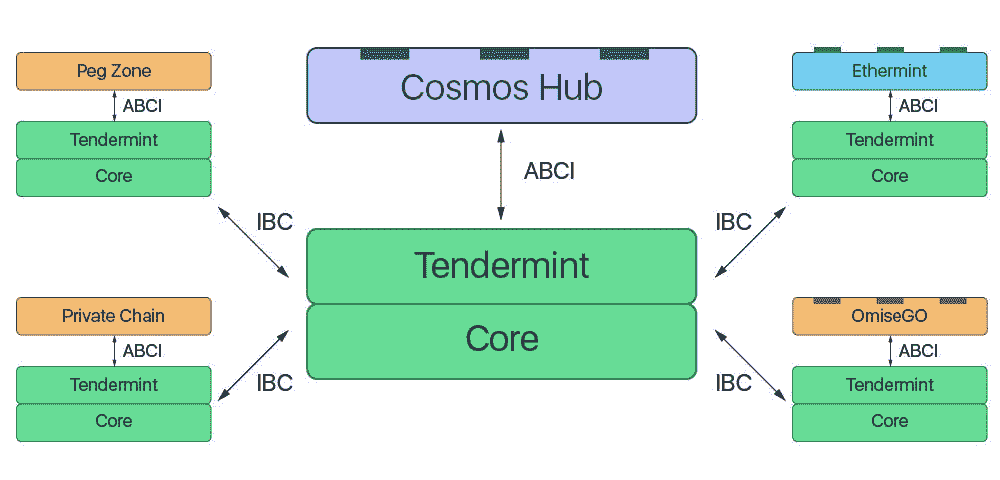

# 关于 Cosmos 你需要知道的一切:用例、估值、竞争和一般论题。

> 原文：<https://medium.com/coinmonks/all-you-need-to-know-about-cosmos-use-cases-valuation-competition-and-general-thesis-bea7401d74b7?source=collection_archive---------5----------------------->

**分散应用的简史**

区块链支持分散式应用程序(dApps)自主执行。这些区块链中的第一个是比特币，这是一个简单的应用程序，使人们能够向其他比特币用户转移价值。这个区块链可以分为三个概念层:

*   ***联网* :** 负责事务的传播。
*   ***一致* :** 使节点能够就系统的当前状态达成一致。
*   ***应用* :** 负责更新给定一组事务的状态，即处理事务

*网络*层确保每个节点接收事务。*共识*层确保每个节点同意相同的事务来修改它们的本地状态。至于*应用*层，它处理事务。给定一个事务和状态，应用程序将返回一个新的状态。

因此，人们很快发现，区块链带来了广泛的可能性——文件存储市场、预测市场、分散的自治组织等等。然而，回到 2013 年，建造这些东西的唯一方法是从零开始建造一个新的区块链，这符合他们的预期目的。当时，开发分散式应用程序有两种选择:

*   编写整个应用程序，
*   网络和共识层，或者
*   分叉比特币代码库(凌乱、难以阅读的 C++代码)，并使其适应预期目的。

比特币代码库非常单一；所有三层——网络、共识和应用——都是混合的。此外，比特币脚本语言是有限的，并且不便于用户使用。需要更好的工具。

然后以太坊出现了，创造了一个新的范式转变。以太坊在其应用层建立了一个新的区块链，允许开发人员直接在这个虚拟机上编写应用程序。这完全改变了游戏规则——开发人员不需要担心网络或共识层，并且可以快速编写和部署分散的应用程序。

以太坊准备成为“世界计算机”,每个 dApp 或 smart 合同都可以在上面运行。然而，两个问题很快变得明显:以太坊不能扩展到每秒超过 15 个交易，dApp 的创建者依赖于以太坊的实现，无法定制他们应用程序的某些部分，如定制的共识算法或新的隐私功能。

新项目现在面临着构建以太坊(平台风险，无法扩展，但易于部署)或构建区块链(可定制，很难构建)的决策。

一群新的闪亮的区块链 DFINITY，Thunder，Tezos 等正在通过建立一个超级可扩展的，管理良好的区块链来使第一个选择更具吸引力——希望实现建立一个运行每个 dApp 的“世界计算机”的梦想。另一方面，Cosmos 采取了一种完全不同的方法——他们想象一个世界，其中每个 dApp 都在自己的区块链上运行，迄今为止，他们正在建立连接所有这些链的协议，以创建“区块链互联网”。

**那么，什么是宇宙？**

宇宙由 Jae Kwon 于 2014 年创建，基于共识协议。这是一个区块链的互联社区，通过内部区块链通信(IBC)协议进行通信。

这种 IBC 使得不同的区块链交换资产和互操作变得容易，而不需要专门的工具，并且它是当前跨不同区块链移动资产的最安全、最可靠和分散的方式，释放了跨多个链的互操作性。

为了开发完整的宇宙互操作生态系统，扎科·米洛塞维奇和伊桑·布赫曼加入了 Kwon。从那时起，宇宙已经发展成为最大的区块链生态系统之一，像 Terra 和 Osmosis 这样受欢迎的 IBC 连锁企业的总市值达到近 700 亿美元*(根据宇宙建设者 Ignite)* 。

Cosmos 提供了一个空间来构建易于连接的定制区块链。这允许开发人员:

*   选择退出高交易费/网络拥塞
*   避免在另一个链上仅作为智能合同存在
*   创建个性化的规则、安全性和治理

在 Cosmos 之前，区块链有一个孤立的方法，不允许链之间的通信。为了实现这一点，Cosmos 提供了以下三种工具:

*   Tendermint 拜占庭容错(BFT)
*   宇宙 SDK
*   IBC(区块链间通信)协议

有了这个工具包、安全性和治理，Cosmos 是可定制的，使它成为各种用例的最佳选择，并使多个应用程序的集成变得容易。

但是在我们深入了解宇宙之前，我们必须先了解它的工作原理。这都是由 Tendermint 共识算法驱动的。

**Tendermint 共识算法**

一致性算法是分布式系统中的节点就世界的某些状态达成一致的一种方式。在公共区块链土地上，我们只关心可以容忍恶意行为的算法，即“拜占庭容错”，或 BFT。在这类算法中，我们已经看到了两类共识协议——经典共识协议，如 Paxos 或 PBFT，以及 Nakamoto 共识协议，如工作证明。

**Cosmos SDK(软件开发工具包)**

在开发和测试 Tendermint 之后，Jae 和 Ethan 构建了 Cosmos SDK——一个软件开发工具包，供开发人员使用 Tendermint 共识算法快速简单地构建区块链，并使用 Proof-of-stage 将其与 Sybil 抗性机制配对。使用 Cosmos SDK，开发人员可以轻松构建和部署区块链，而无需担心共识层和网络层，只需专注于直接编写他们的应用程序逻辑。

开发人员在构建他们的应用程序时有两种选择:从头开始编写他们自己的区块链，或者在以太坊(或其变体)上构建。在以太坊上构建既快速又简单——您可以利用他们的共识和网络层，在 EVM 上构建您的 dApp，但这里的折衷是可定制性。使用 Cosmos SDK，您不必遵循在 EVM 上构建的惯例(可靠性、气体计量系统、操作码、有限的加密原语等)。).相反，您可以快速部署一个利益相关的 Tendermint 区块链，同时保留定制一些东西的灵活性，比如验证器、治理、赌注等等。

**宇宙网络如何融入更广阔的区块链生态系统？**

深入探究了 Cosmos 之后，很明显，Cosmos Network 的成功依赖于三大组件:

*   基于嫩薄荷的区块链的扩散
*   Cosmos 验证器的可靠性和有效性
*   部署速度和超越竞争对手

为了理解这三个组成部分，我将从头开始解释 Cosmos 背后的愿景。

Cosmos 通常被视为互操作性解决方案，是连接区块链的东西。虽然这肯定是我们努力实现的目标的一部分，但这个宇宙概念遗漏了许多重要的部分。Cosmos 不仅仅是一个互操作性解决方案。

Cosmos 的愿景是让开发商更容易建设区块链，并通过允许他们相互交易来打破区块链之间的壁垒。最终目标是建立一个区块链互联网，一个能够以分散的方式相互交流的区块链网络。有了 Cosmos，区块链可以维护主权，快速处理交易，并与生态系统中的其他区块链通信，使其成为各种用例的最佳选择。

现在，这个愿景是通过一套开源工具实现的。

这些开源工具的一些例子是 Tendermint、Cosmos SDK 和 IBC，它们被设计用来让人们快速构建定制的、安全的、可伸缩的和可互操作的区块链应用程序。

让我们仔细看看生态系统中一些最重要的工具以及宇宙网络的技术架构。

**宇宙网络的技术架构**

在我们讨论这个问题时，重要的是要记住，Cosmos 是一个开源社区项目，最初是由 Tendermint 团队构建的。欢迎任何人构建额外的工具来丰富更大的开发者生态系统。

直到最近，构建区块链还需要从头开始构建所有三层(*网络*、*共识*和*应用*)。以太坊通过提供虚拟机区块链简化了分散式应用程序的开发，任何人都可以在其上以智能合约的形式部署定制逻辑。然而，这并没有简化区块链自身的发展。就像比特币一样，Go-Ethereum 仍然是一个难以分离和定制的整体技术栈。这就是 2014 年由 Jae Kwon 创建的 Tendermint 的用武之地。

**什么是嫩薄荷 BFT 和 ABCI？**

Tendermint BFT 是一个将区块链的*网络*和*共识*层打包到一个通用引擎中的解决方案，允许开发者专注于*应用*开发，而不是复杂的底层协议。因此，Tendermint 节省了数百小时的开发时间。

[Tendermint BFT 引擎](https://github.com/tendermint/tendermint)通过名为[应用区块链接口](https://github.com/tendermint/abci) (ABCI)的套接字协议连接到应用。这个协议可以包装在任何编程语言中，使得开发者可以选择适合他们需求的语言。

但这还不是全部。以下是使 Tendermint BFT 成为最先进的区块链发动机的特性:

*   公共或私有区块链就绪:Tendermint BFT 只为一个区块链处理*网络*和*共识*，这意味着它帮助节点传播事务，验证器同意一组事务附加到区块链。*应用*层的作用是定义验证器集是如何构成的。因此，开发人员可以在 Tendermint BFT 引擎的基础上构建公共和私有区块链。如果应用程序定义了验证器的选择是基于它们有多少个处于利害关系的令牌，那么区块链可以被描述为利害关系证明(PoS)。然而，如果应用定义只有预授权实体的有限集合可以是验证者，那么区块链可以被表征为许可的或私有的。开发人员可以自由定制定义区块链验证器集如何变化的规则。
*   高性能:Tendermint BFT 可以有大约 1 秒的阻塞时间，每秒可以处理多达数千个事务。
*   即时终结:这意味着只要超过三分之一的验证者是诚实的，就永远不会创建分叉(拜占庭)。用户可以确保他们的交易在块创建后立即完成(在比特币和以太坊等工作证明区块链中，情况并非如此)。
*   安全性:Tendermint consensus 不仅是容错的，而且是负责任的。如果区块链分叉，[就有办法确定责任](https://docs.tendermint.com/master/spec/light-client/accountability.html)。

**Cosmos SDK 等应用层框架**

Tendermint BFT 将区块链的开发时间从几年减少到几周，但从头开始构建一个安全的 ABCI 应用程序仍然是一项艰巨的任务。这就是 Cosmos SDK 存在的原因。

[Cosmos SDK](https://v1.cosmos.network/sdk) 是一个通用框架，它简化了在 Tendermint BFT 上构建安全区块链应用程序的过程。它基于两个主要原则:

*   模块化:Cosmos SDK 的目标是创建一个模块生态系统，允许开发人员轻松构建特定于应用程序的区块链，而不必从头开始编写应用程序的每一项功能。任何人都可以为 Cosmos SDK 创建一个模块，在您的区块链中使用现成的模块就像将它们导入到您的应用程序中一样简单。随着 Cosmos network 的发展，SDK 模块的生态系统将会扩展，使得开发复杂的区块链应用程序变得越来越容易。
*   基于功能的安全性:功能约束了模块之间的安全边界，使开发人员能够更好地推理模块的可组合性，并限制恶意或意外交互的范围。

Cosmos SDK 还附带了一组有用的开发工具，用于构建命令行界面(CLI)、REST 服务器和各种其他常用的实用程序库。

像所有的 Cosmos 工具一样，Cosmos SDK 被设计成模块化的。今天，它允许开发者在 Tendermint BFT 的基础上构建。然而，它可以与实现 ABCI 的任何其他共识引擎一起使用。

随着时间的推移，我们预计会出现更多的 SDK，使用不同的架构模型构建，并与多个共识引擎兼容——所有这些都在一个单一的生态系统中:Cosmos Network。

**宇宙——枢纽和区域**

现在我们有了一个允许两个异构链互相交换令牌的协议，我们如何创建一个区块链网络呢？

一种想法是通过直接的 IBC 连接将网络中的每个区块链相互连接起来。这种方法的主要问题是网络中连接点的数量随着区块链的数量呈指数增长。如果网络中有 100 个区块链，每个都需要保持一个 IBC 连接，那么就有 4950 个连接。这很快就失控了。

所以我们不要把每个区块链和其他的联系起来。我们接下来面临的一个问题是，区块链之间所需的“信任”水平提高了，区块链相互重复支出的风险也变得更高了。事实上，当区块链从创建它的链中收到令牌时，只需要一个信任级别。在这种情况下，接收链只需信任原始链的验证器集，不会解冻或重复使用令牌。但是当一个区块链从一个不是它创建者的链中接收到一个令牌时，就会涉及到几个层次的信任。这是因为接收链不仅要相信源链没有解冻令牌，还要相信之前收到令牌的所有链没有重复使用令牌。随着中继令牌的链的数量增加，接收者需要信任的链的数量也增加。这是不实际的。

为了解决这个问题，Cosmos 提出了一种模块化架构，包含两类区块链:

*   集线器和
*   区域。

区域是常规的异构区块链，而集线器是专门用于连接区域的区块链。

当一个区域创建与集线器的 IBC 连接时，它可以自动访问与其连接的所有其他区域(即发送和接收)。因此，每个区域只需要与一组有限的集线器建立有限数量的连接。枢纽还能防止区域间的重复支出。这意味着，当一个区域从集线器接收令牌时，它只需要信任该令牌的原始区域和集线器。

宇宙生态系统中推出的第一个中心是宇宙中心。Cosmos Hub 是一个公开的利害关系证明区块链，其本地的赌注和交易令牌称为 Atom。该中心的启动标志着宇宙网络的启动。

**枢纽和区域的实际使用案例**

1.  **ICO 专区:**现在，假设我们想在 Cosmos 上建立一个 ICO 专区。该区域将能够接受几乎任何现有的代币，同时保持透明度和对支持者的分散监管。此外，它可以扩展，不会与其他分散的应用程序同时运行。简而言之，用户将能够从一个单一的、高性能的平台参与所有 ico。

我们希望减轻开发人员的负担，因此选择在 Cosmos-SDK 的基础上进行构建。我们的 ICO 区域是一个公共风险证明区域，这意味着它需要以下模块:

*   标桩:处理标桩证明
*   账户和银行:跟踪每个用户的硬币
*   治理:管理升级和有争议的问题
*   IBC:收发代币

这些已经有了，我们不需要再编码了。我们唯一需要做的就是为我们的特定应用创建一个 ICO 模块。

就是这样！编写一个成熟的公共的、可互操作的和可扩展的区块链归结为编写一个简单的模块。现在我们仍然需要为我们的区块链应用程序开发前端，但这不是最难的部分。如果我们愿意的话，我们也可以开源并记录我们的 ICO 模块，这样其他开发者就可以将它导入到他们的应用程序中来支持它的功能。

**2。分散式交换:**在 Cosmos 上构建分散式交换相当简单。交易所的区块链部分将处理资金保管和清算。至于订单匹配，它仍将由集中运营商处理，以提供令人满意的用户体验和深度订单。

假设我们希望我们的分散式交换支持 FIAT-token。菲亚特-token 的问题在于，它们必须服从监管，因此不能在公共区块链上发射。因此，我们的分散式交换将有一个 2 链基础架构。一个链将是处理法定令牌的私有授权证明链，另一个将是用于加密到加密交易的公共利益证明链，两者都运行在 Tendermint 核心之上。这两条链将通过 IBC 连接与宇宙枢纽相连。

现在，我们需要做什么来建立这样一个复杂的基础设施呢？实际上，不多。我们需要的赌注、治理、账户、银行和 IBC 模块已经存在。我们需要编码的是:

*   一个权威证明模块:为我们的 FIAT 链设置一个私有验证器。
*   菲亚特-token 模块:根据我所在辖区的法规处理菲亚特-token 的发行和转让。
*   结算模块:允许结算两个链上的代币之间的交易

有了这三个模块，我们就有了部署分散式 exchange 体系结构的基本区块链层所需的构造块。

在这个阶段，我们已经涵盖了宇宙的大部分组成部分。现在，让我们试着用三个要点来概括和总结宇宙是什么。

**宇宙 3 分**

1.  使用 Tendermint 和 Cosmos-SDK 的模块化使区块链功能强大且易于开发。
2.  使区块链能够在保留其主权同时，与 IBC 和盯住区相互转移价值。
3.  通过水平和垂直可伸缩性使区块链应用程序可伸缩。

最重要的是，宇宙不是一个产品。它是建立在一套模块化、适应性强、可互换的工具之上的生态系统。

**那么，我们能用$ATOM(宇宙区块链的令牌)做什么呢？**

在这一点上，我们需要记住，Cosmos 依赖于利害关系证明机制。

这意味着$atom 令牌可以用于治理。

这也意味着$atom 持有者可以通过赌注计划获得网络块奖励和交易费的一部分。他们还可以通过运行他们的节点或通过将他们的 ATOM 硬币委托给验证者来获得这些奖励。

现在，这些验证者锁定他们的原子，运行专门的软件，通过提出新的区块和验证交易来维护宇宙网络。

**$ATOM 的代币组学和资助**

一段时间以来，批评者的主要论点是 [$ATOM](https://twitter.com/search?q=%24ATOM&src=cashtag_click) 是通货膨胀的，它的供应是没有上限的。

但事实是，美元的通胀率每年在 7%到 20%之间波动。当铆接比减小时，它增大，当铆接比增大时，它减小。用户押上他们的$ATOM 代币以避免稀释，并获得难以置信的忠诚空投。

现在，需要注意的是,$ATOM 空投不是你日常使用的典型空投。它更有回报，来自于可靠的团队回馈给$ATOM 社区的礼物 tender mint & Cosmos SDK。几乎所有基于 Cosmos 的项目都是这样做的，因为这有助于他们建立自己的社区，而且通常会带来净收益。

在资金问题上，宇宙网络在 [7](https://www.crunchbase.com/search/funding_rounds/field/organizations/num_funding_rounds/cosmos-network) 轮中总共筹集了[1700 万美元](https://www.crunchbase.com/search/funding_rounds/field/organizations/funding_total/cosmos-network)的资金，最近一次是在 2021 年 5 月 27 日，来自一轮风险投资[未知](https://www.crunchbase.com/search/funding_rounds/field/organizations/last_funding_type/cosmos-network)轮。

宇宙网络由 6 位投资者出资，其中 1confirmation 和范式是最近的投资者。

宇宙网络也进行了两项投资。他们最近一次投资是在 2022 年 4 月 12 日，当时 [Nomad](https://www.crunchbase.com/organization/nomad-7846) 筹集了 2240 万美元。

$ATOM 公开销售于 2017 年 4 月结束，所有硬币现已解锁。这可以被视为一件好事，因为它减少了风投倾销的担忧。

它目前的市值约为 18 亿美元，日交易量约为 3 . 5 亿美元。

另一个需要注意的重要事情是$ATOM 是非常分散的。上个月，当[点燃](https://twitter.com/ignite_com)未兑现的 760 万 [$ATOM](https://twitter.com/search?q=%24ATOM&src=cashtag_click) ， [$ATOM](https://twitter.com/search?q=%24ATOM&src=cashtag_click) 的表现并不比市场其他股票差。

那么价值增长呢？

这就是 IBC 路由的用武之地。

随着越来越多的链加入生态系统，中心辐射连接模型将用于最小化所需的跳数和连接数。

现在，考虑到 IBC 已经促成了超过 1180 亿美元的跨链交易，这些交易要求在中心支付费用，这就产生了一点购买压力。

请不要被这个事实冲昏头脑，因为这个购买压力没有以太坊那么大。这是因为宇宙连锁店的费用很低。*(这部分价值累计只有在牛市这样疯狂的环境下才会明显。即使那样，也还是低于同行)。*

根据 Electric Capital 的一份报告，2021 年，Cosmos 生态系统中的开发者增长了 70%。

随着 Cosmos 技术的改进和更多工具的出现，如基于 EVM 的链，这可能会继续增长。这份报告指出，在一年多一点的时间里，已经有大约 48 家活跃的 IBC 连锁店；还不算那些链中的所有项目。

此外， [Cosmos](https://twitter.com/hashtag/Cosmos?src=hashtag_click) Hub $ATOM 是社区的重要组成部分，可以增加价值。

该中心作为 IBC 社区的一个关键部分，充当从该中心到其他连锁店的路由器。例如，作为 ATOM 进入社区，然后能够移动到任何其他链并交换其他令牌。

该中心旨在成为最具弹性的链，为其他链保存资产，并在未来为希望由该中心保护的应用程序提供安全性。

Cosmos Hub 充当生态系统的中央总账，提供额外的安全层，它也是第一个由$atom 令牌供电的区块链，在 Cosmos 网络上发射。

宇宙给予每个区块链它的主权；这意味着应用程序可以由用户定制和管理。Cosmos 的目标是创建一个网络，允许所有其他区块链以最有效/最快的方式无缝通信。

**Cosmos 的高层战略是否健全？…或者它有缺陷？**

Cosmos 将互操作性作为其主要关注点，随着区块链和 TVL 比以往任何时候都多，很明显为什么高层次的战略是重要的。

但是有一个问题。他们有很多竞争对手。

**宇宙竞争者**

现在，我将概述 Cosmos 的竞争对手，并简要说明他们试图实现的目标。

1.  计量实验室:这是一个高性能的基础设施，允许智能合约通过异构的区块链网络无缝扩展和传输。
2.  Solana: Solana 是一个快速、安全、抗审查的区块链，提供全球采用所需的开放基础设施。
3.  Chainlink: Chainlink 的分散式 oracle 网络为任何区块链上的复杂智能合约提供可靠的防篡改输入和输出。
4.  阿尔格兰德:实现无摩擦金融的技术。它是世界上第一个开放的、无许可的、纯粹的利害关系证明区块链协议，无需分叉，就能提供当今经济所需的必要安全性、可伸缩性和去中心化。
5.  EOS:提供行业领先的交易速度和亚秒级的块时间延迟率，使 EOSIO 能够支持关键任务应用。
6.  Polkadot: Polkadot 是一个区块链网络，旨在实现 Web 3.0，一个分散而公平的互联网，用户可以控制他们的数据，市场可以从网络效率和安全性中繁荣起来。
7.  Tezos:安全至上。可升级。经久耐用。Tezos 是一个面向资产和应用程序的开源平台，由全球验证者、研究人员和构建者社区提供支持。
8.  Thorchain:这是一个基于 Tendermint & Cosmos-SDK 并利用门限签名方案(TSS)的分散式跨链流动性协议。它不固定或包装资产，它只是决定如何移动它们来响应用户的动作。
9.  轨道链:轨道链支持 15+公共链，包括比特币、以太坊、BNB、HECO、Polygon、Ripple、Klaytn、ICON、Celo 和 Terra。Orbit Chain 致力于研究异构链的互操作性，并以更好的产品和服务进一步开发整体 DeFi 生态系统。
10.  LayerZero: LayerZero 是一个 Omnichain 互操作协议，设计用于跨链传递轻量级消息。LayerZero 通过可配置的不信任度提供真实可靠的消息传递。该协议被实现为一组节能、不可升级的智能合同。
11.  Terra: Anchor Protocol 允许 Terra stablecoin 存款获得稳定的收益，由领先的 proof-stage 区块链提供大宗奖励。Terra stablecoins 提供即时结算、低费用和无缝跨境交换，受到数百万用户和商家的喜爱。
12.  Umee: 最简单的方式开始您的 DeFi 体验，了解整个区块链的赌注、费率和互操作解决方案。Umee 是用于跨链通信和互操作性的第一层区块链，构建于 Cosmos SDK 之上，由 Tendermint Consensus 和一个自治验证器网络提供支持。
13.  以太坊:以太坊是一种社区运营的技术，为加密货币、以太网(ETH)和数以千计的分散式应用提供动力。以太坊是数字货币、全球支付和应用的发源地。
14.  Avalanche: Avalanche 是一个开放的、可编程的平台，用于分散式金融应用。推出以太坊 dapps，即时确认交易，每秒处理数千笔交易，远超当今任何去中心化的区块链平台。
15.  Zilliqa: Zilliqa 由第一个经过同行评审、设计安全的智能契约语言 Scilla 支持。使用函数式编程设计原则(如在 OCaml 中)允许它对静态检查和形式验证更加友好。
16.  埃尔隆德网络:一个高度可扩展、快速、安全的区块链平台，用于分布式应用、企业用例以及新的互联网经济。
17.  Acala: Acala 是 Polkadot 的去中心化金融网络和流动性枢纽。这是一个第 1 层智能合约平台，可扩展，兼容以太坊，并针对 DeFi 进行了优化，具有内置的流动性和现成的金融应用程序。
18.  Neo: Neo 提供了一整套开箱即用的功能，但不会将您束缚在其中。本机功能提供了构建完整的分散式应用程序所需的所有基础设施，而高级互操作性允许您利用全球区块链生态系统的力量。
19.  BNB 链:BNB 链，世界上最受欢迎的区块链之一，致力于提供未来公共采用所必需的核心基础设施，并始终保持社区第一和开源生态系统，建立在无许可和去中心化的环境上。
20.  Evmos: 符合区块链间通信协议，又名 IBC；区块链的 IP 层。IBC 是目前跨不同区块链移动资产的最安全、最可靠和分散的方式，释放了跨多个链的互操作性。
21.  持久性:持久性是一个基于 Tendermint/Cosmos 的第一层网络，为 DeFi 产品生态系统提供动力，旨在使流动资产成为 PoS 经济的默认资产。持久性是一个可互操作的协议，它为开发人员提供了构建应用程序的能力，这些应用程序可以是独占的、模块化的，也可以构建在持久性的 CosmWasm 层之上。
22.  图标:图标是一个用于分散应用的区块链协议。作为一个聚合链，它实现了互操作性，这是一个将所有区块链数据聚合到一个层的互联网络。
23.  Cosmostation: 用 Mintscan 探索用 Cosmos-SDK 构建的网络。适用于 exchanges 和日常用户的 Block Explorer。在安全方便的 GUI 上本地签署交易。基于 Tendermint 的连锁店的分散式移动钱包。

如你所见，几乎有 25 个其他项目以这样或那样的方式提供了 Cosmos 也提供的东西。这对任何投资者来说都不是好消息。竞争越激烈，市场份额越小。

但是如果 Cosmos 的方法实际上比它的竞争对手更好呢？或者，如果他们不是真正的竞争对手，更多的互操作性有助于增加所有这些项目的网络效应呢？

我想几个月后我们就会知道这些答案了。升级完成后。

**在接下来的几个月里，宇宙号可能会发生什么？**

为了回答这个问题，我从几个不同的角度评估了 Cosmos。

1.  我们还得看看 [$ATOM](https://twitter.com/search?q=%24ATOM&src=cashtag_click) 的表现。在最近的牛市中，它设法拉动了 7.5 倍，这并不坏…但它的表现远远不及$ADA、$DOT 或任何其他竞争对手。

这整个场景引发了另一个问题。

为什么 [$ATOM](https://twitter.com/search?q=%24ATOM&src=cashtag_click) 落后同行这么多？毕竟许多大项目都使用他们的 SDK 和 IBC，那么难道 [$ATOM](https://twitter.com/search?q=%24ATOM&src=cashtag_click) 不应该更值钱吗？为什么价值没有体现在代币价格上？

经过长时间的研究，我发现答案出奇的简单。

$ATOM 在获取价值方面做得很糟糕！

现在，如果你仔细看看 Cosmos 价值捕获，你会认为 Polkadot 是更好的互操作性，因为它更好地捕获价值。这是因为你需要$DOT 来参与 parachain 拍卖，并支付他们的中继链费用。对于$AVAX 和$MATIC 以及许多其他产品来说也是如此。

宇宙生态系统确实产生了一些经济活动，但是很少一部分流向了 [$ATOM](https://twitter.com/search?q=%24ATOM&src=cashtag_click) 。

为什么会这样呢？

这是因为一个人可以在没有 [$ATOM](https://twitter.com/search?q=%24ATOM&src=cashtag_click) 的情况下做很多事情！

所有那些用 Cosmos SDK 构建的大而成功的项目都不需要 [$ATOM](https://twitter.com/search?q=%24ATOM&src=cashtag_click) 。他们也不需要 [$ATOM](https://twitter.com/search?q=%24ATOM&src=cashtag_click) 来使用 IBC 桥。所以他们最受欢迎的两种产品根本没有惠及 [$ATOM](https://twitter.com/search?q=%24ATOM&src=cashtag_click) 持有者。*(虽然这可能会随着共享安全和流动赌注而改变，但就目前而言，没有任何好处。)*

在这一问题得到解决之前，Cosmos 将继续流失价值。

除了价值泄露，宇宙生态系统看起来强大而健康。它有大约 250 个应用程序&很多项目使用 IBC 协议。也有许多不同的区块链是使用他们的 SDK 构建的。如果你问我，我真的很感动。

2.另一个要考虑的是他们的开发者场景有多活跃。2021 年，Cosmos 的总活跃开发者增长了 70%！这使他们在整体开发活动方面排名第三！他们的工具、文档和 SDK 都获得了巨大的成功。

3.同样值得注意的是，与以太坊连锁店相比，基于宇宙的连锁店的市值要低得多。

这不是一个好兆头，因为其他第 0 层生态系统预计将优于以太坊。是的，以太坊在过去两年中确实蓬勃发展，部分原因是其可组合性标准，但在牛市中，由于其较低的市值，竞争对手的低价竞标预计会优于以太坊也是事实。如果任何特定的第 0 层没有超越以太坊，持有以太坊本身难道不是明智的吗？

**路线图和升级**

有一件大事我一直没有提到，那就是他们即将推出的路线图。他们今年有 4 次主要升级，每个季度一次。一些亮点包括链间账户，共享安全，流动赌注等。

Cosmos 已经有 30 个活跃区域连接到 IBC，几乎涵盖了分散金融的每个流行方面。但是链间安全升级(将于今年 9 月推出)预计将成为采用的主要催化剂，因为每个新的加密项目都意识到 Cosmos 提供了可扩展性、安全性和互操作性的无与伦比的组合。在这一切发生之前，我们应该继续关注宇宙。

**我的最终判决？**

随着多链世界的出现，越来越难否认  宇宙的基本原理。我认为宇宙(Atom)可以在下一轮牛市中获得 10 倍的回报(如果他们找到更多方法来推动其价值)，但这将需要比今年更长的时间。也许在当前的市场中，90%的可能性更大，但我认为当下一个牛市到来时，它将准备好滚动。

宇宙应用的潜力实际上是无限的。Cosmos 被设计成模块化的、适应性强的和可扩展的。它的存在是为了实现区块链的承诺。无论您的区块链用例可能是什么，您都会找到在 Cosmos 上快速构建它的工具。这不是一个可能在几年内实现的承诺，这是现在就可以实现的。

但是作为投资者，我们知道整个加密市场是周期性的。每四年诞生一个新的故事。现在,《宇宙》可能看起来是一部好戏，但在接下来的四年里，它会是什么呢？

我的建议是，尽管我们密切关注着宇宙生态系统中正在发生的事情，但我们也必须注意叙述方式的转变。在 crypto 中，叙述就是金钱，而不是相反。如果我们感觉到叙事的实质性变化，我们应该开始逐步淘汰我们对宇宙的任何计划，并拥抱新的技术/叙事。

如果我们不这样做，我们可能最终会持有一套新的恐龙硬币，并不得不承担随之而来的后果(提款)。

> 加入 Coinmonks [电报频道](https://t.me/coincodecap)和 [Youtube 频道](https://www.youtube.com/c/coinmonks/videos)了解加密交易和投资

# 另外，阅读

*   [CoinLoan 评论](https://coincodecap.com/coinloan-review) | [YouHodler 评论](/coinmonks/youhodler-4-easy-ways-to-make-money-98969b9689f2) | [BlockFi 评论](https://coincodecap.com/blockfi-review)
*   [XT.COM 评论](https://coincodecap.com/profittradingapp-for-binance)币安评论 |
*   [SmithBot 评论](https://coincodecap.com/smithbot-review) | [4 款最佳免费开源交易机器人](https://coincodecap.com/free-open-source-trading-bots)
*   [比特币基地僵尸程序](/coinmonks/coinbase-bots-ac6359e897f3) | [AscendEX 审查](/coinmonks/ascendex-review-53e829cf75fa) | [OKEx 交易僵尸程序](/coinmonks/okex-trading-bots-234920f61e60)
*   [如何在印度购买比特币？](/coinmonks/buy-bitcoin-in-india-feb50ddfef94) | [WazirX 评论](/coinmonks/wazirx-review-5c811b074f5b)
*   [加密交易机器人](/coinmonks/crypto-trading-bot-c2ffce8acb2a) | [Probit 审查](https://coincodecap.com/probit-review)