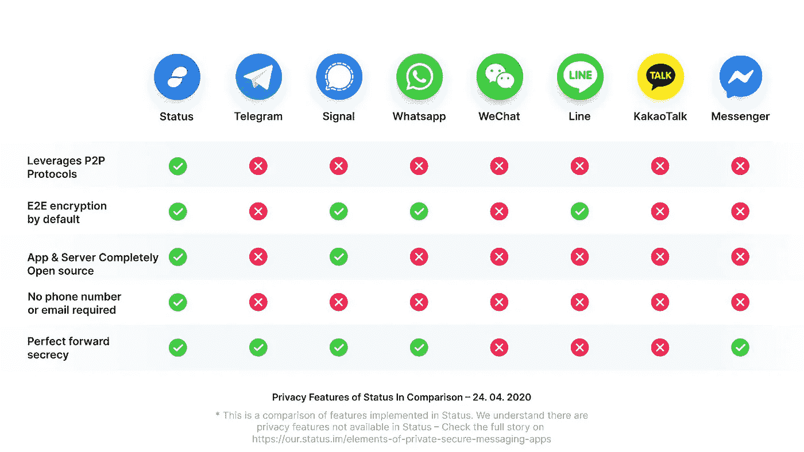

# 关于状态网络令牌(SNT)您需要知道的一切

> 原文：<https://medium.com/coinmonks/all-you-need-to-know-about-the-status-network-token-snt-f2b8362e057f?source=collection_archive---------56----------------------->

状态网络(SNT)加密是一个项目，让您无缝地使用以太网。它还提供了一个平台，所有分散的移动应用程序，也称为 dApps，可以运行，以最大限度地利用区块链。

状态网络(SNT)加密是区块链使用的加密货币。这个项目是由瑞士楚格的状态研究和发展有限公司发起的。

状态网络(SNT)加密是一种软件，使人能够轻松使用以太坊区块链或以太坊网络。Status 通过提供一个平台来做到这一点，各种分散的移动应用程序可以在该平台上运行，以最大限度地利用以太坊网络所采用的区块链技术。

此外，状态网络(SNT)加密设计用于任何设备；无论是新的还是旧的，都包含了不同版本的移动 OS 软件。目前，它可以在 Android 和 iOS 移动操作系统上使用。此外，Status Network (SNT) crypto 已被设计为用作开源消息平台移动接口。

只要以太网存在，状态网络(SNT)加密也将是一个不可忽视的实体。以太坊网络对比特币的崛起和影响力也有一些坚实的竞争。

此外，它是比特币的一个更好、更分散的版本，由于其作为第一种加密货币的声誉，它受到了巨大的欢迎。状态网络使用状态网络(SNT)加密货币，不能被挖掘。

# 地位网络的历史(SNT)

Jarrad Hope 和 Carl Bennets 创建了状态网络(SNT)加密货币。他们资助了这个项目的初始实施，并将整个以太坊 Java 实施移植到 Android 系统的工作于 2014 年开始。

最初的计划是为所有的 DApps 开发一个移动浏览器，这是一个分布式和非集中式的移动应用程序。之后，在 2016 年，这一决定被改变，决定将“状态”改为“Go Ethereum”产品，该产品将使用轻客户端和特定于 whisper 的协议。这一决定非常重要，因为它改变了整个身份网络(SNT)加密货币的面貌。

> 在**上多看一些这样有趣的隐秘故事**

# **为什么 Status Network (SNT)加密货币意义重大？**

**由于许多原因，状态网络(SNT)加密货币被认为是重要的。它与以太坊并驾齐驱，成为比特币的有力竞争者。此外，以太坊是受欢迎的，由于其先进的技术，并允许所有其他硬币和代币在其网络上。状态网络也使用 SNT，以太坊上的一种令牌，并得到它的支持。**

# **身份网加密货币有什么特点**

**以下是状态网络(SNT)加密货币初始版本的一些特征:**

*   **它的重点是确保有一个设施，进一步提供加密通信可能通过消息传递没有任何问题。**
*   **这个版本还应该包括一个以太钱包，因为它是为那些想社交的人设计的。此外，它还有一个名为“发现”的东西，这是一个基于标签的搜索，允许人们找到其他状态用户，搜索其他 DApps(分散应用程序)，并在交换商品和服务的同时讨论想法。**
*   **为了保护用户的隐私，Status Network (SNT)加密货币还允许个人用户决定是公开还是保密他们的个人资料。**
*   **当它发布时，本地对等(P2P)交换设施也是这个初始版本的一部分。**

# **结论**

**状态网络(SNT)主要是作为一个消息应用程序开发的，以确保用户可以互动。它是基于一项研究，该研究支持越来越多的人喜欢通过即时消息而不是其他形式的通信进行交流。此外，美国乃至全球的趋势表明，即时通讯应用的活跃用户数量高于社交网络。**

> **原载于**

> ****加入 Coinmonks [电报频道](https://t.me/coincodecap)和 [Youtube 频道](https://www.youtube.com/c/coinmonks/videos)了解加密交易和投资****

# ****另外，阅读****

*   ****[如何在 FTX 交易所交易期货](https://coincodecap.com/ftx-futures-trading) | [OKEx vs 币安](https://coincodecap.com/okex-vs-binance)****
*   ****[CoinLoan 审查](https://coincodecap.com/coinloan-review) | [YouHodler 审查](/coinmonks/youhodler-4-easy-ways-to-make-money-98969b9689f2) | [BlockFi 审查](https://coincodecap.com/blockfi-review)****
*   ****XT.COM 评论[币安评论](https://coincodecap.com/profittradingapp-for-binance) |****
*   ****[SmithBot 评论](https://coincodecap.com/smithbot-review) | [4 款最佳免费开源交易机器人](https://coincodecap.com/free-open-source-trading-bots)****
*   ****[比特币基地僵尸程序](/coinmonks/coinbase-bots-ac6359e897f3) | [AscendEX 审查](/coinmonks/ascendex-review-53e829cf75fa) | [OKEx 交易僵尸程序](/coinmonks/okex-trading-bots-234920f61e60)****