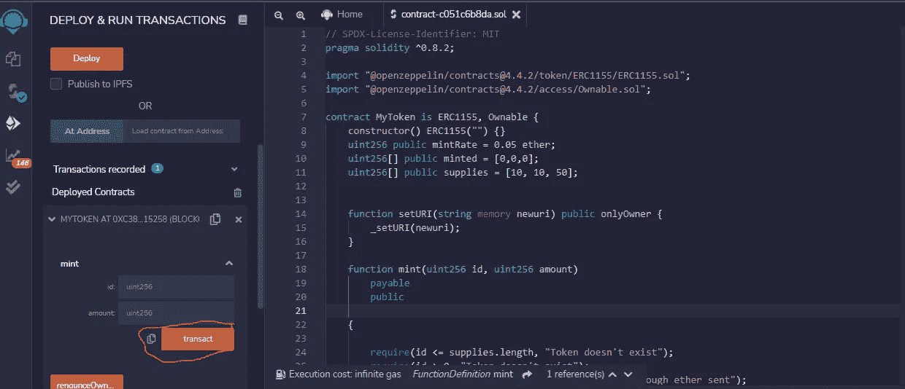

# 允许用户从你的网站上铸造 ERC1155 NFT。

> 原文：<https://medium.com/coinmonks/allowing-users-to-mint-erc1155-nft-from-your-website-6a4732b4b72a?source=collection_archive---------1----------------------->

我建立了一个简单的 HTML 网站，在智能合同上铸造一个新的 NFT，它也使铸造功能可以支付，所以所有者可以获得一些 NFT 的收益。

我将分解我的步骤，这样你可以重新创建和迭代你自己的版本。

工具:Remix IDE，Metamask，Visual studio 代码。

第一步。我将使用 openzepplin。你可以在这里找到这些文件([https://docs.openzeppelin.com/contracts/4.x/wizard](https://docs.openzeppelin.com/contracts/4.x/wizard))。在访问控制下选择 ERC1155、mintable 特征和 ownable。

在混音中打开


Openzepplin

步骤 2:我移除了 mintBatch 函数，因为我想一次铸造一个特定的令牌。此外，我删除了仅所有者条件，这样任何有钱包地址的人都可以造币。

找到下面的智能合同代码。

```
// SPDX-License-Identifier: MITpragma solidity ^0.8.2;import "@openzeppelin/contracts@4.4.2/token/ERC1155/ERC1155.sol";import "@openzeppelin/contracts@4.4.2/access/Ownable.sol";contract MyToken is ERC1155, Ownable {constructor() ERC1155("") {}uint256 public mintRate = 0.05 ether;uint256[] public minted = [0,0,0];uint256[] public supplies = [10, 10, 50];function setURI(string memory newuri) public onlyOwner {_setURI(newuri);}function mint(uint256 id, uint256 amount)payablepublic{require(id <= supplies.length, "Token doesn't exist");require(id > 0, "Token doesn't exist");require(msg.value >= (amount * mintRate), "Not enough ether sent");require(minted[id -1] + amount <= supplies[id -1], "not enought supply left");_mint(msg.sender, id, amount, "");}}
```

第三步:编制合同


Compile contract

第四步:


步骤 5:使用 Rinkeby 测试网络或您选择的任何测试网络连接到 metamask wallet 并执行交易。



Transact

步骤 5:在以太扫描上复制钱包地址


步骤 6:创建 HTML 文件并开始构建 HTML 网页

```
<html lang="en"><head><meta charset="UTF-8"><title>ERC1155</title><script src="https://cdn.jsdelivr.net/npm/web3@latest/dist/web3.min.js"></script></head><body><div><p>Wallet address - <span id="wallet-address"></span></p><label>Token ID</label><input type="number" name="tokenId"><br><label>Amount</label><input type="number" name="Amount"><br><br><button id= "mint">Mint an NFT</button></div><script type="text/javascript">// Connect metamask to our site. Get the user's addressvar account = null;var contract = null;const ABI = [];const ADDRESS = "";(async () => {if (window.ethereum) {await window.ethereum.send('eth_requestAccounts');window.web3 = new Web3(window.ethereum);var accounts = await web3.eth.getAccounts();account = accounts[0];document.getElementById('wallet-address').textContent = account;contract = new web3.eth.Contract(ABI, ADDRESS);document.getElementById('mint').onclick = async () => {var tokenId = Number(document.querySelector("[name=tokenId]").value);var amount = Number(document.querySelector("[name=amount]"));var mintRate = Number(await contract.methods.mintRate().call());var totalAmount = mintRate * amount;contract.methods.mint(tokenId, amount).send({ from: account, value: String(totalAmount)});}}})();</script></body></html>
```

在代码中嵌入应用程序二进制接口(ABI)和合同地址


Copy ABI from solidity

步骤 7:在本地主机上设置一个简单的 HTTP 服务器和视图。

你可以观看我的屏幕视频

[](https://drive.google.com/file/d/1CtkCgLdEg0-jbB7JKWrjMtAFdibeOJIw/view?usp=sharing) [## 2 月 3 日，2022.mp4

### 编辑描述

drive.google.com](https://drive.google.com/file/d/1CtkCgLdEg0-jbB7JKWrjMtAFdibeOJIw/view?usp=sharing) 

谢谢你的反馈，非常感谢。

我是一名产品经理，不熟悉 web 3 领域，并且乐于接受这个领域的机会。请伸出手！！

> 加入 Coinmonks [电报频道](https://t.me/coincodecap)和 [Youtube 频道](https://www.youtube.com/c/coinmonks/videos)了解加密交易和投资

# 另外，阅读

*   [折叠 App 审核](https://coincodecap.com/fold-app-review) | [Kucoin 交易机器人](/coinmonks/kucoin-trading-bot-automate-your-trades-8cf0ca2138e0) | [Probit 审核](https://coincodecap.com/probit-review)
*   [如何匿名购买比特币](https://coincodecap.com/buy-bitcoin-anonymously) | [比特币现金钱包](https://coincodecap.com/bitcoin-cash-wallets)
*   [币安 vs FTX](https://coincodecap.com/binance-vs-ftx) | [最佳(SOL)索拉纳钱包](https://coincodecap.com/solana-wallets)
*   [比诺莫评论](https://coincodecap.com/binomo-review) | [斯多葛派 vs 3Commas vs TradeSanta](https://coincodecap.com/stoic-vs-3commas-vs-tradesanta)
*   【Capital.com】|[港加密借贷平台](https://coincodecap.com/crypto-lending-hong-kong)
*   [如何在 Uniswap 上交换加密？](https://coincodecap.com/swap-crypto-on-uniswap) | [A-Ads 评论](https://coincodecap.com/a-ads-review)
*   [WazirX vs CoinDCX vs bit bns](/coinmonks/wazirx-vs-coindcx-vs-bitbns-149f4f19a2f1)|[block fi vs coin loan vs Nexo](/coinmonks/blockfi-vs-coinloan-vs-nexo-cb624635230d)
*   [本地比特币审核](/coinmonks/localbitcoins-review-6cc001c6ed56) | [加密货币储蓄账户](https://coincodecap.com/cryptocurrency-savings-accounts)
*   [什么是保证金交易](https://coincodecap.com/margin-trading) | [美元成本平均法](https://coincodecap.com/dca)