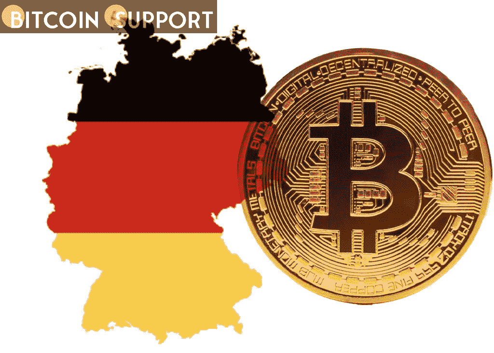
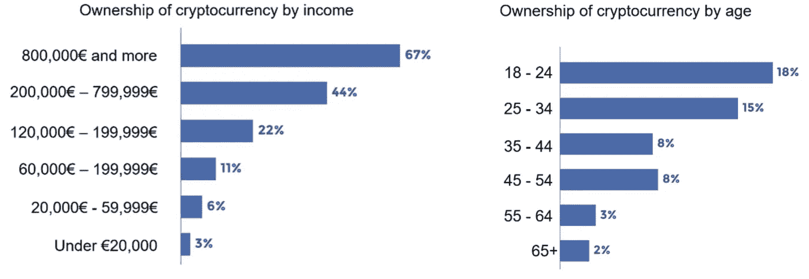

# 几乎一半的德国人计划投资加密货币

> 原文：<https://medium.com/coinmonks/almost-half-of-germans-are-planning-to-invest-in-cryptocurrency-c62e85c5516b?source=collection_archive---------86----------------------->

**Visit our website:-** [**https://bitcoinsupports.com/**](https://bitcoinsupports.com/)

根据 KuCoin 发布的一项研究，44%的德国人被吸引投资加密货币；专家怎么看？

欧洲最富裕的国家正在拥抱加密货币。这是根据 KuCoin 发表的一项研究，其中包括一些关于德国加密货币未来的令人鼓舞的数字。

值得注意的是，44%的德国人“受到激励投资加密货币，成为‘金融未来’的一部分”，而 37%的德国加密投资者已经交易了一年多。

德国加密投资者的现状根据发布该报告的 KuCoin 公司首席执行官 Johnny Lyu 的说法:

**“加密货币在积累策略支持者中非常受欢迎，尤其是在年轻一代中。他们宁愿自己为退休储蓄，并通过使用加密货币来分散投资。”Lyu 警告说:“尽管德国对加密货币有巨大的需求，但该国还没有明确限制数字货币使用的具体立法。”。根据这篇论文，德国是第一个“认识到比特币是‘价值单位’，可以归类为‘金融工具’的国家。”到目前为止，当地监管机构只“在控制加密货币方面取得了一些成功”。

另一方面，德国是世界上第一个建立区块链战略的政府，有趣的是，德国在加密货币上的政治立场在最近的立法选举中引起了争论。F5 Crypto 董事总经理 Florian d hnert-Breyer 表示:“德国是其他欧盟国家的榜样，这些国家的人口通常更倾向于长期投资。此外，“作为对金融资产普遍持避险态度的欧盟最大国家，德国扮演着特殊的角色。他接着说:

**对加密感兴趣的女性比例之高尤其令人鼓舞，因为这一人群较少涉足金融系统(例如股票市场)。”根据调查，“男性占加密投资者的 69%，而女性占加密好奇者的 53%”，这表明女性对金融的未来比传统金融更感兴趣，据多纳特-布雷耶说。****

**Visit our website:-** [**https://bitcoinsupports.com/**](https://bitcoinsupports.com/)

Immutable Insight 的首席执行官兼联合创始人卡塔琳娜·格拉(Katharina Gehra)在谈到加密投资者不断变化的人口统计数据时表示:“年轻群体表现出更加自我导向和专注于股票的投资风格，通常对通货膨胀的担忧更加敏感。”然而，未来仍然是不可预测的，尤其是在监管环境方面，因为“联邦金融监管局从未对危险发出警告”德国联邦金融监管局(BaFin)负责加密监管。他们刚刚批准了 neobank N26 在 2022 年开始加密交易的计划。多纳特-布雷耶“确信德国将继续追求有利于加密的立法”，而 BaFin 最近的举措，如托管许可证和基于比特币的安全令牌的批准，都是令人鼓舞的信号。根据 Gehra 的说法，德国可能没有瑞士或英国那样的公平竞争环境，但“有一些立法进展。”

Lyu 说了算:

**“通过去年允许投资数字资产的特别基金，德国朝着接受加密投资迈出了正式的第一步。”我认为国家已经为创造一个有利于加密货币用户的环境奠定了坚实的基础。"**

**访问我们的网站:-**[**https://bitcoinsupports.com/**](https://bitcoinsupports.com/)

**免责声明:以上为作者观点，不应视为投资建议。读者应该自己做研究。**

> 加入 Coinmonks [电报频道](https://t.me/coincodecap)和 [Youtube 频道](https://www.youtube.com/c/coinmonks/videos)了解加密交易和投资

# 另外，阅读

*   [氹欞侊贸易评论](https://coincodecap.com/anny-trade-review) | [Paybis 评论](https://coincodecap.com/paybis-review) | [Keevo 钱包评论](https://coincodecap.com/keevo-wallet-review)
*   [印度最佳 P2P 加密交易所](https://coincodecap.com/p2p-crypto-exchanges-in-india) | [柴犬钱包](https://coincodecap.com/baby-shiba-inu-wallets)
*   [8 大加密附属计划](https://coincodecap.com/crypto-affiliate-programs) | [eToro vs 比特币基地](https://coincodecap.com/etoro-vs-coinbase)
*   [最佳以太坊钱包](https://coincodecap.com/best-ethereum-wallets) | [电报上的加密货币机器人](https://coincodecap.com/telegram-crypto-bots)
*   [交易杠杆代币的最佳交易所](https://coincodecap.com/leveraged-token-exchanges) | [购买 HTZ 代币](https://coincodecap.com/how-to-buy-htz-token)
*   [5 大最佳社交交易平台](https://coincodecap.com/best-social-trading-platforms) | [瓦济克斯 NFT 印度](https://coincodecap.com/wazirx-nft-india)